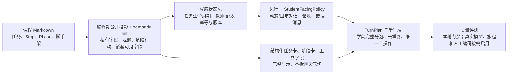

# AI 对话系统 P0–P2 实施与验收报告

> 日期：2026-08-11
> 范围：五门故宫课程、课程 SPEC、服务端 Agent、学生端任务体验、质量评测与发布门禁
> 状态口径：“已实现”只表示代码／配置已进入当前工作树；“已验证”必须附当次命令与结果；当前“发布检查通过”只要求本地门禁。live、旅程和人工复核已于 2026-08-12 降为建议项，只有正式对外／研究级验收才强制执行。

## 1. 当前结论

**当前本地发布检查仍为红色；正式研究级 AI 质量验收没有执行，也不能声称已经通过。**

已有 P0–P2 主体代码、课程迁移、确定性评测器和发布门禁实现。本次更新可复现的证据是：

- AI 评测基础设施测试已通过；
- 生产构建已通过；
- 严格课程 lint 当前为 **1 error / 0 warning**，故本地`quality:gate`尚未通过；
- 本轮未获得将合成评测数据发送到外部模型的明确授权，所以没有运行 live eval；
- J01–J05 没有真实浏览器证据 artifact；
- 没有完成人工 review queue 编码和第二编码员复核。以上三项属于建议性诊断／正式研究级验收缺口，不再阻断当前发布。

旧报告中“466 / 466”、“0 error / 0 warning”、“本地工程整改已完成”等结论不再作为当前验收证据。本报告只保留本次重新执行或有可核验 artifact 的结果。

## 2. 整体归因与治理链

此前的尴尬回答来自多层失配：课程 Markdown 声明的任务与运行时能力不一致；任务缺少权威收口；固定话术、模型输出和验收反馈的边界分散；前端呈现把多条事件同时堆出；旧评测主要检查关键词和索引，无法证明语境、完整性与真实页面体验。

课程 lint 只证明静态配置；状态机只证明权威推进；自动对话评测只证明已编码契约；语境自然度与真实交互仍需浏览器证据和人工复核。

## 3. 实施状态

### 3.1 P0：权威规则、输出边界与留痕

当前工作树已包含：

- 运行时`StudentFacingPolicy`，对动态对话、固定对话、AI 验收反馈和可见错误消息执行防剧透、安全、按学段完整分泡与去重复；
- 编译期公开投影与 semantic lint，对结构化任务卡、阶段卡和工具可见字段执行私有字段裁剪、防剧透和危险内容检查；这些结构化内容完整显示，不拆成聊天气泡也不硬截断。当前只有 Phase Prompt 具有 2000 字作者审阅 warning，任务卡和工具字段的通用字数门禁尚未实现；
- 同一 canonical matcher 供 lint、运行时与评测共用，归一阿拉伯／中文数字、万／亿量级、百分比、`m³`／立方米，并拦截高置信等价结论；
- `TurnPlan.stateChanges`记录服务端实际提交的权威状态变化，`TurnPlan.source`记录核准的来源模式、标签与引用数量，并随末尾`state.updated`和最小 trace 一起下发；
- SSE 幂等重放使用版本化 replay envelope；请求摘要、版本、事件序列、终态或当前权威状态任一不一致即 fail closed，不重播缓存学生文本，也不由残缺事件重建回复；
- 危险指令、过度安全提醒、课程动态保护词和完整 SSE 终态检查；安全门禁遍历气泡、阶段卡、快捷回复、工具卡与验收反馈，不只看主气泡；
- 教师 API Bearer 鉴权、服务端行为授权、请求重放与 trace schema；
- 无密钥评测指纹和隐私清理。

这些条目已通过本次全量确定性回归；真实模型的组合质量仍需 live artifact 证明。

### 3.2 P1：任务生命周期与学生端体验

当前工作树已包含：

- `auto_on_last_step`、`explicit_bundle_submit`与`teacher_confirm`三种收口语义；
- 格物课程删除“扫码领取角色卡”任务，短片和初始猜想位于选择角色前；
- 阶段卡、提示气泡、工具卡的顺序与延迟呈现；
- 照片删除、重拍、同名文件重选和再次提交路径；
- 媒体、相机、录音、上传、验收与导航期间的主动提醒抑制；
- 正式教师场次的学生席位初始不预填角色；教师`release_roles`后，学生才能领取本组尚未被占用的角色，同组角色唯一、不同组可领取同名角色；
- 首次领取角色复用选择角色前已经完成任务的同一阶段会话，保留对话、进度与证据；直接新建首个角色会话和未领取即发送`role_assigned`均被服务端拒绝；
- 领取在运行态与 Agent 会话之间执行一致性校验；并发冲突只允许一个请求成功，失败时保留原角色与草稿；学生端只消费本人已领、同组已占用和可领取角色，不暴露其他敏感运行态；
- 教师`lock_roles`只有在全部学生已领取后才能生效，锁定后禁止调换；正式场次中，学生已有活跃 Agent 会话时教师不能从旁改写其小组或角色；独立体验模式继续允许自由切换角色。

上述列表是实现清单，不是真实浏览器验收结论。J01–J05 结构化证据仍缺，因此“两秒延迟、照片重提、收口一次性、角色连续性、busy 抑制”都不能标为真实旅程已通过。

### 3.3 P2：课程 lint 与可选正式质量评测

已实现：

- 课程字段、执行单位、保护答案、危险行动、能力声明、阶段时长、工具与媒体源 lint；工具 lint 同时覆盖`fields／options／choices／metrics／zones／roundPrompts`等嵌套学生可见字段；
- corpus `2026-08-11.3` 包含 27 场景／96 正式语料回合的完整 manifest，Release 默认每场景重复 3 次；
- managed in-process server、完整 SSE 归档、无密钥配置与工作树指纹；
- 总 artifact schema 4 中的 journey 输入 schema 3（fixture `2026-08-11.4`）结构化证据校验：环境、观察、学生可见文本、捕获类型/SHA-256 和逐项 assertions；
- 人工 review queue、完整编码校验、至少 20% 独立二次复核与语境／复读／过度安全阈值；
- review 结果对 live artifact 文件字节 SHA-256 的强绑定，避免同`runId`复用旧人工编码；
- 两阶段发布流程：先生成机器通过的 live artifact，再对该精确 artifact 完成人工编码和校验。

## 4. 本次可复现验证

| 命令／门禁 | 当次结果 | 可支持的结论 |
|---|---:|---|
| `npm run test:ai-eval` | **51 / 51 通过（2026-08-12）** | 评测语料、所有可见表面的安全／保护检查、自动阈值、旅程证据校验、隐私、复现、人工 review、SHA-256 绑定与两层门禁脚本的确定性契约可运行 |
| `npm run lint:lesson -- --strict` | **失败：1 error / 0 warning** | 课程仍有发布级内容缺口；`quality:gate`必须保持红色 |
| 全量`npm test` | **636 项：634 通过；2 项在创建 `127.0.0.1` 临时监听时被沙箱以 `EPERM` 拒绝** | 本轮没有业务断言失败；沙箱外定向复跑申请被平台额度／审批层拒绝，因此本轮不将这两项记为已验证通过，全量命令仍为代码 1 |
| `npm run build` | **通过：1789 modules transformed** | 当前工作树可完成生产构建；该结果不关闭内容、live、旅程或人工门禁 |
| `npm run eval:ai:live` | **未运行（建议项）** | 不得声称真实模型质量或三次稳定性通过；不阻断当前发布 |
| J01–J05 journey result | **缺失（建议项）** | 不得声称真实浏览器交互通过；不阻断当前发布 |
| `npm run eval:ai:review` | **未运行（建议项）** | 不得声称人工语境自然度与教学适切性通过；不阻断当前发布 |

本表中的“AI 评测基础设施测试通过”不等于 live eval 通过；它只证明评测和门禁代码对已编码样本的行为符合契约。

## 5. 当前红门禁与正式验收建议项

| 红门禁 | 直接证据 | 关闭条件 |
|---|---|---|
| 格物短片缺少正式媒体源 | `6-lessons/lesson_gewu_001/phases.md:23` 报`missing_media_source`；当前只能显示 poster | 补可播放的真实 video URL，重跑 sync、strict lint 和 build |
| Phase 4 正式动画缺失 | 当前没有可核验的官方动画资产 | 补正式动画并验证来源、播放与移动端呈现；不得用无关素材代替 |
| 正式建议项：真实模型评测 | 本轮未获外发合成评测数据授权 | 仅在正式对外／研究级验收时，完整 27 场景／96 语料运行 3 次 |
| 正式建议项：真实浏览器证据 | 无 J01–J05 journey result artifact | 按需在真实移动端或受控浏览器执行全部 Step，并保存结构化证据 |
| 正式建议项：人工质性复核 | 无 review result、review summary 和第二编码员记录 | 正式验收时完成全部 review queue，并由第二编码员独立复核至少 20% |

## 6. 当前发布与可选正式验收

当前开发／发布运行`quality:gate`或`quality:gate:release`，内容都是 strict lint、全量测试和 build。真实模型、J01–J05 和人工编码不参与阻断。

正式对外／研究级验收按需执行：

1. 在真实移动端完成 J01–J05，按 journey schema 3（fixture `2026-08-11.4`）生成结构化证据。
2. 取得明确授权后，运行`quality:gate:formal:live`；该命令固定 Release profile 和每场景 3 次。
3. 对 live artifact 的全部 review queue 人工编码，由第二编码员独立复核至少 20%。
4. 运行`quality:gate:formal`校验精确 live artifact 和人工 review；全部代码 0 后才能写“正式研究级质量验收通过”。

`quality:gate:formal`是校验型命令，不在人工编码之后重跑并覆写 live artifact。Review 结果同时绑定`runId`与文件 SHA-256；即使重用同一`runId`，文件内容变化也会代码 2 失败。

## 7. 权威资料

- 课程文件、任务归属、继承和无配置行为：`6-lessons/COURSE-SUBMISSION-SPEC.md`
- 实施任务与阶段门禁：`1-docs/AI对话系统P0-P2实施任务书-2026-08-11.md`
- 质量标准与人工编码：`1-docs/AI对话质量评测标准与质性编码手册-2026-08-11.md`
- 评测运行、证据 schema、人工 review 和退出码：`4-stu-learning/docs/ai-dialogue-eval.md`
- 课程 lint 说明：`4-stu-learning/docs/lesson-lint.md`
