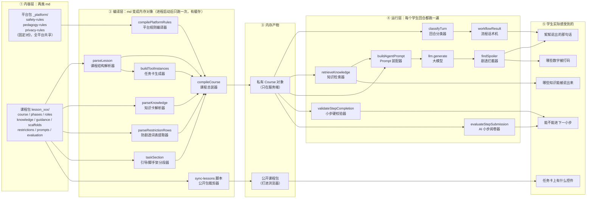
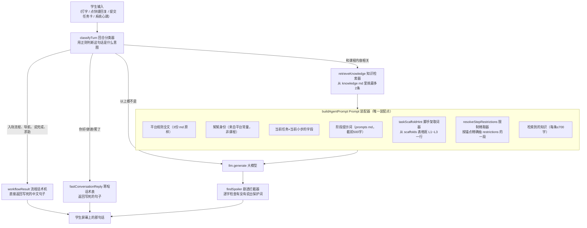
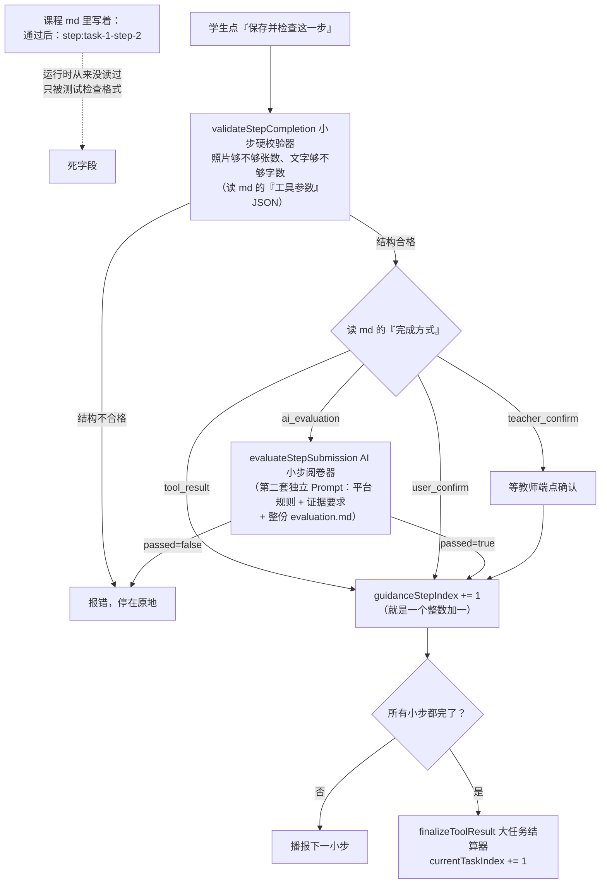

# md 课程包如何驱动学生智能体（图解版）

> 文档性质：现状讲解（As-Is），面向"准备改 md 包架构和学生智能体"的读者
> 适用工程：`6-lessons`、`4-stu-learning/server`
> 更新时间：2026-08-06
> 前置文档：[技术架构总览-研发对接讲解.md](./技术架构总览-研发对接讲解.md)、[学生端当前-workflow-与课程编译详解.md](./学生端当前-workflow-与课程编译详解.md)

## 0. 这份文档解决什么问题

前两份文档已经讲清楚"系统有哪些部分"。这份文档只回答一个问题：

> **课程团队写的那些 Markdown，到底以什么方式、什么粒度、在什么时刻，影响到学生屏幕上的那句话和进度条？**

结论先给出来，后面全是展开：

> **md 包并不"驱动"智能体，它被压扁成一个字符串塞进 System Prompt。真正驱动学生进度的是服务端 session 里的两个整数（当前第几个任务、当前第几小步），加上 Step 的 `完成方式` 分支。md 里写的状态机（`通过后：step:xxx`）目前完全没有被执行。**

---

## 1. 图一：总览 —— 两类 md 如何变成学生看到的东西

**这张图要记住的一件事**：md 走完编译层之后，就变成一个躺在服务端内存里的大对象。之后每个回合都是"从这个对象里挑几段文字，拼成一封信发给大模型"。md 本身不参与运行，参与运行的是那个对象。

### 1.1 两类 md 的地位完全不同

**平台包 `6-lessons/_platform/`**：`safety-rules.md`、`pedagogy-rules.md`、`privacy-rules.md`。这三个文件名在代码里是**硬编码清单**（`platform-rules.js` 的 `PLATFORM_RULE_DEFINITIONS`），少一份或内容为空，课程编译直接失败。它们按"安全 → 教学 → 隐私"顺序拼成一段带前言的文字，并计算 SHA-256 当版本号。只进服务端，不进浏览器。

**课程包 `6-lessons/lesson_xxx/`**：`course.md` + `phases.md` + `roles/*.md`（真正的数据模型核心）+ B1–B6 六类辅助文件。当前规模：

| 课程 | 角色数 | 任务数 | Step 数 |
|---|---|---|---|
| lesson_gewu_001 | 6 | 18 | 54 |
| lesson_zhizhi_001 / 002 / 003 | 各 6 | 各 18 | 各 36 |
| lesson_zhuhun_001 | 5 | 15 | 46 |
| 合计 | 29 | 87 | 208 |

### 1.2 一个需要澄清的偏差

`_platform/README.md` 里写着"引擎按 6 步顺序拼装 System Prompt：平台规则 → course.md 人设 → 阶段提示词 → 角色引导 → 课程限制 → 脚手架"。

这是**设计意图，不是实现**。实际只有第 1 步（平台规则全文）和第 3 步（阶段提示词，还被截断）大致对得上；人设来自平台常量而非 `course.md`；角色引导基本不进 Prompt；脚手架只取一行。详见第 4 节。

---

## 2. 图二：学生发一句话，内部发生了什么

**这张图要记住的一件事**：大约一半的回合根本不会走到大模型。入场对话、导航、"我做完了"、寒暄，全都是 `workflowResult` 和 `fastConversationReply` 里**写死在 JS 代码里的中文句子**。所以课程作者在 `guidance/*.md` 里设计的引导话术，在这些回合里一个字都不会出现。

---

## 3. 图三：进度到底由谁推进（最容易误解的一条）

**这张图要记住的一件事**：进度是**两个整数**（当前第几个任务、当前第几小步），只会线性加一。md 里写的跳转目标是死的。

### 3.1 六种 `完成方式` 的实际待遇

| 完成方式 | 代码怎么处理 | 五门课实际用量 |
|---|---|---|
| `ai_evaluation` | 结构校验通过后再调 AI 阅卷器 | 138 处 |
| `tool_result` | 只做结构校验 | 59 处 |
| `teacher_confirm` | 等教师端 `approve_evidence` | 11 处 |
| `user_confirm` | 学生说"做完了"即可推进 | 0 处 |
| `location_event` | 位置验证通过时自动推进 | 0 处 |
| `compound` | 位置 + 工具组合 | 0 处 |

后三种代码里实现了，课程里一个都没用。

---

## 4. Prompt 装配器的 11 个注入槽

`server/agent/prompt.js` 只有 152 行，`buildAgentPrompt()` 产出一个扁平字符串。这是**整个智能体人格和知识边界的唯一来源**。

| Prompt 段落 | md 来源 | 装配方式 / 限制 |
|---|---|---|
| `[平台规则｜最高优先级]` | `_platform/` 三份 | **全文**，永远注入，缺失直接抛错 |
| `[身份]` | `course.md` 的 title | 名字/性格/语气来自平台常量 `PLATFORM_COMPANION`，**课程不能改** |
| `[本轮]` 意图 | 无（来自分类器） | 一行 |
| `[待回答问题]` | 无（来自会话状态） | 一行 |
| `[学生表达标准]` | `course.md` 的适用年级 | 映射成"小学高年级：30–50字为主"这种一句话 |
| `[任务]` | 当前 task + 当前 step 的 8 个字段 | 仅 `includeTaskContext` 为真时注入 |
| `[阶段规则]` | `prompts/phaseN-*.md` | **截断前 500 字** |
| `[本轮可用线索]` | `scaffolds/<role>.md` | 正则抠出 **L{当前等级+1} 一行文案** |
| `[未解锁表格限制名称]` | `restrictions.md` 表格第一列 | 只给"名称"清单，不给内容 |
| `[当前小步引用限制]` | `restrictions.md#锚点` | 精确到章节或表格行，**唯一做对粒度的** |
| `[可用课程知识]` | `knowledge/*.md` | 最多 **2 条**，每条压到 **700 字** |
| 对话历史 | session | 最近 **8 条**，每条截 600 字 |

`guidance/*.md` 的整段内容**没有进主 Prompt**。它唯一的用法是：当脚手架表格没匹配上时，`taskScaffoldHint()` 用正则从 guidance 里抓**第一个引号里的句子**当兜底提示。

---

## 5. 函数中文名词典

### 5.1 编译层（改 md 后需要重启服务端才生效）

| 函数 | 中文名 | 干什么 | 吃哪些 md | 实际影响 |
|---|---|---|---|---|
| `compilePlatformRules` | 平台规则编译器 | 读 3 份平台 md，原样拼成一段带前言的文字，算版本号 | `_platform/` 三份 | 每封信最上面那段"最高优先级"内容 |
| `parseLesson` | 课程结构解析器 | 把 md 的标题和 `- 键：值` 变成角色/任务/小步/工具对象 | `course.md`、`phases.md`、`roles/*.md`、`time-bank.md` | 有几个角色、几个任务、几个小步、任务卡上有什么控件 |
| `parseKnowledge` | 知识卡解析器 | 把 `## K-01` 段落变成可检索条目 | `knowledge/*.md` | 絮絮能引用哪些知识 |
| `parseRestrictionRows` | 防剧透词表提取器 | 从四列表格里抠出年份、数字、引号短语当"禁词" | `restrictions.md` | 哪些词会被打码成 `[待学生探索]` |
| `parseRestrictionDocument` | 限制章节切分器 | 把限制文档切成可按锚点引用的小段 | `restrictions.md` | 让小步只注入自己那一条限制，而不是整份 |
| `taskSection` | 引导/脚手架分段器 | 按 `## 任务N` 把整份文件切成三段 | `guidance/*.md`、`scaffolds/*.md` | ⚠️ 按序号切，不认 md 里写的锚点 |
| `buildToolInstances` | 任务卡生成器 | 每个任务生成一张卡，分成 `publicConfig`（给学生看）和 `validation`（服务端判分） | roles 里的 `功能模块` + `工具参数` | 任务卡长什么样、要几张照片才算数 |
| `compileCourse` | 课程总装器 | 调用上面所有解析器，装成 Course 对象并缓存 | 全部 | 缓存只认平台规则版本，改课程 md 不会自动失效 |
| `sync-lessons` 脚本 | 公开包裁剪器 | 构建期删答案字段、替换禁词，生成浏览器静态包 | 全部 | 浏览器里搜不到答案 |

### 5.2 运行层（每个回合都跑一遍）

| 函数 | 中文名 | 干什么 | 实际影响 |
|---|---|---|---|
| `runTurn` | 回合总控 | 1360 行的大函数，串起下面所有步骤 | 全部 |
| `ensureSessionRuntime` | 会话状态初始化器 | 保证 session 字段齐全，任务切换时清零 | 换任务时进度归零、待答问题清空 |
| `applyToolResult` | 提交预处理器 | 检查任务卡是否失效、证据够不够、位置状态 | 提交时的各种报错 |
| `classifyTurn` | 回合分类器 | 用一堆正则判断学生这句话是什么意图 | 决定这轮**要不要调模型** |
| `workflowResult` | 流程话术机 | 15 个 intent 分支，每个返回写死的中文句子 | 入场、导航、"做完了"这些回合的文案 |
| `fastConversationReply` | 寒暄话术表 | 你好/谢谢/累了的固定回复 | 寒暄文案 |
| `evaluateNudge` | 冷场检测器 | 学生多久没动了，该不该主动问一句 | 主动提醒时机（读 md 的 `无操作提醒`） |
| `retrieveKnowledge` | 知识检索器 | 按角色权限 + 解锁时机过滤，双字匹配打分，取前 2 条 | 絮絮这轮能引用什么知识 |
| `resolveStepRestrictions` | 限制精取器 | 按 `restrictions.md#锚点` 精确抽一段 | 这一小步不能说什么 |
| `taskScaffoldHint` | 脚手架取词器 | 从脚手架表格正则抠出 L{当前等级+1} 那一行 | 学生说"不会"时的那句提示 |
| `buildAgentPrompt` | Prompt 装配器 | 把上面所有材料拼成一个字符串 | **智能体的全部人格和知识边界** |
| `validateStepCompletion` | 小步硬校验器 | 照片张数、文字长度、选择题对错的确定性检查 | 报错文案、能不能提交 |
| `evaluateStepSubmission` | AI 小步阅卷器 | **第二套独立 Prompt**，输出 `{passed, feedback, missing}` | `ai_evaluation` 小步能不能过 |
| `validateClientTool` | 工具下发校验器 | 检查模型给的工具 ID 是不是当前任务的 | 防止模型乱开任务卡 |
| `findSpoiler` | 剧透拦截器 | 逐字检查输出有没有未解锁保护词 | 命中就整句换成兜底话术 |
| `finalizeToolResult` | 大任务结算器 | 大任务通过后决定进不进下一任务 | 读 md 的 `推进方式`（自动 / 等学生 / 等老师） |
| `recordStepCompletion` | 进度记账 | 完成的小步 ID 记进 session | 前端进度条 |
| `runtimeSnapshot` | 状态快照 | 打包成 `state.updated` 事件发给前端 | **唯一能推进前端进度的信号** |

---

## 6. md 字段的驱动力分级

### 强驱动（改了立刻影响运行）

`功能模块` + `工具参数` JSON（唯一的验收参数来源）、`完成方式`、`证据要求`、`小步目标`、`学生行动`、`位置模式`、`坐标`、`推进方式`、`知识引用`（检索时加 100 分权重）、`限制引用`、`restrictions.md` 四列表格（同时决定防剧透词表和流式拦截）、`course.md` 的角色体系必填项和视觉素材路径。

### 弱驱动（进了 Prompt 但被大幅节选）

`prompts/phaseN-*.md`（只前 500 字）、`scaffolds/*.md`（只一行）、`evaluation.md`（整份灌进 AI 阅卷器，模型自己找相关量规）、`最大尝试`（只用来置 `teacherRecommended` 标志）、`常见误区`（只进主对话的任务上下文和 AI 阅卷器）。

### 只是标签或死字段（写了但运行时不读）

`引导引用`、`脚手架引用`、`评估引用`、`通过后`、`失败处理`、`教师介入`、`目标关联`、`关键数据`、`密符奖励`、`AI引导方向`、`phases.md` 的 `### 转场` 和 `### 安全规则`、解析出来但无人使用的 `phase.flow[]`、`objectives.md`、`assets-checklist.md`、课程 `README.md`。

### 规范支持但五门课都没用

`user_confirm`、`location_event`、`compound` 三种完成方式。

---

## 7. 三条大白话总结

**第一条：平台包和课程包的地位完全不一样。**
平台包那 3 份 md 是**原样全文**塞进每一封信的最前面，一个字不删。课程包的 md 全都被节选了——阶段提示词只取前 500 字，脚手架只取一行，知识只取 2 条每条 700 字，引导文件基本不进信。所以平台包写什么就是什么，课程包写多了大部分是浪费。

**第二条：`guidance/*.md`（引导策略）现在接近摆设。**
课程作者写的"开场引导""当学生不知道看什么时""绝对禁止"这些内容，运行时只有一种用法：脚手架表格没匹配上时，用正则抓第一个引号里的句子当兜底。除此之外整份文件不进 Prompt。这是最值得在新架构里优先修掉的一处。

**第三条：md 描述的是一张流程图，代码执行的是一个计数器。**
`通过后：step:xxx` 这个字段，规范说它构成状态机，测试也在检查它写得对不对，但运行时没有任何代码读它。实际推进就是"第几小步 + 1"。这意味着现在**做不到**：条件分支、跳过某步、根据表现走不同路径、回退重做。好消息是 md 里的数据已经写齐了，缺的只是一个执行器。

---

## 8. 改架构前必须知道的约束

1. **私有字段裁剪有两套清单**：`scripts/sync-lessons.mjs` 和 `server/course/compiler.js` 各维护一份 `publicTool` 删除列表。新增私有字段必须同改两处，否则一条链路脱敏、另一条泄漏。

2. **验收数据有三份来源**：`role.tasks[].steps[]`（AI 验收和结构校验读它）、`tool.validation`（只有 `validateClientTool` 读其中的 `completionMode`）、`pendingTools[].payload.config`（大任务最终提交读 `minEvidenceCount`）。改 Step schema 要三处都跟。

3. **`runTurn()` 是 1360 行的巨型函数**：混着输入预处理、Step 验收、模型调用、工具校验、事件生成、持久化。其中 `workflowResult()` 一个函数就有 15 个 intent 分支，每个分支都在硬编码中文文案，这些文案**不来自 md**，改课程语气改不动它们。

4. **平台 IP 是常量**：`PLATFORM_COMPANION` 在 `src/engine/platform-config.js`，课程不能覆盖絮絮的名字、性格、动画。

5. **学生模型基本是空的**：`learnerState` 定义了 `engagement`、`preferredInput`、`consecutiveDifficulties` 但从不更新；只有 `emotion` 被意图 signal 赋值，`scaffoldLevel` 在"连续两轮求助"时 +1、上限 3、**只升不降**。

6. **教师的脚手架指令是断链的**：教师端发 `set_scaffold`，学生端只弹一句"老师已调整后续提示深度"的提示，**从不写回 `session.scaffoldLevel`**，对 Prompt 零影响。

7. **课程缓存不认课程 md**：`compileCourse` 的缓存失效判据只有平台规则的 SHA-256 版本。改课程 md 必须重启 API 进程，改平台规则则会自动失效。

8. **测试是硬约束**：`agent.test.js` 锁定"口头说完成不推进""照片不足返课程原因""整轮只调一次模型"；`animal-level-lessons.test.js` 锁定 `通过后` 字符串合法性和跨课 ID 唯一；`course.test.js` 锁定浏览器包不含答案。改架构会同时撞上这几个。

---

## 9. 天然的改造接缝

| 想改什么 | 动哪里 | 影响面 |
|---|---|---|
| md 包字段结构 | `lesson-parser.js` 的 `parseStructuredSteps` | 中，需同步 spec 和测试 |
| 让 `引导引用`/`脚手架引用`/`评估引用` 真正生效 | `compiler.js` 的 `taskSection` 换成锚点解析（可复用 `restriction-sections.js` 的做法） | 小，收益大 |
| Prompt 分层与上下文预算 | `prompt.js` 的 `buildAgentPrompt`（唯一装配点） | 小，收益大 |
| 支持分支/跳步/回退 | `service.js` 里两处 `guidanceStepIndex += 1` 换成读 `step.next` 的图执行器 | 中 |
| 插入教学决策层（Tutor Policy） | `classifyTurn` 和 `buildAgentPrompt` 之间 | 大，但切口干净 |
| 拆 `runTurn` | 按前置文档 §18 的五层划分：回合理解 → 教学决策 → 回复生成 → 状态执行 → 事件持久化 | 大 |

---

## 10. 代码位置索引

| 中文名 | 文件 |
|---|---|
| 平台规则编译器 | `4-stu-learning/server/course/platform-rules.js` |
| 课程总装器、任务卡生成器、引导分段器 | `4-stu-learning/server/course/compiler.js` |
| 课程结构解析器 | `4-stu-learning/src/engine/lesson-parser.js` |
| 知识检索器、剧透拦截器 | `4-stu-learning/server/course/retrieval.js` |
| 限制章节切分器、限制精取器 | `4-stu-learning/server/course/restriction-sections.js` |
| Prompt 装配器、脚手架取词器 | `4-stu-learning/server/agent/prompt.js` |
| 回合总控、小步硬校验器、AI 小步阅卷器、流程话术机、大任务结算器 | `4-stu-learning/server/agent/service.js` |
| 回合分类器、寒暄话术表 | `4-stu-learning/server/agent/turn-router.js` |
| 会话状态初始化器、进度记账、状态快照 | `4-stu-learning/server/agent/session-state.js` |
| 工具下发校验器 | `4-stu-learning/server/agent/tools.js` |
| 冷场检测器 | `4-stu-learning/server/agent/nudge-policy.js` |
| 公开包裁剪器 | `4-stu-learning/scripts/sync-lessons.mjs` |
| 活动工具注册表 | `4-stu-learning/src/engine/tool-registry.js` |
| 平台 IP 常量 | `4-stu-learning/src/engine/platform-config.js` |
| 课程 md 权威规范 | `6-lessons/COURSE-SUBMISSION-SPEC.md` |
| 平台规则包说明 | `6-lessons/_platform/README.md` |
