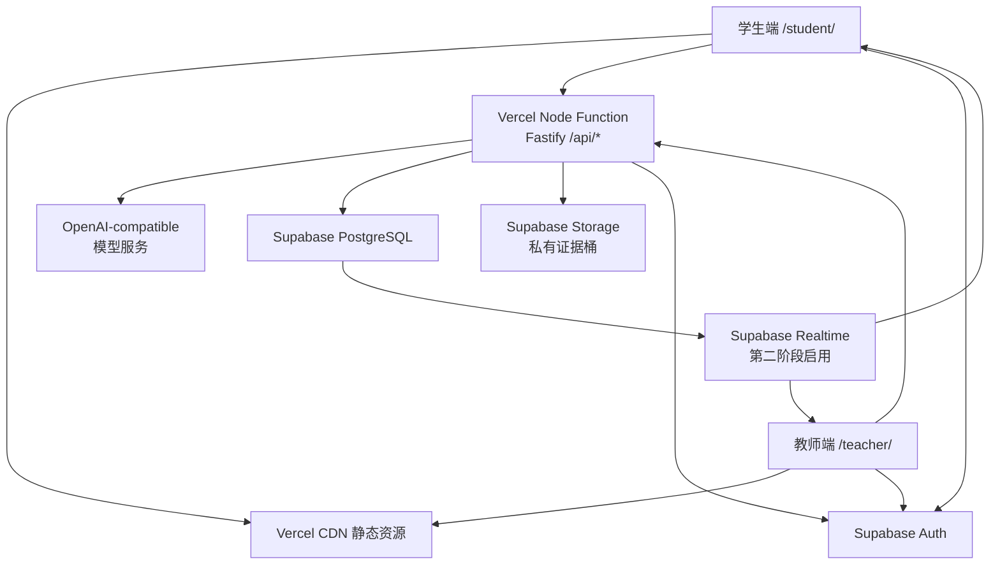

# Vercel + Supabase AI 全栈实施计划

> 项目：故宫研学智能学习平台
>
> 版本：v1.0（实施基线）
>
> 日期：2026-07-31
>
> 状态：Preview 全链路验收完成；Production 发布仍等待 Auth、授权、限流与规范化运行态
>
> 目标：在保留现有学生端、教师端和课程配置体系的前提下，让 AI、会话、教师控制、证据文件和数据持久化完整运行于生产环境。

## 0. 实施进度（2026-07-31）

| 阶段 | 当前状态 | 已完成或下一门禁 |
|---|---|---|
| M0 基线与护栏 | 已完成 | 根 npm workspace/单一 lockfile、环境变量模板、依赖安全升级和部署产物校验脚本 |
| M1 Vercel API Function | 构建产物已验证 | 单一 Fastify Function、API rewrite、SSE、断连取消、轮询模式、课程 Markdown 打包；Function 入口可加载 |
| M2a PostgreSQL 基础 | 本地代码完成 | Supabase migration、共享小连接池、session CAS、请求 lease/回放、状态与回放结果原子提交、readiness schema 探测 |
| M2 staging 验收 | 已完成 | migration 一致、readiness schema 探测通过、session 写入/恢复与跨 deployment 持久化通过 |
| Vercel Preview 验收 | 已完成 | 静态页面、connected 浏览器路径、health、readiness、数据库、Storage 往返、真实 AI SSE、幂等与跨 deployment 持久化均通过 |
| M2b 规范化运行态 | 待实施 | 将教师课堂运行写入规范化表；当前保留 `runtime_state('course-runs')` 兼容写入 |
| M3–M7 | 待实施 | Auth/RLS 策略、API 授权与限流、Storage 直传、Realtime、负载与正式发布 |

本地门禁结果：

- `npm ci --ignore-scripts`：通过；
- `npm test`：学生端/服务端 99 项 + Function adapter 3 项，共 102/102 通过；
- `npm run build`：通过，5 门课程成功同步并生成学生端与教师端统一 `dist`；
- `npm audit --omit=dev`：0 个已知漏洞；
- migration 静态契约：覆盖 13 张表、RLS、浏览器角色撤权和禁止破坏旧数据；
- Supabase migration：本地与远端均为 `20260731120000`，CLI 已确认应用成功；
- `npm run vercel:build && npm run verify:vercel-output`：通过；仅 1 个 Function、853 个文件、4.42 MB，入口动态加载成功，5 门课程 Markdown 完整，未混入 `.env`、媒体、测试或前端静态文件；
- Vercel Preview：Deployment Protection 已开启；学生端静态页面与 `/api/health` 均返回 `200`；
- connected 浏览器路径：修复 `VITE_API_BASE_URL` 被 Vercel CLI 脱敏为 `[SENSITIVE]` 后导致的 404；构建固定同源 `/api`，运行时提供安全回退，产物门禁阻止同类回归；
- connected 复验：页面 `200`、Session 创建 `201`；真实模型收到 42 个 delta，完成事件 `streamed=true`、`degraded=false`；
- 数据库 readiness：`configured=true`、`healthy=true`、`schemaReady=true`，冷启动探测约 1.1–1.2 秒；
- E2E 会话 `ses_aeee0c3dae184dcd994cf119765a05d3`：创建 `201`、恢复 `200`，在新 deployment 中仍可恢复，证明 Supabase 跨冷启动/重新部署持久化生效；
- AI SSE：入场工作流、`assistant.delta`、`assistant.completed` 与 `state.updated` 均成功；相同 `requestId` 回放相同消息 ID，数据库幂等缓存通过；
- 最终 readiness：HTTP `200`；AI、数据库与 Storage 均为 `configured=true`、`healthy=true`，数据库 `schemaReady=true`，本次延迟 1139 ms；
- Storage 实际往返：上传返回 `201` 与 `storage=s3`，随后下载文件与源文件逐字节一致；
- 真实 AI：连续收到 `assistant.delta`，完成事件 `streamed=true`、`degraded=false`；
- 成功 AI 请求幂等回放：返回相同消息 ID `msg_6e7529ac-0432-462f-b953-e4f70b8cb53b`，没有重复 delta；
- 最新代码已部署，模型失败日志仅记录 `name/code/status`，不记录响应正文、Key 或 URL；
- 详细证据见：[Vercel Preview 验收报告](./vercel-preview-acceptance-report-2026-07-31.md)。

账号侧操作见：[Supabase + Vercel Preview 人工配置清单](./supabase-staging-setup-checklist.md)。

## 1. 结论

推荐目标架构：

- Vercel CDN 继续提供 `/student/` 和 `/teacher/` 静态页面；
- Vercel Node Function 承载现有 Fastify `/api/*` 服务；
- 模型请求继续由服务端调用 OpenAI-compatible API，密钥不进入浏览器；
- Supabase PostgreSQL 保存学生会话、课程场次、指令、回执、告警和审计；
- Supabase Storage 保存照片、录音和其他证据文件；
- Supabase Auth 负责教师与学生身份；
- 首发使用现有轮询完成教师—学生控制闭环，稳定后接入 Supabase Realtime Broadcast；
- 数据库是所有业务状态的权威来源，Realtime 只发送轻量事件通知。

现有项目已具备大部分业务能力。主要工作集中在部署入口、生产持久化、并发正确性、身份权限、文件直传和上线运维。



## 2. 首版范围

### 2.1 必须跑通

- 学生端创建并恢复 AI 会话；
- AI SSE 流式回复；
- 课程知识、角色限制、工具调用和状态推进；
- 图片证据上传与视觉模型读取；
- 时间银行；
- 教师创建场次、查看课堂态势、发送指令；
- 学生接收指令并回传送达/确认状态；
- 数据在 Vercel 冷启动和重新部署后仍然存在；
- 教师与学生身份验证、场次授权；
- API 限流、日志、错误降级和部署回滚。

### 2.2 后续增强

- Supabase Realtime Broadcast 替代高频轮询；
- 会话消息、课堂状态从兼容 JSONB 逐步规范化；
- 语音转写、Web 搜索和更完整的 AI 成本分析；
- 多学校、多租户和管理后台。

当前 `AI_WEB_SEARCH_MODE` 已有环境变量，但模型适配器实际报告 `webSearch: false`。联网检索应单独实施和验收，不能仅通过填写环境变量启用。

## 3. 实施前项目准备度（基线）

下表保留最初诊断结果，当前进度以上方“实施进度”为准。

| 能力 | 当前状态 | 结论 |
|---|---|---|
| 学生端与教师端 | 可构建成统一静态 `dist` | 可复用 |
| Fastify API | 本地可运行，已有完整路由 | 可复用 |
| AI 模型适配 | 支持 Responses/Chat Completions、SSE、工具和视觉 | 可复用 |
| 课程编译 | 服务端动态读取 `6-lessons/**/*.md` | 需显式打入 Function |
| 学生会话 | 文件 store + PostgreSQL store | PostgreSQL 路径需修复 |
| 教师运行态 | 文件 store + 单行 JSONB PostgreSQL store | 仅适合试点，需逐步规范化 |
| 证据存储 | 本地文件 + S3-compatible adapter | 可直接对接 Supabase Storage S3 |
| 实时能力 | 单进程 WebSocket + 教师 5 秒/学生 3 秒轮询 | 首发使用轮询 |
| 鉴权 | 教师使用可伪造 Header，学生仅凭 sessionId | 生产阻断项 |
| 自动化测试 | 52 项服务级测试通过 | 缺 PostgreSQL、API、部署和权限测试 |
| Vercel 部署 | 只有静态产物，线上 `/api/*` 为 404 | 需新增 Function |

## 4. 已确认的阻断问题

### 4.1 Vercel 没有 API Function

根 `vercel.json` 只声明 `buildCommand`、`outputDirectory` 和静态跳转。根构建脚本只复制学生端与教师端静态文件。`4-stu-learning/server/index.js` 没有被 Vercel 识别或执行。

### 4.2 全局尾斜杠会干扰 API

`trailingSlash: true` 会把 `/api/health`、`/api/sessions` 等请求先 308 到带尾斜杠的地址。生产配置应移除全局尾斜杠，仅对静态入口使用明确跳转。

### 4.3 PostgreSQL 不能只靠填写 `DATABASE_URL` 上线

当前 PostgreSQL adapter 存在以下问题：

- 运行时自动执行建表语句，缺少正式 migration；
- 带参数的单次 `pool.query()` 混合执行多条 SQL，可能触发 PostgreSQL 扩展协议错误；
- 学生和教师 store 分别创建 `max: 8` 的连接池，每个 Function 实例最多产生 16 条连接；
- 全部课程场次写入同一个 `runtime_state('course-runs')` JSONB 行；
- 学生会话使用 `get → 修改 → upsert`，没有版本锁，并发 turn 可能覆盖状态；
- 已声明的 `course_runs`、`run_events`、`teacher_commands` 等表尚未被 store 使用；
- 现有测试没有覆盖真实 PostgreSQL。

### 4.4 进程内 WebSocket 无法跨 Function 实例

`realtime.js` 使用进程内 `Map` 保存连接。Vercel 横向扩容后，不同实例之间无法互相广播。教师端已有 5 秒轮询，学生端已有 3 秒指令轮询，因此首发可以关闭 WebSocket 加速层并保持完整业务闭环。

### 4.5 证据上传受到 Function 4.5 MB 限制

当前 Fastify 允许 10 MB，并在内存中读取整个文件。Vercel Function 的请求/响应 payload 上限为 4.5 MB。图片通常会被浏览器压缩，HEIC、音频和较大文件仍会失败。完整方案应改为 API 签发短期凭证、浏览器直传 Supabase Storage。

### 4.6 当前鉴权不能用于公网

- 教师身份来自客户端 `x-teacher-id`，且默认值是 `teacher-demo`；
- demo 场次创建接口公开；
- 学生创建会话时提交的 `studentId`、`groupId`、`runId` 和 `participantId` 未经过身份校验；
- 入课绑定没有校验入课码，可覆盖现有 `learnerSessionId`；
- 上传和下载没有会话/场次授权；
- CORS 当前允许任意来源。

## 5. 架构决策

### ADR-01：保留单域混合部署

采用同一个 Vercel Project：

- 静态页面继续进入 `dist/student` 和 `dist/teacher`；
- 新增根级 `api/serverless.mjs`，作为唯一 Node Function；
- `vercel.json` 将 `/api/:path*` rewrite 到 `/api/serverless?path=:path*`；
- Function 只注册 API，不把学生、教师静态资源重复打入函数包；
- 本地 `npm start` 继续使用常驻 Fastify + 静态托管模式。

### ADR-02：Fastify Function 使用显式适配入口

`api/serverless.mjs` 默认导出 Node `(req, res)` handler。它根据 rewrite 的 `path` 参数恢复 `/api/<path>` 和原始 query，在同一温热 Function 实例内缓存 `buildApp()` Promise，等待 `app.ready()` 后通过 `app.server.emit('request', req, res)` 交给 Fastify。线上适配器不得使用会缓冲完整响应的 `fastify.inject()`。

冷启动和横向实例仍会各自创建 Fastify 与 pool；同一实例内的 session/run stores 必须共享一个 pool，数据库侧连接汇聚由 Supavisor 负责。

`buildApp` 增加 Function 模式参数：

- `serveStatic: false`；
- `realtimeMode: polling`；
- 不注册当前 `@fastify/websocket` 路由；
- 生产环境禁止回退到本地 `.runtime` 和 `uploads/`。

根依赖需要建立可复现的安装拓扑。优先将根项目改为 npm workspace/单一 lockfile；若暂时保留嵌套 package，必须证明全新 checkout 在标准 install + `vercel build` 后可以解析 `4-stu-learning` 的全部生产依赖。

课程目录也不能继续依赖打包后 `import.meta.url` 的源码相对位置。Function 入口应显式注入 `projectRoot/lessonsRoot`，或生成静态 import 的私有课程编译产物；`includeFiles` 只负责文件进入函数包。

SSE 先保留现有 Fastify raw stream，在真实 Node req/res bridge 下验证首块到达、持续分块、取消传播和断线清理。若出现缓冲或取消失效，改为 `PassThrough/Readable`：先设置 `text/event-stream` 与 `no-cache, no-transform`，立即 `reply.send(stream)`，producer 在后台写入事件并在 `finally` 关闭。

同时统一三层超时：

- 整次 turn deadline；
- Function `maxDuration`；
- 浏览器请求超时。

建议初值：

- 整次 turn：70 秒；
- Vercel Function `maxDuration`：90 秒；
- 浏览器：100 秒。

同一 turn 内的多个模型调用共享剩余 deadline。开启 Vercel Fluid Compute，并设置 `supportsCancellation: true`；客户端断开或 AbortSignal 必须传播到模型 `fetch`，避免用户离开后继续计费。

### ADR-03：Supabase PostgreSQL 是权威状态源

- Vercel 运行时使用 Supavisor transaction pooler（端口 6543）；
- migration 和备份使用 direct connection；
- 所有 Function 共享一个小连接池；
- 每实例连接数先限制为 1–2；
- 使用 `attachDatabasePool` 或等效的生命周期管理；
- 生产请求不负责执行 DDL。

### ADR-04：先兼容迁移，再规范化

学生 Agent 内部状态可以继续使用每会话一行 JSONB。教师课堂运行态需要在 M2 至少拆出 `course_runs`、`run_groups`、`participants` 和 `participant_presence`，生产环境停止写入全局 `runtime_state('course-runs')`。

兼容阶段：

- `learner_sessions`：每个会话一行，状态保留 JSONB；
- 每个 `course_run` 可暂保一列运行详情 JSONB，但不可让全部场次共用一行；
- 增加 `state_version` 和请求幂等记录。

正式阶段：

- 场次、分组、参与者、事件、指令、回执、告警、审计和证据使用独立表；
- AI 高频内部状态仍可保留在 `learner_sessions.state jsonb`；
- 会话消息按行拆分，避免整包 JSONB 无限增长。

### ADR-05：Storage 使用私有桶和直传

- 创建 private bucket：`study-evidence`；
- 现有 AWS SDK S3 adapter 可直接连接 Supabase Storage S3 endpoint；
- S3 access key 仅保存在 Vercel 服务端；
- 生产上传使用 `init → direct upload → complete` 三步流程；
- 数据库保存 object key，AI 读取时不再依赖 `ListObjectsV2` 搜索；
- 教师查看证据使用短时 signed URL；
- 证据必须绑定 run、participant、session、task 和 step。

### ADR-06：Realtime 只负责通知

首发：

- 教师每 5 秒刷新快照；
- 学生每 3 秒拉取教师指令；
- 所有指令继续依赖 sequence、idempotency key 和 receipt。

增强：

- 使用 Supabase private Broadcast；
- 频道建议为 `run:<run-id>` 与 `participant:<participant-id>`；
- 事件只携带 `type + sequence + entityId`；
- 客户端收到事件后重新获取权威快照；
- 保留 cursor 和轮询作为断网补偿。

### ADR-07：生产前必须启用真实身份

推荐方案：

- 教师：Supabase Auth 邮箱 OTP / Magic Link；
- 学生：Supabase Anonymous Auth + 入课码；
- Node API 验证 Bearer JWT 后使用已验证 token 的 `sub` 作为用户 ID；
- 入课码只用于加入指定场次，不能代替后续身份；
- Anonymous Auth 配合 CAPTCHA、IP 限流和过期账号清理；
- 正式环境关闭 demo bootstrap。

邮箱 OTP 只证明邮箱所有权。教师权限必须由管理员邀请、服务端 provisioning 或经过确认的学校域名规则授予；客户端不能创建或修改自己的教师角色。

## 6. 建议数据模型

### 6.1 身份与场次

| 表 | 关键字段 | 用途 |
|---|---|---|
| `profiles` | `user_id`, `display_name`, `account_type` | 教师/管理员资料 |
| `course_runs` | `owner_user_id`, `course_id`, `status`, `phase_id`, `state_version`, `entry_code_digest`, `join_expires_at` | 课程场次 |
| `run_staff` | `run_id`, `user_id`, `role` | 多教师授权 |
| `run_groups` | `id`, `run_id`, `external_key`, `name` | 场次小组 |
| `participants` | `run_id`, `group_id`, `role_id`, `auth_user_id`, `claimed_at`, `status` | 学生席位与角色 |

约束：

- `run_staff`：`(run_id, user_id)` 唯一；
- `run_groups`：`(run_id, external_key)` 唯一；
- `participants`：`(group_id, role_id)` 唯一；
- `participants`：对非空 `auth_user_id` 建立 `(run_id, auth_user_id)` partial unique；
- participant 使用全局 UUID；
- 入课 API 对 participant 行加锁，只允许原子领取未绑定席位；
- 不再信任浏览器提交的 `studentId`；
- 所有业务关系建立 FK，并为场次、状态、sequence 和常用 cursor 查询建立索引。

### 6.2 AI 会话

| 表 | 关键字段 | 用途 |
|---|---|---|
| `learner_sessions` | `run_id`, `participant_id`, `auth_user_id`, `course_id`, `role_id`, `state jsonb`, `state_version` | 当前 Agent 状态 |
| `learner_requests` | `session_id`, `request_id`, `status`, `result jsonb` | 请求幂等和并发保护 |
| `session_messages` | `session_id`, `role`, `content`, `source jsonb`, `created_at` | 对话历史与审计 |

约束：

- `(session_id, request_id)` 唯一；
- `learner_requests` 使用 `processing/completed/failed` 状态、请求摘要、active lease 和结果缓存；
- 正常并发时只有取得 lease 的请求调用模型，其余请求返回 pending 或回放已缓存结果；
- Function 中断后由 lease 超时恢复，故障窗口不承诺绝对 exactly-once 外部调用；
- 保存会话使用 version/CAS 或行锁；
- 对话内容制定保留与删除周期。

### 6.3 教师运行态

| 表 | 用途 |
|---|---|
| `participant_presence` | 设备、网络、位置、学习进度与最后在线时间 |
| `run_events` | 递增 sequence、`audience_type/audience_id` 或 topic 的事件流与轮询游标 |
| `teacher_commands` | 教师指令、幂等键和期望版本 |
| `command_deliveries` | 学生指令送达与确认回执 |
| `alerts` | 求助、安全和设备告警 |
| `teacher_interventions` | 教师干预记录 |
| `audit_events` | 只追加的隐私与操作审计 |

### 6.4 证据

`evidence_assets` 建议包含：

- `id`；
- `run_id`；
- `participant_id`；
- `learner_session_id`；
- `task_id`；
- `step_id`；
- `bucket`；
- `object_path`；
- `mime_type`；
- `size_bytes`；
- `sha256`；
- `status`：`pending/uploaded_unverified/submitted/accepted/rejected/quarantined`；
- `created_by`；
- `created_at/updated_at`。

对象路径建议：

```text
run/<run-id>/participant/<participant-id>/<evidence-id>.<ext>
```

`evidence_assets.object_path` 必须唯一，并为 run、session、status 和创建时间建立查询索引。

## 7. 分阶段实施

### M0：基线、密钥和实施护栏

#### 工作

- 记录当前线上静态版本和 `/api/*` 404 基线；
- 为后续实现使用独立小批次提交，避开当前工作区已有课程/素材改动；
- 增加根级 `test`、`build`、`verify` 统一脚本；
- 确认 Preview 和 Production 使用两个独立 Supabase project；
- 为所有带真实模型和写接口的 Preview 强制启用 Vercel Deployment Protection；
- 当前模型密钥若曾暴露或共享则立即轮换，生产始终使用独立新密钥；
- 保持 `.env.local` 不纳入 Git；
- 明确现有 `.runtime/` 和 `uploads/` 是归档 demo 数据还是需要一次性 importer，默认不导入生产；
- 确定未成年人姓名、精确位置、对话和证据的保留期限、删除责任人及导出流程；
- 增加生产环境开关：
  - `APP_ENV`；
  - `AI_ENABLED`；
  - `REALTIME_MODE=polling|supabase`；
  - `EVIDENCE_UPLOAD_MODE=proxy|direct`；
  - `ENABLE_DEMO=false`。

#### 验收

- 现有 52 项测试通过；
- 根构建成功；
- Preview Deployment Protection 已开启；
- Git 中无 `.env*`、数据库密码、S3 secret；
- 构建不会无意改写课程源文件。

### M1：Vercel API Function 与 SSE

#### 工作

- 新增 `api/serverless.mjs` Node handler，并以模块级 Promise 复用 `buildApp()`；
- 使用真实 `app.server.emit('request', req, res)` 桥接 Fastify；
- 建立 npm workspace/单一 lockfile，或完成等价的可复现嵌套依赖安装；
- 将 `buildApp` 拆成 API-only 与本地常驻模式；
- Function 内模块级复用 Fastify、课程 cache 和数据库 pool；
- 移除 API 的全局尾斜杠跳转；
- 在 `vercel.json` 中增加：
  - `/api/:path*` → `/api/serverless?path=:path*` rewrite；
  - `api/serverless.mjs` 的精确 Function 配置；
  - `maxDuration: 90`；
  - `supportsCancellation: true`；
  - `includeFiles: 6-lessons/**/*.md`；
  - 静态资源排除规则；
- 由 `vercel.json` 声明启用 Fluid Compute，并在 Vercel 项目设置中确认生效；
- 课程私有 Markdown 打入函数包；
- 由入口显式注入 `projectRoot/lessonsRoot`，消除打包后路径假设；
- 课程图片、视频和静态 `dist` 不进入函数包；
- 排除教师端 `_temp_ref` 等非生产资源；
- 先验证现有 SSE 分块；只有出现缓冲或取消传播问题时再切换 `Readable`；
- `REALTIME_MODE=polling` 时教师端不建立 `/live` WebSocket，在线状态由 snapshot 轮询决定；
- 增加 API 集成测试和 Vercel handler 测试；
- 使用 `vercel build` 检查 `.vercel/output/functions`、Function tracing、课程 includeFiles 和 bundle 大小；
- 新增受保护、禁止缓存的 `/api/readiness`；M1 先验证依赖配置契约，数据库与 Storage 的真实探测分别在 M2、M5 接通；
- 模型真实探测放在受保护 smoke 接口，避免普通健康检查产生费用；
- `/api/health` 只返回服务状态和版本，不返回模型名或 secret 派生信息。

#### 验收

- `GET /api/health` 直接返回 200，无 308；
- 本地 Vercel handler 使用注入的 fake/file adapter 验证 `POST /api/sessions` 返回 201；
- 本地 handler 合约测试验证 `POST /api/agent/turn` 返回 `text/event-stream`；
- 浏览器逐块收到 `assistant.delta` 和状态事件；
- 两门课程都可创建会话；
- Function bundle 不包含课程媒体和前端静态目录；
- `vercel build` 成功并生成预期的单一 API Function；
- 全新 checkout 仅执行标准 install + `vercel build` 即可成功；
- `.vercel/output/functions` 中包含两门课程 Markdown，不包含媒体、`dist` 或 `_temp_ref`；
- handler 测试证明 SSE 首块在完整 turn 结束前到达，并覆盖客户端取消；
- 本地 `npm start` 行为保持可用；
- M1 不把 Vercel 临时文件写入视为持久化成功，首个真实线上 Preview 会话门禁放在 M2。

### M2：Supabase PostgreSQL 持久化

#### 工作

- 初始化 `supabase/` 目录；
- 使用版本化 migration 替代运行时建表；
- 修复 PostgreSQL 多语句参数查询；
- 创建共享低容量 pool；
- 配置连接、查询、statement timeout 和 pool error 处理；
- 运行连接使用 transaction pooler；
- migration 使用 direct connection；
- 为 `learner_sessions` 增加版本锁；
- 创建 `learner_requests` 幂等表；
- 学生 Agent 状态先跑通每会话一行的兼容 JSONB store；
- 至少完成 `course_runs`、`run_groups`、`participants` 和 `participant_presence` 规范化；
- 每个场次的低频详情可以暂存于该场次自己的 JSONB 列；
- 生产环境停止读写全局 `runtime_state('course-runs')`；
- 为 Vercel API 创建最小权限、尽量使用 `NOBYPASSRLS` 的应用数据库角色；
- 按 expand → backfill/双写 → 校验 → cutover → 停止旧写入推进；
- backfill 后校验行数、FK、关键关联和抽样 checksum；
- 保留一个发布周期的旧读路径与回滚窗口；
- 增加 PostgreSQL 集成测试。

#### 验收

- migration 可从零在全新数据库完整执行，并可从上一生产 schema 正向升级；
- 连续执行两次本地 `supabase db reset` 得到一致 schema，已应用 migration 不会重复执行；
- session create/get/save 通过真实 PostgreSQL；
- 受保护的 Vercel Preview 中 `POST /api/sessions` 返回 201；
- `/api/readiness` 能真实验证数据库连接；
- Vercel 冷启动和重新部署后会话仍可恢复；
- 两个相同 requestId 正常并发时只有一个请求取得 active lease，另一个返回 pending 或缓存结果；
- Function 中断、lease 过期和恢复语义均有测试；
- 30 个学生并发 presence 无丢失、无连接耗尽；
- 数据库不可用时 readiness 返回 503；
- 生产运行用户不具备建表权限。

### M3：Supabase Auth 与权限

#### 工作

- 教师接入邮箱 OTP / Magic Link；
- 教师角色只允许管理员邀请、服务端 provisioning 或受控学校域名规则授予；
- 学生接入 Anonymous Auth；
- 新增受控 join API；
- 入课码保存摘要并设置过期时间；
- participant 原子领取并绑定已验证 JWT 的 `sub`；
- 删除 `x-teacher-id` 的授权作用；
- 正式环境关闭 `/api/teacher/demo`；
- 所有 API 验证 JWT 和资源归属；
- CORS 限制为正式域名和 Preview 域名；
- 为 AI、session、join、upload 添加 IP/用户/场次限流；
- 为 Supabase 暴露表、Storage 和 Realtime channel 配置 RLS；
- 将教师端纳入 Vite 构建，使 `VITE_SUPABASE_URL` 和 publishable key 按环境注入；教师端不再作为无法注入环境变量的原样 ES module 复制；
- 教师端退出或场次结束时清除本地敏感快照。

#### RLS 边界

- migration 对所有 exposed tables 显式执行 `enable row level security`；
- 教师只能访问自己拥有或通过 `run_staff` 加入的场次；
- 学生只能访问自己的 participant、session、evidence 和 command delivery；
- 同组协作通过 PostgreSQL 15 `security_invoker=true` 的安全 view 暴露必要字段；
- 学生不可读取同伴精确位置、设备详情或对话原文；
- `audit_events` 禁止普通客户端 UPDATE/DELETE；
- `profiles.account_type`、教师 membership 和审计数据禁止普通用户自行提升或修改；
- `anon` 数据库角色不获得业务表权限；
- server/admin key 永远不进入浏览器；
- Vercel 的 admin/Postgres 连接可能绕过 RLS，所有服务端 API 仍必须验证 JWT 和资源归属；RLS 提供浏览器与 Realtime 的纵深防御。

#### 验收

- 无 token 的教师接口全部返回 401；
- 伪造 `x-teacher-id` 无效；
- 学生 A 无法读取学生 B 的会话与证据；
- 重复领取同一角色只有一个请求成功；
- 跨站 Origin 被拒绝；
- 超过限额返回 429；
- 构建产物不包含任何服务端 secret。

### M4：AI 线上闭环

#### 工作

- 仅在已启用 Deployment Protection 且 M3 权限完成的 Vercel Preview 配置 `OPENAI_*`；
- 统一浏览器、整次 turn 和 Function deadline；
- 检查 SSE 代理缓冲、取消和断线行为；
- 把客户端 AbortSignal 传播到服务端与模型 `fetch`；
- 记录 request ID、首 token 时间、总耗时、provider 状态和模型 usage；
- 为单会话增加回合上限和课次预算；
- 对模型 429、5xx、超时、空响应设置明确降级；
- 验证文本回复、工具调用、限制内容拦截和 requestId lease/结果回放；
- 图像证据与视觉模型验收放在 M5；
- 不在日志中保存完整模型密钥、数据库 URL、学生姓名、精确位置或照片内容。

#### 验收

- 已登录且有场次权限的用户可以获得真实模型回复；
- 无权限请求不会触发模型调用；
- SSE 首 token 和完整响应满足课堂体验；
- 工具调用能推进正确状态；
- 受保护课程答案不会提前输出；
- 客户端取消后模型请求及时终止；
- 模型失败时保留规则层、已保存进度和教师求助入口；
- AI 预算超限后返回友好提示并停止继续计费。

### M5：Supabase Storage

#### 工作

- 创建 private bucket `study-evidence`；
- 启用 S3 endpoint 并创建 server-only access key；
- 明确 S3 server access key 会绕过 Storage RLS，只能由后端持有；
- 先验证现有 S3 adapter；
- 新增 `evidence_assets`；
- 实现：
  1. `POST /api/evidence/init`；
  2. 浏览器 direct upload；
  3. `POST /api/evidence/:id/complete`；
- `init` 只签发绑定单一 object path、短 TTL 的上传凭证，绝不把 S3 access key 返回浏览器；
- direct upload 完成后先进入 `uploaded_unverified`；
- `complete` 验证文件实际存在、大小、magic bytes、MIME 和归属，通过后才进入 `submitted`；
- 图片 EXIF/GPS 通过客户端重编码或服务端异步处理清理，直传本身不视为已清理；
- 教师查看使用短时 signed URL；
- AI 只接受属于当前 session/task 的 evidenceId；
- 未通过校验或处于 quarantined 状态的对象不能生成下载 URL，也不能进入视觉模型；
- 清理 24 小时未完成的 pending 对象；
- 配置证据保留、导出和删除规则。

#### 过渡策略

在 direct upload 完成前：

- 服务端上传上限降至 4 MB 以下；
- 前端同步显示限制；
- HEIC 和音频超限时给出明确提示；
- 生产环境禁止回退本地 `uploads/`。

#### 验收

- 图片和音频直传成功；
- 冷启动后仍能读取对象；
- 未授权用户无法下载其他学生文件；
- 错误 MIME 和超限文件被拒绝；
- 模型可以读取已授权图片完成视觉任务；
- 未验证或隔离对象不会进入模型；
- `/api/readiness` 能真实验证 Storage；
- 删除数据库记录时按策略处理对应对象。

### M6：教师实时控制

#### 首发优化

- 保持数据库事件 sequence 和 cursor；
- 保持教师 5 秒、学生 3 秒轮询；
- 页面隐藏、离线或无状态变化时指数退避；
- 合并 context tick 与 presence；
- presence 只在变化或心跳阈值达到时写入；
- 支持 ETag/游标，空轮询返回轻量响应。

当前约 30 人课堂的固定轮询可能达到约 4.4 万次 Function invocation/课堂小时，需在正式规模测试前完成上述优化。

#### Realtime 增强

- 数据库事务写入业务状态和 `run_events`；
- `run_events` 在数据库层通过 audience/topic 明确分流教师与学生事件；
- trigger 发送 private Broadcast；
- 教师订阅 `run:<run-id>`；
- 学生订阅 `participant:<participant-id>`；
- 为 `realtime.messages` 配置 private-channel RLS；
- Realtime 只通知刷新，不直接决定业务状态；
- 断线后按 cursor 补拉事件；
- 保留低频轮询兜底。

#### 验收

- 教师指令、学生送达和确认完整闭环；
- 两个 Vercel Function 实例之间事件不丢失；
- Realtime 断开后轮询能够补偿；
- 重连不会重复执行指令；
- 精确位置、名单和对话摘要只进入有权限的教师通道。

### M7：可观测性、负载与正式发布

#### 日志和指标

- API route、request ID、状态码、耗时、冷启动；
- AI provider、首 token 时间、总耗时、usage、429/5xx；
- DB query、pool 使用量、连接超时、事务冲突；
- Storage 上传/读取失败、容量和 egress；
- 每场课学生数、AI 回合数、模型成本和 Function 调用量；
- 权限拒绝、限流和异常加入尝试。

#### 告警建议

- API 5xx > 1%；
- AI 429/5xx 持续 5 分钟；
- AI p95 接近浏览器超时；
- DB p95 > 500 ms；
- pool 接近耗尽；
- Storage 错误率 > 1%；
- 月预算达到 50%、80%、100%。

#### 发布门禁

1. Preview 全套烟测；
2. Playwright 自动跑通“学生入课 → AI → 教师指令 → 学生回执”最小闭环；
3. 6 人小班演练；
4. 30 人、60 分钟负载脚本与真实移动网络演练；
5. 模拟模型超时、数据库断连、Storage 失败和浏览器断网；
6. 优化教师端非生产资源与超大背景图，满足现场移动网络预算；
7. 执行一次 Vercel 与数据库回滚演练；
8. 再切换正式域名。

## 8. 环境变量规划

### 8.1 浏览器可见

| 变量 | 用途 |
|---|---|
| `VITE_API_BASE_URL=/api` | 同域 API |
| `VITE_SUPABASE_URL` | Supabase Auth/Realtime URL |
| `VITE_SUPABASE_PUBLISHABLE_KEY` | 浏览器 publishable key |
| `VITE_AMAP_KEY` | 高德 Web key |
| `VITE_AMAP_SECURITY_CODE` | 高德 Web 安全码 |
| `VITE_AMAP_STYLE` | 地图样式 |

### 8.2 Vercel 服务端 secret

| 变量 | 用途 |
|---|---|
| `OPENAI_BASE_URL` | 模型 API |
| `OPENAI_API_KEY` | 模型密钥 |
| `OPENAI_MODEL` | 模型名 |
| `OPENAI_WIRE_API` | Responses / Chat Completions |
| `DATABASE_URL` | Supavisor transaction pooler 6543 |
| `SUPABASE_URL` | 服务端 Auth/Storage |
| `SUPABASE_SECRET_KEY` | 仅在教师 provisioning、签名或 Auth Admin 确有需要时配置，严禁进入浏览器 |
| `S3_ENDPOINT` | `https://<ref>.storage.supabase.co/storage/v1/s3` |
| `S3_REGION` | Supabase 项目区域 |
| `S3_BUCKET` | `study-evidence` |
| `S3_ACCESS_KEY_ID` | server-only |
| `S3_SECRET_ACCESS_KEY` | server-only |
| `ALLOWED_ORIGINS` | 正式与 Preview 域名 |

### 8.3 migration/运维专用

| 变量 | 用途 |
|---|---|
| `DIRECT_DATABASE_URL` | migration、备份和管理；不用于 Function 请求 |

Preview 与 Production 必须使用不同的 Supabase project，完整隔离 Auth、Storage、Realtime、数据和配额。

## 9. 端到端验收矩阵

| 范畴 | 必测用例 |
|---|---|
| 静态 | `/student/`、`/teacher/` 返回 200 |
| API 路由 | 所有 POST API 无 308 |
| 健康 | health 200；DB/Storage 故障时 readiness 503 |
| AI | 确定性回复、真实模型、SSE、工具调用、视觉、超时降级 |
| 状态 | 刷新、冷启动、重新部署后 session 保留 |
| 幂等 | 相同 requestId 正常并发只有一个 active lease；中断后按已测试的 lease 恢复语义处理 |
| 教师 | 创建场次、名单、快照、指令、学生接收、回执 |
| 存储 | 初始化、直传、完成、AI 读取、教师查看、删除 |
| 权限 | 未登录、跨学生、伪造教师、过期入课码、重复角色 |
| 并发 | presence、赠时、教师命令、学生 turn |
| 故障 | 模型 429/5xx、DB 断连、Storage 404、Realtime 断线 |
| 性能 | AI 首 token、API p95、DB p95、课堂小时调用量 |
| 安全 | secret 扫描、CORS、限流、文件类型、日志脱敏 |

## 10. 回滚策略

- 保留上一 Vercel Production deployment，可即时回切；
- 数据库先部署向后兼容 migration，再部署代码；
- 删除字段放在独立后续版本；
- migration 前执行备份，正式环境启用 Supabase 备份/PITR；
- 使用功能开关快速关闭 AI、Realtime 或 direct upload；
- AI 故障时保留课程规则层、已保存进度、教师控制和人工求助；
- schema 迁移期间使用兼容读写，优先 forward-fix。

## 11. 预计改动文件

### 新增

- `api/serverless.mjs`：唯一 Vercel catch-all Function 入口；
- `supabase/config.toml`；
- `supabase/migrations/*.sql`；
- `4-stu-learning/server/auth/`；
- `4-stu-learning/server/db/` 或共享 pool 模块；
- `4-stu-learning/server/realtime/` 的 Supabase adapter；
- `scripts/smoke-production.mjs`；
- Playwright 最小闭环与 30 人负载脚本；
- PostgreSQL、Auth、Storage、Vercel handler 集成测试。

### 修改

- `vercel.json`；
- 根 `package.json`；
- `scripts/build-vercel-site.mjs`；
- `4-stu-learning/package.json`；
- `4-stu-learning/server/index.js`；
- `4-stu-learning/server/app.js`；
- `4-stu-learning/server/config/env.js`；
- `4-stu-learning/server/runtime/postgres-store.js`；
- `4-stu-learning/server/runtime/routes.js`；
- `4-stu-learning/server/runtime/course-run-service.js`；
- `4-stu-learning/server/services/evidence-store.js`；
- `4-stu-learning/src/services/ai-service.js`；
- `4-stu-learning/src/app-controller.js`；
- `4-tea-leading/app.js`。

## 12. 用户需要准备的外部资源

### Supabase

- 一个 staging/Preview project；
- 一个完全独立的 production project；
- 选择靠近主要用户和 Vercel Function 的 region；
- transaction pooler connection string（6543）；
- direct connection string，仅用于 migration；
- private bucket `study-evidence`；
- Storage S3 endpoint、region、access key、secret；
- 教师 Auth 登录方式；
- 教师账号邀请/provisioning 规则；
- Anonymous Auth 与 CAPTCHA 设置；
- Preview/Production 的允许回调域名。

### Vercel

- Preview 与 Production 环境变量；
- Function region 与 Supabase 接近；
- Preview Deployment Protection；
- 正式域名；
- WAF/rate-limit 规则；
- 预算与告警阈值。

### AI 与地图

- 生产模型 endpoint、model 和新密钥；
- 预期每班人数、时长和 AI 回合预算；
- 高德正式域名白名单；
- 姓名、位置、对话与证据的保留期限和删除责任人。

所有 secret 应直接填写到 Supabase/Vercel 控制台，不写入文档、Git 或聊天消息。

## 13. 推荐实施顺序

1. M0 基线与密钥；
2. M1 Vercel API Function；
3. M2 Supabase PostgreSQL；
4. M3 Auth 与权限；
5. M4 AI 线上闭环；
6. M5 Storage 直传；
7. M6 Realtime 与调用量优化；
8. M7 负载、回滚和正式发布。

在 Supabase 尚未创建时，可以先完成 M0、M1、migration 文件、数据库 adapter 单元测试和本地 Vercel handler 测试。拿到 staging project 后进入真实 PostgreSQL、Storage、Auth 和线上 Preview 验证。

## 14. 官方依据

- [Fastify on Vercel](https://vercel.com/docs/frameworks/backend/fastify)
- [Fastify Serverless/Vercel 适配](https://fastify.dev/docs/v5.2.x/Guides/Serverless/#vercel)
- [Vercel Fastify 与 Streaming](https://vercel.com/kb/guide/ship-a-fastify-app-on-vercel)
- [Vercel Function 限制](https://vercel.com/docs/functions/limitations)
- [Vercel Rewrites](https://vercel.com/docs/routing/rewrites)
- [Vercel Function 文件打包](https://vercel.com/kb/guide/how-can-i-use-files-in-serverless-functions)
- [Vercel Functions 数据库池生命周期](https://vercel.com/docs/functions/functions-api-reference/vercel-functions-package)
- [Vercel WAF Rate Limiting](https://vercel.com/docs/vercel-firewall/vercel-waf/rate-limiting)
- [Supabase PostgreSQL 连接方式](https://supabase.com/docs/guides/database/connecting-to-postgres)
- [Supabase migration 工作流](https://supabase.com/docs/guides/local-development/overview)
- [Supabase Anonymous Auth](https://supabase.com/docs/guides/auth/auth-anonymous)
- [Supabase Row Level Security](https://supabase.com/docs/guides/database/postgres/row-level-security)
- [Supabase Realtime](https://supabase.com/docs/guides/realtime)
- [Supabase Storage S3 兼容](https://supabase.com/docs/guides/storage/s3/compatibility)
- [Supabase Storage S3 认证](https://supabase.com/docs/guides/storage/s3/authentication)
- [Supabase Storage Access Control](https://supabase.com/docs/guides/storage/security/access-control)
- [Supabase Private Storage 与 signed URL](https://supabase.com/docs/guides/storage/serving/downloads)
