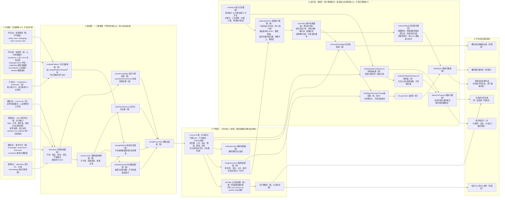

# 图一目标态：两包 md 如何变成学生看到的东西

> 配套：[目标架构讨论稿-两包md与课程渲染管线.md](./目标架构讨论稿-两包md与课程渲染管线.md)（已定稿）
> 已渲染版本：同目录 `图一目标态-两包md渲染管线.png`（打开即看）/ `.svg`（矢量可放大）
> 运行层方案对比图：`图-回合语义理解-甲乙对比.png`（2026-08-06 定案采用乙案）
> 图例：（新）＝新增 ｜（改）＝升级改造 ｜（留）＝原样保留

读图抓两句话：
1. **md 编译成唯一的一份 Course IR，之后浏览器、Prompt、验收器、教师端都只是从这份 IR 上"切自己要的那一片"**——现状的双清单、三来源、死引用，根因都是没有这份 IR；
2. **运行层的分界线是"语言输入 / 非语言输入"**——一切自由文字必经轻量 LLM 语义理解（乙案），规则永远不再猜自由文本的语义；进度判定保持确定性。

## 与现状图一的节点对照

| 现状图一的节点 | 目标态 | 变化 |
|---|---|---|
| compilePlatformRules 平台规则编译器 | compilePlatform（改） | 从只编 3 份规则扩为编整个缺省层＋标签树 |
| parseLesson / parseKnowledge / parseRestriction 系列 | 原样保留 | 只扩字段，解析方式不动 |
| taskSection 引导/脚手架分段器 | **消失** | 内容就地后不再需要按序号切分装配，装错风险一并消失 |
| buildToolInstances 任务卡生成器 | 原样保留 | 其 validation 归入 IR 单一验收计划 |
| compileCourse 课程总装器 | compileCourseIR（改） | 缓存失效从"只认平台版本"改为内容 hash；产出唯一 IR |
| sync-lessons 公开包裁剪器 | 并入 toPublic 投影器 | 构建脚本仍在，裁剪逻辑与服务端共用同一个函数，双清单消失 |
| **classifyTurn 回合分类器** | **取消对自由文本的正则分类** | 只保留 routeInput 对"语言/非语言输入"的分流；自由文本的语义判断全部交给 understandTurn，规则不再猜语义 |
| （雏形：待答问题时的"回合理解器"） | understandTurn 轻量语义理解（新） | 从"特殊情况才调"提为"语言输入必经第一站"；zod 校验＋重试一次＋保守缺省的降级链，绝不回落会循环的正则分支 |
| （无对应，散落在 service.js 各分支） | tutorPolicy 教学决策器（新） | 确定性代码：拿结构化意图＋任务状态选择教学动作；能看到提醒历史，同样的求助第二次来会换策略而不是复读 |
| workflowResult 流程话术机 | composeReply 回应组合器（改） | 对话性回应由轻量模型自然生成（先接住学生的话）；流程性事实取 voice.md 模板；写死中文消失 |
| buildAgentPrompt Prompt 装配器 | 保留但简化 | 从"自己凑 11 个槽"变为"消费 toAgentContext 一个切片" |
| evaluateStepSubmission AI 阅卷器 | 保留 | 量规就地后只拿本步一段，不再整份灌 evaluation.md |
| validateStepCompletion / retrieveKnowledge / findSpoiler / llm.generate | 原样保留 | 只是喂料来源变成 IR/切片 |
| （无对应） | lintLesson（新） | 课程作者的即时反馈，报错到 file:line |
| （无对应） | mergeDefaults（新） | "换课只需课程 md"的落点：课程没写的都有平台缺省 |
| （无对应） | buildTaskGraph＋advanceProgress（新） | 图三从计数器变图执行器；三种模式的地基 |
| （无对应） | toAgentContext（新） | 图二的输入契约，图二迭代不再碰编译层 |

## 图上画不出来的七件事

1. **mergeDefaults 箭头上的规则（覆盖白名单）**：不可覆盖＝三底线＋絮絮名字底色；可覆盖＝语气侧面、话术模板、学段规范、工具与时长缺省。每份平台文件头部自己声明。
2. **IR 里"内容 hash"的含义**：hash 写进学生 session，从此能回答"这个学生当时跑的哪版课程"；本地改 md 不用重启；也是未来评价数据对齐的键。
3. **课程包B 的本质是"消灭引用"而非"修好引用"**：一个任务从散在 5 个文件变为就地同居，大部分引用不再存在。保留的引用只剩 知识引用、限制引用 两种（指向真正共享的内容），全部锚点化并由 lintLesson 编译期校验。
4. **advanceProgress 背后是"数据与策略分离"**：任务图是数据（任务单元的 前置 字段，不写＝链式，现有 5 门课零迁移）；遍历模式是策略（course.md 一行）。模式1＝链式＋sequential；模式2＝弱依赖＋open；模式3＝无任务图＋methodology 驱动。约束：无序只发生在任务层，Step 内永远线性；闯关线只支持 sequential，对话线支持全部三种。
5. **运行层的分界线是"语言/非语言"，不是"高置信/低置信"**（乙案，2026-08-06 定案）：一切自由文字必经 understandTurn（约 0.2–0.5 秒，成本比一次 AI 阅卷低一个量级以上）；非语言输入（工具结果、位置事件、心跳、带问题ID按钮）保持确定性路径。闲聊类回合允许理解与回应在同一次轻量调用里完成（一跳）。进度判定不经过任何 LLM。对比图见《图-回合语义理解-甲乙对比.png》。
6. **时间维度（迁移）**：双格式兼容期——旧布局照常编译＋告警；5 门存量课脚本机械迁移后人工抽查，再关闭兼容期。
7. **完全不动的部分**：requestId 幂等/租约/SSE 回放链路、防剧透三道防线、工具注册表 A01–A07、知识权限模型、服务端唯一权威、前端渲染壳与事件协议。
