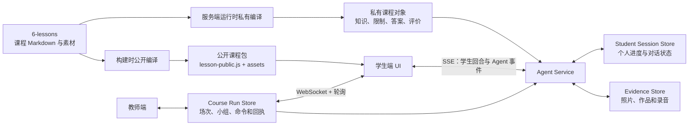
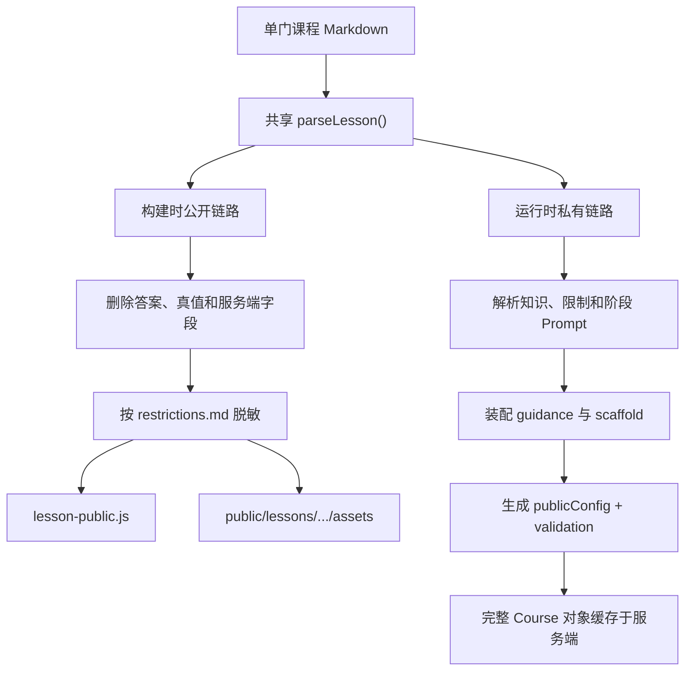
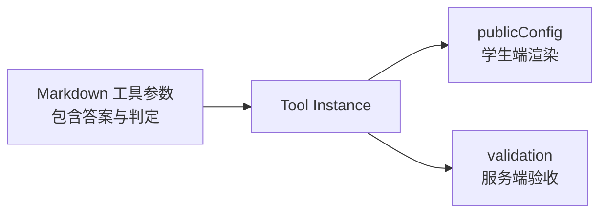
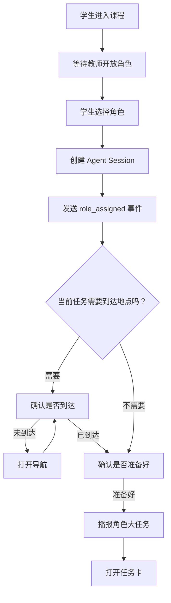
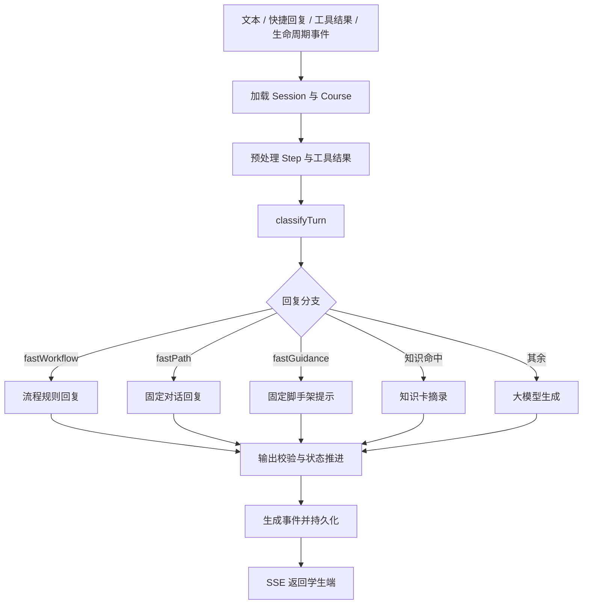

# 学生端当前 Workflow 与课程编译详解

> 文档性质：当前实现说明（As-Is）  
> 适用工程：`4-stu-learning`、`6-lessons`  
> 更新时间：2026-08-04

## 1. 这套系统当前是什么

当前学生端以**确定性课程状态机**为主干：固定回复和固定脚手架处理一部分高频回合，大模型处理剩余的自由对话，部分任务小步使用独立的 AI 验收器，教师通过另一套场次与指令通道介入。

工程中实际存在六条相互交汇的 Workflow：

1. 课程编译：Markdown 如何变成学生端公开课程包和服务端私有课程对象；
2. 学生入场：选择角色、确认到达、确认准备、打开任务；
3. Agent 单轮处理：分类、检索、规则回复、模型回复、工具调用和持久化；
4. Step 验收：不同 `completionMode` 如何完成一个任务小步；
5. 角色大任务推进：全部 Step 完成后如何最终提交并进入下一任务；
6. 教师控制：场次、小组、教师命令、学生回执和求助。

当前复杂度主要汇集在 `server/agent/service.js` 的 `runTurn()`：它同时承担输入预处理、状态推进、Step 验收、模型调用、工具调度、回复生成、事件输出和会话持久化。

## 2. 术语与层级

工程中的“任务”对应多个层级，应使用以下名称区分：

| 层级 | 工程概念 | 示例 |
|---|---|---|
| 课程阶段 | `Phase` | Phase 2 现场采证 |
| 角色大任务 | `Role Stage / task` | 数龙官·观其形 |
| 任务小步 | `Step` | 找一只螭首，拍摄正面全景 |
| 活动工具 | `Activity Tool` | 拍照、文字、答题、画板 |
| 任务卡工具实例 | `open_task_tool` | 打开“观其形”整张任务卡 |
| 时间银行任务 | `bank task` | 独立赚取时间的小任务 |

典型层级如下：

```text
Course Phase
  └── Role Stage / Task 1
       ├── Step 1
       ├── Step 2
       ├── Step 3
       └── 大任务最终提交
            ↓
      Role Stage / Task 2
```

一个角色大任务存在两层完成机制：

1. 每个 Step 分别完成；
2. 全部 Step 完成后，再进行一次大任务最终提交。

## 3. 系统总图



### 3.1 四套主要状态

| 状态 | 内容 | 当前权威来源 |
|---|---|---|
| 课程内容 | 任务、知识、工具、评价 | `6-lessons` |
| 学生会话 | 当前任务、Step、对话、脚手架 | 服务端 Session Store |
| 学生端本地状态 | 消息、草稿、照片预览、界面状态 | 浏览器 `state.roleStates` |
| 教师场次 | 小组、教师指令、暂停、加时 | Course Run Store |

学生端保留服务端状态的界面镜像。服务端发送 `state.updated` 事件后，前端再更新本地进度。

---

# Workflow 1：课程编译

## 4. 课程编译解决什么问题

课程编译的目标是把课程团队维护的 Markdown 和素材转换成程序能够稳定运行的数据结构，同时解决以下问题：

1. 把自然语言课程文件转换为稳定字段和 ID；
2. 把角色大任务拆成可推进、可验收的 Step；
3. 把 `A01—A07` 转换成平台可渲染的十类活动工具；
4. 解析地点、围栏、时长、主动提醒和推进方式；
5. 为学生端生成安全的公开对象；
6. 为服务端保留答案、评价和防剧透信息；
7. 把知识、限制、引导、脚手架和阶段 Prompt 装配到同一课程对象。

这里的“编译”不涉及传统机器码。它更接近：

```text
课程 Markdown DSL
→ 语法解析
→ 字段标准化
→ 工具实例化
→ 隐私与答案裁剪
→ 公开产物 + 私有运行对象
```

## 5. 为什么有两条课程编译链路

当前工程同时存在：

- 构建时公开编译；
- 服务端运行时私有编译。

两条链路都使用 `src/engine/lesson-parser.js`，但后续处理和产物不同。



### 5.1 公开链路的目的

浏览器必须知道“如何展示和操作”，同时不能知道“正确答案是什么”。

公开链路输出：

- 课程入口信息；
- 角色、角色卡和徽章；
- Phase、Task 和 Step；
- 学生行动和证据要求；
- 可公开的题干、选项和工具参数；
- 地图、图片、视频等公开素材。

### 5.2 私有链路的目的

服务端需要知道“如何判断和推进”。

私有链路额外保留：

- 客观题答案；
- 允许误差；
- 正确映射；
- 预期扫描结果；
- 评价标准；
- 防剧透内容及解锁条件；
- 完整知识卡；
- Guidance、Scaffold 和阶段 Prompt；
- 教师介入与失败处理规则。

## 6. 构建时公开编译的完整流程

入口：`4-stu-learning/scripts/sync-lessons.mjs`

触发时机：

```text
npm run dev
  → predev
  → npm run sync:lessons

npm run build
  → prebuild
  → npm run sync:lessons
```

### 6.1 枚举课程目录

脚本读取 `6-lessons` 下所有目录，并排除以下划线开头的目录：

```text
6-lessons/
├── _platform/             排除
├── lesson_gewu_001/       编译
├── lesson_zhuhun_001/     编译
├── lesson_zhizhi_001/     编译
├── lesson_zhizhi_002/     编译
└── lesson_zhizhi_003/     编译
```

因此，`_platform` 当前不会作为课程目录参与 `sync-lessons.mjs` 的**公开**编译——这句话指的是浏览器可见的 `lesson-public.js` / `public/lessons` 链路，**不是** `_platform` 整体未接入。

私有编译走 `server/course/platform-defaults.js` 与 `server/course/platform-rules.js`：六份默认层 md（`defaults` / `language-levels` / `companion` / `voice` / `scaffolding` / `tool-defaults`）在服务端编译期全部生效。覆盖优先级：**平台默认 → 课程 `course.md` 覆盖段 → 角色/任务字段**；只有公开投影（`toPublic()`）会排除 `_platform` 原文。

### 6.2 收集单门课程 Markdown

`collectMarkdown()` 递归读取课程目录下所有 `.md`，形成：

```js
{
  "course.md": "...",
  "phases.md": "...",
  "roles/dragon-counter.md": "...",
  "knowledge/chishou.md": "...",
  "guidance/dragon-counter.md": "...",
  "scaffolds/dragon-counter.md": "...",
  "prompts/phase2-field.md": "...",
  "restrictions.md": "...",
  "evaluation.md": "..."
}
```

公开解析阶段虽然收集了全部 Markdown，`parseLesson()` 主要消费：

- `course.md`；
- `phases.md`；
- `roles/*.md`；
- `time-bank.md`。

知识、引导、脚手架、限制和评价主要由服务端私有编译和 Agent 运行时使用。

### 6.3 调用共享解析器 `parseLesson()`

输入：

```js
{
  id: lessonId,
  files: markdownFiles,
  assetBase: `lessons/${lessonId}/assets`
}
```

输出是一个标准课程对象，包含：

- 课程信息；
- 统一 AI IP；
- Phase；
- 角色体系；
- 角色、Task 和 Step；
- 时间银行；
- 视觉素材路径。

### 6.4 裁剪公开字段

脚本随后执行第二次公开裁剪：

#### 角色层

- 删除 `role.keyData`；

#### 大任务层

- 删除 `task.guide`；
- 删除 `task.toolParameters`；

#### Step 与工具层

只保留 Step 的公开字段：

```text
id
title
objective
studentAction
completionMode
evidenceRequirement
location
modules
next
tools（已脱敏）
```

工具配置删除：

```text
answer
answers
expectedResults
correctMapping
validConnections
explanation
retryMessage
evaluationPrompt
choices[].score
choices[].correct
```

#### 时间银行层

删除：

```text
answer
verify
location
radius
```

另外生成公开的 `requiresText`，供前端判断是否显示补充文字输入。

### 6.5 防剧透字符串脱敏

脚本从 `restrictions.md` 的四列表格中提取受保护词，主要包括：

- 年月日；
- 较大的数字；
- 百分比、米、体积等精确值；
- 引号中的短语；
- 限制内容中的较长片段。

然后递归扫描公开课程对象，将命中的字符串替换为：

```text
[待学生探索]
```

这一步是在字段裁剪之后执行的第二层防护。

### 6.6 同步公开素材

每门课程的整个 `assets/` 目录被复制到：

```text
4-stu-learning/public/lessons/<lessonId>/assets/
```

这里没有针对素材内容的自动防剧透扫描。课程团队仍需保证公开图片、SVG、视频文件名或可见内容不包含隐藏答案。

### 6.7 生成公开 JS 模块

所有课程合并后写入：

```text
4-stu-learning/src/generated/lesson-public.js
```

结构近似：

```js
export default {
  lesson_gewu_001: { /* 公开课程对象 */ },
  lesson_zhuhun_001: { /* 公开课程对象 */ },
  lesson_zhizhi_001: { /* 公开课程对象 */ }
};
```

学生端的 `course-service.js` 直接导入这个静态模块。它不会在打开页面时重新读取 Markdown，也不会调用课程编译 API。

结论：

> 修改课程 Markdown 后，需要再次执行 `sync:lessons` 或重新运行 `dev/build`，浏览器课程包才会更新。

## 7. 共享解析器 `parseLesson()` 的工作

入口：`4-stu-learning/src/engine/lesson-parser.js`

### 7.1 解析 `course.md`

生成：

- `title`、`subtitle`；
- 系列和主题模板；
- 场地与地图中心；
- 年级、时长和分组；
- 课程层级；
- 核心问题；
- 角色体系文案；
- 视觉素材路径。

课程文件可以定义絮絮在本课的身份、性格侧重和语气侧重。平台名称与动画素材来自 `platform-config.js`，课程不能覆盖统一 IP。

### 7.2 解析 `phases.md`

识别：

```md
## Phase 2：现场采证
```

并读取：

- 时长；
- 模式；
- 地点；
- 功能模块；
- 触发条件；
- 结束条件；
- 流程列表。

最终生成稳定 ID：

```text
phase-2
```

### 7.3 解析 `roles/*.md`

角色 ID 直接来自文件名：

```text
roles/dragon-counter.md
→ role.id = dragon-counter
```

角色必填字段包括：

- 选择说明；
- 收集物；
- 收集物图；
- 角色卡图；
- 角色徽章图。

缺少必填字段会直接抛出课程配置错误。

角色大任务通过以下标题识别：

```md
### 任务1：观其形
```

或：

```md
### 角色阶段1：观其形
```

### 7.4 解析角色大任务

大任务字段被转换为：

```js
{
  id,
  roleStageId,
  name,
  phase,
  requirement,
  passCondition,
  goals,
  modules,
  tools,
  steps,
  completionMode,
  location,
  timing,
  nudgePolicy,
  advanceMode
}
```

重要的默认行为：

| 缺少内容 | 当前默认行为 |
|---|---|
| 大任务 `id` | `task-1`、`task-2` |
| 建议时长 | 15 分钟 |
| 无操作提醒 | 3 分钟 |
| 提醒冷却 | 2 分钟 |
| 最大主动提醒 | 2 次 |
| 推进方式 | `auto_after_validation` |
| 大任务完成方式 | `tool_result` |

### 7.5 解析结构化 Step

结构化 Step 通过以下标题识别：

```md
#### Step 1：采集现场照片
```

转换为：

```js
{
  id,
  title,
  objective,
  studentAction,
  completionMode,
  evidenceRequirement,
  location,
  tools,
  knowledgeRef,
  guidanceRef,
  restrictionRef,
  evaluationRef,
  scaffoldRef,
  commonMisconception,
  maxAttempts,
  failureHandling,
  teacherIntervention,
  next
}
```

### 7.6 旧格式的兼容降级

如果一个大任务没有结构化 Step，解析器会读取：

```md
- 引导步骤：先观察……；再拍照……；最后记录……
```

并自动生成最多五个 Step：

```js
{
  id: `${taskId}-step-1`,
  objective: studentAction,
  studentAction,
  completionMode: "user_confirm",
  evidenceRequirement: "",
  location: { mode: "inherit" }
}
```

这使旧课程可以运行，但会产生明显能力差异：

- 每个 Step 都依赖学生确认；
- 没有 Step 级证据要求；
- 没有 Step 级评价引用；
- 没有常见误区；
- 没有失败处理和教师介入规则。

`lesson_gewu_001` 在本次迁移前的 54 个 Step 来自这一兼容逻辑。当前 6 个角色、18 个任务已经改为 54 个显式结构化 Step，不再依赖 `引导步骤` 降级生成。

### 7.7 位置继承与推断

大任务和 Step 的位置模式会被归一化为：

```text
none
point
geofence
route
area
inherit
```

当大任务使用 `inherit` 时，解析器从角色基本信息继承：

- 地点名称；
- 坐标；
- 围栏半径；
- 地理围栏文字。

如果存在坐标，通常归一化为 `geofence`；只有地点名称时归一化为 `point`。

### 7.8 工具解析

`功能模块` 由 `tool-registry.js` 解析为十种稳定工具：

| 课程模块 | 工具 ID |
|---|---|
| A01 | `photo`、`audio`、`text`、`sketch` |
| A02 | `quiz` |
| A03 | `builder` |
| A04 | `simulation` |
| A05 | `team` |
| A06 | `media` |
| A07 | `scanner` |

例如：

```md
- 功能模块：A01(拍照), A01(文字), A02(单选)
```

会生成：

```text
photo + text + quiz
```

工具参数与平台默认配置合并：

```text
平台默认值
→ 根据“功能模块”括号文字推断的模式
→ 课程“工具参数”覆盖
```

当前解析器支持标准 JSON，也支持较宽松的 `key=value` / `key：value` 格式。正式课程规范仍应坚持单行合法 JSON，避免宽松解析造成字段歧义。

如果只写 `A01(多模态)` 或无法判断 A01 子工具，系统会同时生成四种 A01 工具。若模块文字非空但没有识别出 A01—A07，系统会回退到 `text` 工具。

## 8. 服务端运行时私有编译

入口：`4-stu-learning/server/course/compiler.js`

触发位置包括：

- 创建学生 Session；
- 执行每一个 Agent 回合；
- 时间银行作答；
- 教师创建或读取课程场次。

默认入口位于 `server/app.js`：

```js
const getCourse = (courseId) => compileCourse({ lessonsRoot, courseId });
```

### 8.1 先编译平台规则包

`compileCourse()` 首先固定读取：

```text
6-lessons/_platform/safety-rules.md
6-lessons/_platform/pedagogy-rules.md
6-lessons/_platform/privacy-rules.md
```

三份文件按“安全 → 教学 → 隐私”的固定顺序编译为服务端私有 `platformRules`：

```js
{
  version: "sha256:...",
  documents: [/* 三份规则原文 */],
  prompt: "最高优先级平台规则前缀"
}
```

缺少任意必需文件或文件为空时，课程编译直接失败，不会静默退回硬编码规则。规则内容的 SHA-256 版本参与课程缓存有效性判断；平台规则变化后，即使没有手动清除课程缓存，下次编译也会重新生成 Course 对象。

平台规则只进入服务端私有 Course，不写入学生端 `publicLesson` 和静态公开课程包。主对话 Prompt 与小步 AI 验收 Prompt 都把它放在课程身份、阶段、角色、知识和学生输入之前；发生冲突时以平台规则为准。

### 8.2 读取课程专属 Markdown

完成平台规则装配后，`compileCourse()` 再递归读取：

```text
6-lessons/<courseId>/
```

### 8.3 再次调用 `parseLesson()`

服务端同样通过共享解析器得到基础课程对象。此时对象仍保留：

- 角色关键数据；
- Task 完整字段；
- Step 完整工具配置；
- 工具答案和私有判定字段。

这个字段**曾经**叫 `publicLesson`，名叫"公开"却是全量结构——已于 A1 改名为 `course.lesson`，同时新增 `server/course/projections.js` 的 `toPublic()` 作为唯一裁剪入口（构建期与运行期共用）。读到旧名时按 `lesson` 理解。

### 8.4 解析知识卡

服务端扫描 `knowledge/*.md`，识别：

```md
## K-01 知识标题
```

每条知识转换为：

```js
{
  id,
  title,
  topic,
  content,
  tags,
  source,
  roles,
  revealWhen
}
```

这些字段用于：

- 角色权限过滤；
- 解锁时机判断；
- 课程知识检索；
- 来源标签；
- AI Step 验收。

### 8.5 解析限制

`restrictions.md` 被解析成两种结构：

#### 限制行列表

用于：

- 提取 `protectedTerms`；
- 判断是否已经解锁；
- 回复流式防剧透；
- 知识内容脱敏。

#### 分章节限制文档

用于：

- 根据 Step 的 `restrictionRef` 精确提取相关章节或表格行；
- 将最小必要限制注入当前对话或 AI 验收。

### 8.6 装配 Guidance 与 Scaffold

服务端按角色 ID 找到：

```text
guidance/<roleId>.md
scaffolds/<roleId>.md
```

然后按照大任务在角色文件中的顺序提取：

```text
任务1 / 角色阶段1
任务2 / 角色阶段2
任务3 / 角色阶段3
```

装配到对应 `task.guidance` 和 `task.scaffold`。

当前的关键限制是：

- 装配主要依赖任务序号；
- Step 中的 `guidanceRef` 和 `scaffoldRef` 会保留，但运行时尚未按锚点只抽取目标片段；
- Prompt 通常只从整段 Scaffold 中抽取一条 L1—L3 提示。

### 8.7 生成任务工具实例

每个角色大任务生成一个主工具实例：

```text
<roleId>:<taskId>:primary
```

例如：

```text
dragon-counter:observe-shape:primary
```

工具实例包含两部分：

#### `publicConfig`

用于发送给学生端：

- 可公开工具；
- 最少证据数量；
- 输入提示；
- 任务图；
- 位置与时长；
- 主动提醒；
- 推进方式；
- 公开 Step。

#### `validation`

作为工具实例上的服务端私有伴随配置：

- 大任务通过条件；
- 最少证据数量；
- 必需工具 ID；
- 完整工具配置；
- 完整 Step；
- 大任务完成方式。

需要注意：它目前还不是所有验收逻辑的唯一读取入口。`validateClientTool()` 会读取其中的 `completionMode`；Step 结构校验和 AI 验收主要直接读取 `role.tasks[].steps[]`，大任务最终提交还会读取已经下发并保存在 `pendingTools` 中的公开任务配置。也就是说，当前服务端同时保留了 `task/step` 原始私有结构和 `tool.validation` 两份相近数据。



### 8.8 装配阶段 Prompt 和完整评价

服务端把：

```text
prompts/phase1-*.md
prompts/phase2-*.md
...
```

映射为：

```js
{
  "phase-1": "...",
  "phase-2": "..."
}
```

`evaluation.md` 当前整份保存在：

```text
course.evaluation
```

AI 小步验收时，会同时收到 Step 的 `evaluationRef` 标签和完整评价文件。当前尚未按照 `evaluationRef` 只抽取目标量规。

### 8.9 最终私有 Course 对象

服务端最终对象近似：

```js
{
  id,
  schemaVersion,
  courseVersion,
  contentVersion,
  platformRules: {
    version,
    documents,
    prompt
  },
  lesson,          // 全量 IR（含 phases[].tasks 阶段任务）；下发浏览器前须过 toPublic()
  platformDefaults,
  taskGraph,       // 角色任务节点 roleId/taskId ＋ 阶段任务节点 phaseId/taskId；仅装配不执行
  roles: [
    {
      ...role,
      tasks,
      tools,
      sourceMarkdown
    }
  ],
  knowledge,
  restrictions,
  restrictionMarkdown,
  restrictionDocument,
  phasePrompts,
  evaluation,
  files
}
```

Agent、教师运行时和时间银行共用该对象。

### 8.10 内存缓存

`compileCourse()` 使用进程内 `Map` 缓存：

```text
cacheKey  = absoluteLessonsRoot + courseId
cacheValid = cached.platformRules.version    === currentPlatformRules.version
          && cached.platformDefaults.version === currentPlatformDefaults.version
          && cached.courseVersion            === courseVersionFor(files)   // 课程 md 内容 hash
```

**缓存按内容失效**（A3）：课程 md、平台规则、平台默认三者任一变化就重编译，**改课程 md 不必再重启服务端**。读几十个 md 本身很便宜，贵的是解析与装配。

`contentVersion` 是课程内容 ＋ 平台包的联合指纹，会话记录下它就能追溯"当时那一版内容"。

开发环境中 `node --watch-path=server` 只监听 `server`，因此改 `server/` 下的代码会重启进程；改课程 md 不重启，靠上面的内容 hash 自动失效。`predev` 在启动前重新生成浏览器公开包。

## 9. 一个 Step 从 Markdown 到运行时的字段流转

课程源：

```md
#### Step 2：判断水流方向
- id：observe-flow
- 小步目标：根据现场证据判断水流方向
- 学生行动：拍摄两张照片，并写下判断依据
- 位置：inherit
- 完成方式：ai_evaluation
- 证据要求：至少2张照片；判断依据不少于20字
- 功能模块：A01(拍照), A01(文字)
- 工具参数：{"photo":{"minCount":2},"text":{"fields":[{"id":"reason","label":"判断依据","type":"long_text","minLength":20,"required":true}]}}
- 知识引用：K-03
- 评估引用：evaluation.md#S2
- 常见误区：只根据建筑朝向推测水流方向
- 通过后：step:compare-flow
```

共享解析器生成：

```js
{
  id: "observe-flow",
  objective: "根据现场证据判断水流方向",
  studentAction: "拍摄两张照片，并写下判断依据",
  completionMode: "ai_evaluation",
  evidenceRequirement: "至少2张照片；判断依据不少于20字",
  location: { mode: "inherit" },
  tools: [
    { id: "photo", config: { minCount: 2, /* 默认值 */ } },
    { id: "text", config: { fields: [/* ... */] } }
  ],
  knowledgeRef: "K-03",
  evaluationRef: "evaluation.md#S2",
  commonMisconception: "只根据建筑朝向推测水流方向",
  next: "step:compare-flow"
}
```

学生端得到：

```text
目标、学生行动、完成方式、证据要求、公开工具和下一步
```

服务端保留：

```text
完整工具参数、知识引用、评价引用、常见误区、失败处理和教师介入
```

运行时：

```text
任务卡渲染 photo + text
→ 客户端做必填与最少数量检查
→ 服务端根据 role.tasks[].steps[] 再次做结构和私有参数检查
→ 调用 AI Step 验收器
→ passed=true 才推进 Step
```

## 10. 当前课程编译已经做得较好的部分

1. 学生端与服务端双视图已经建立；
2. 客观答案和正确映射不进入浏览器课程包；
3. 角色、Task、Step、工具拥有稳定 ID；
4. 工具采用中央注册表，课程只注入内容和参数；
5. Step 能表达位置、证据、评价、失败和教师介入；
6. 防剧透同时覆盖静态公开包和运行时回复；
7. 测试已经覆盖公开字段泄漏、引用、素材、ID 和状态流。

## 11. 当前课程编译的主要复杂点和风险

### 11.1 公开字段裁剪存在两套实现

以下位置分别维护私有字段删除列表：

- `scripts/sync-lessons.mjs`；
- `server/course/compiler.js`。

新增私有工具字段时必须同步修改两处并增加测试，否则可能出现一条链路已脱敏、另一条链路仍暴露。

### 11.2 旧课程静默降级

旧格式自动变成 `user_confirm` Step，使课程“可以运行”，但智能验收能力显著下降。正式发布更适合使用：

```text
开发预览：允许兼容并显示警告
正式发布：缺少结构化 Step 时编译失败
```

### 11.3 `_platform` 已进入私有编译，公开链路继续排除

服务端现在显式加载安全、教学和隐私规则，生成版本哈希，并注入主对话及小步验收的最高优先级前缀。公开同步仍排除 `_platform`，这是为了防止内部 System Prompt 规则进入浏览器课程包。新增或改名平台规则文件时，需要同步修改固定清单和对应测试。

### 11.4 Guidance、Scaffold、Evaluation 引用粒度不一致

- `restrictionRef` 已能精确提取章节；
- `guidanceRef` 主要按任务顺序装配整段；
- `scaffoldRef` 主要按任务顺序装配整段；
- `evaluationRef` 保留标签，同时注入完整 `evaluation.md`。

后续应统一为“文件 + 稳定锚点 → 最小相关片段”。

### 11.5 公开素材没有内容扫描

`assets/` 整体复制。隐藏答案写入 SVG 文本、图片或视频画面时，字段裁剪无法发现。

### 11.6 编译缓存没有课程版本

当前缓存键只包含目录和 `courseId`，没有：

- 课程内容摘要；
- 课程版本；
- 编译器版本；
- 发布时间。

生产环境难以回答“某个学生会话具体运行的是哪版课程”。

### 11.7 私有验收结构存在重复来源

当前同时存在：

- `role.tasks[].steps[]` 中的完整 Step 与工具私有配置；
- `role.tools[].validation` 中再次汇总的通过条件、工具和 Step；
- `pendingTools[].payload.config` 中保存的学生端公开任务配置。

实际验收代码分别读取这些结构的不同字段。后续适合确定一个服务端权威的 `validationPlan`，工具下发只生成公开投影，避免字段修改后出现两份配置不一致。

## 12. Workflow 2：学生入场



该流程主要由 `dialogue-policy.js`、`session-state.js` 和 `workflowResult()` 确定性控制。

## 13. Workflow 3：Agent 单轮处理



## 14. Workflow 4：Step 验收

| `completionMode` | 通过方式 |
|---|---|
| `user_confirm` | 学生明确确认 |
| `tool_result` | 当前工具结果通过结构和私有参数校验 |
| `ai_evaluation` | 工具结果通过后，再由 AI 按评价标准验收 |
| `teacher_confirm` | 等待教师批准 |
| `location_event` | 位置、精度和停留条件满足 |
| `compound` | 多种条件组合满足 |

通过后更新 `guidanceStepIndex` 和 `completedStepIds`，并进入下一 Step 或等待大任务最终提交。

## 15. Workflow 5：角色大任务推进

```text
全部 Step 完成
→ 提交大任务工具结果
→ 检查 toolCallId 和最少证据
→ 生成任务反馈
→ 写入 completedTaskIds
→ 根据 advanceMode 分三路（server/agent/task-advance.js）
   ├ auto_after_validation：当轮就 currentTaskIndex += 1
   ├ ai_suggest：写 session.pendingAdvance = { mode: 'student' }，进度不动
   └ teacher    ：写 session.pendingAdvance = { mode: 'teacher' }，进度不动
→ 同地点直接打开下一任务；不同地点先导航
```

`pendingAdvance` 落在**会话**上而不是回合载荷上，这是它能跨回合等到解除的前提（2026-08-08 R3-0 修复，此前那两个分支只写单次回合的 `input.data`，做完就永久卡死）。

等待态的解除有两个入口，共用同一套校验：

```text
教师：教师端「进入下一任务」（advance_task）→ 场次记录 → 学生端轮询
     → applyTeacherCommand → lifecycle_event: teacher_advance_task
学生：任务卡上「继续下一个任务」→ lifecycle_event: student_advance_task

两者 → resolvePendingAdvance()：必须真的在等待 ＋ 等的必须是这个 actor
     → currentTaskIndex += 1 → 清空 pendingAdvance → 开下一任务的工具卡
```

`state.updated` 带 `pendingAdvance: { mode, taskId } | null`，学生端据此把任务卡的提交区换成「等老师确认」或「继续下一个任务」——否则做完任务后界面看不出为什么停住。

## 16. Workflow 6：教师控制

```text
教师操作
→ Course Run Store 写入命令
→ WebSocket 推送
→ 学生端轮询补偿
→ 学生端执行
→ 发送回执
```

教师可控制角色开放、课程开始、暂停、恢复、加时、脚手架、审核、任务推进、消息、集合和求助处理。

"学生端执行"这一步是这条链的关键：教师运行时（`server/runtime/`）只持有场次记录，碰不到 agent 会话存储——`course-run-service.js` 至今只有 `node:crypto` 一个 import，这是刻意维持的墙。所有需要真改会话的指令（`advance_phase`、`set_scaffold`、`approve_evidence`、`skip_step`、`advance_task`）都由学生端轮询到之后回发一个 `lifecycle_event`，在 agent 侧落地。

## 17. 当前三种模型调用角色

| 模型角色 | 触发条件 | 输出 |
|---|---|---|
| 自由回复生成器 | 规则分支未处理的对话 | 自然语言和可选工具 |
| 回合理解器 | 存在待回答问题，规则无法理解学生 | 结构化意图 JSON |
| Step 验收器 | `ai_evaluation` Step 提交 | `passed / feedback / missing` |

当前尚未存在统一的：

```text
学生诊断
→ 教学目标
→ 教学动作
→ 脚手架选择
→ 学生模型更新
```

这些判断分散在 `turn-router.js`、`dialogue-policy.js`、`service.js` 和课程脚手架 Markdown 中。

## 18. 后续重构时应优先划分的边界

在增加教学决策器前，建议先把当前回合服务概念上拆成五层：

```text
Turn Interpreter
  回合理解
        ↓
Tutor Policy
  教学诊断与教学动作选择
        ↓
Response Composer
  检索上下文与自然语言生成
        ↓
Runtime Executor
  状态推进、工具和验收
        ↓
Event & Persistence
  事件、幂等、回放和持久化
```

这五层形成稳定边界后，再加入学生模型和教学决策器，能够避免继续扩大 `service.js` 的分支树。

## 19. 关键代码索引

| 功能 | 文件 |
|---|---|
| 构建时课程同步 | `4-stu-learning/scripts/sync-lessons.mjs` |
| Markdown 共享解析 | `4-stu-learning/src/engine/lesson-parser.js` |
| 活动工具注册表 | `4-stu-learning/src/engine/tool-registry.js` |
| 浏览器课程加载 | `4-stu-learning/src/services/course-service.js` |
| 服务端私有课程编译 | `4-stu-learning/server/course/compiler.js` |
| 知识检索与防剧透 | `4-stu-learning/server/course/retrieval.js` |
| 限制章节解析 | `4-stu-learning/server/course/restriction-sections.js` |
| 单轮 Agent 主流程 | `4-stu-learning/server/agent/service.js` |
| 回合分类 | `4-stu-learning/server/agent/turn-router.js` |
| 对话流程规则 | `4-stu-learning/server/agent/dialogue-policy.js` |
| 会话状态 | `4-stu-learning/server/agent/session-state.js` |
| Prompt 生成 | `4-stu-learning/server/agent/prompt.js` |
| 学生端渲染与事件应用 | `4-stu-learning/src/app-controller.js` |
| 课程提交规范 | `6-lessons/COURSE-SUBMISSION-SPEC.md` |
