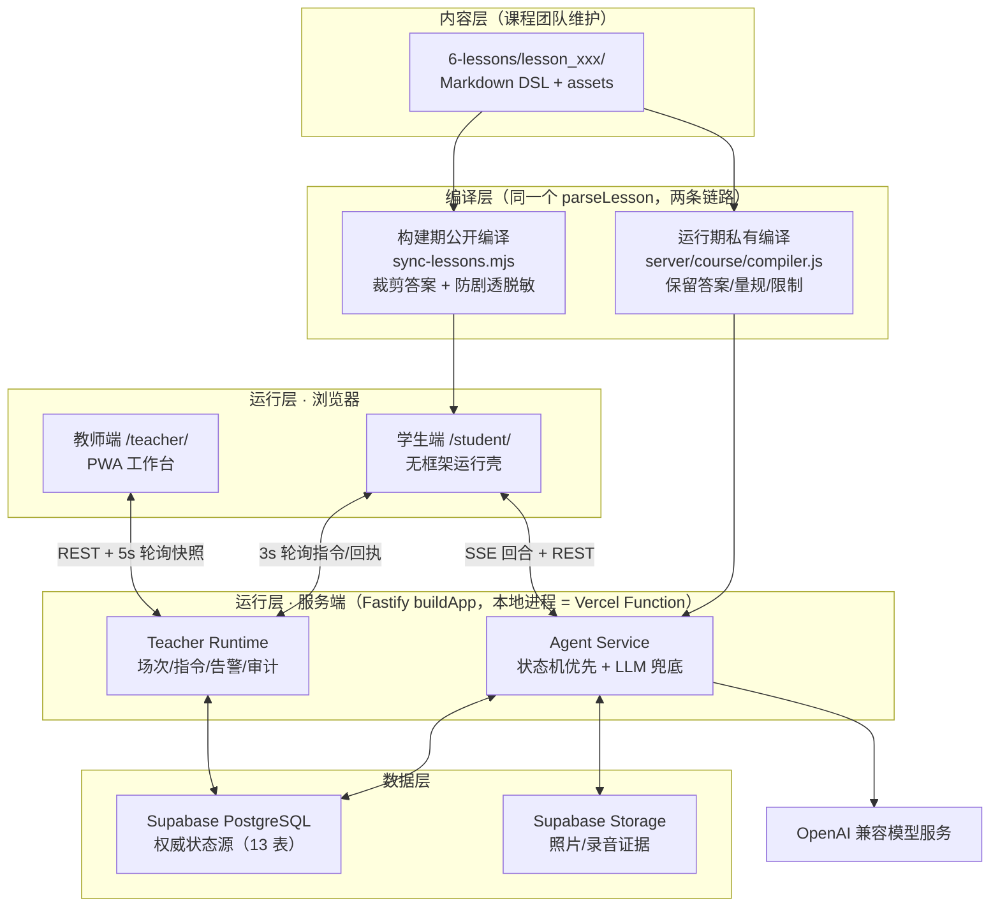
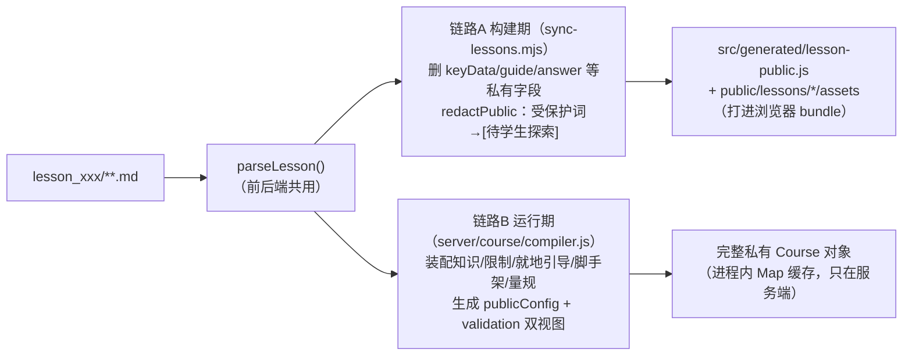
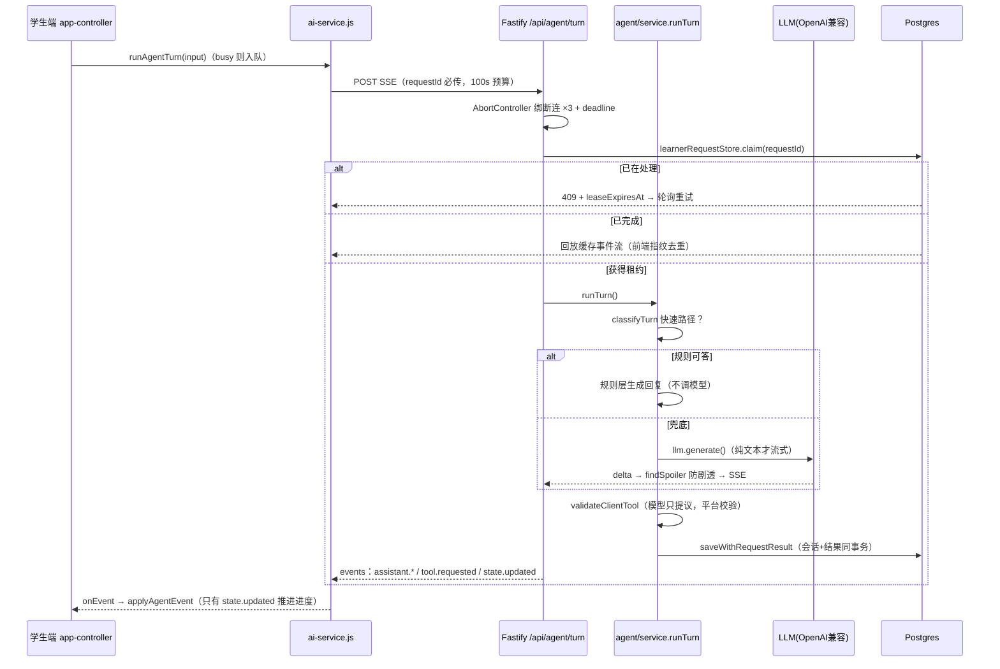

# 技术架构总览（研发对接讲解版）

> 文档性质：系统级架构讲解（As-Is，含已知偏差标注）
> 适用读者：新接入的研发、外部对接团队
> 更新时间：2026-08-07（课程包升级 v2 任务单元格式；5 门存量课已迁移）
> 目标态与实施计划：[目标架构讨论稿](./目标架构讨论稿-两包md与课程渲染管线.md) ＋ [实施计划](./问题清单-优先级与解决思路.md)
> 深度阅读入口见文末「文档与代码索引」

---

## 1. 一句话定位

**这是一个"AI 研学课程智能体平台"**：课程团队用 Markdown 写课，平台把它编译成可运行的课程；学生在实地（故宫、博物馆等）用手机以角色身份完成任务，由 AI 学习同伴"絮絮"引导；教师用另一个 Web 端实时掌控课堂。当前已有 5 门课程（故宫治水、动物博物馆三层级、四渡赤水）。

系统的核心哲学可以概括为三句话，讲解时贯穿始终：

1. **内容即代码**：课程是 Markdown DSL，经"编译"变成运行时数据，学生端是与具体课程无关的通用运行壳；
2. **确定性优先**：课程推进由状态机主导，规则能处理的回合不调大模型；模型只能"提议"动作，平台校验、服务端判定；
3. **服务端是唯一权威**：答案、判定逻辑永不进浏览器；只有服务端的 `state.updated` 事件能推进学习进度。

---

## 2. 系统角色与产品形态

| 角色 | 使用什么 | 形态 |
|---|---|---|
| 课程作者 | `6-lessons/lesson_xxx/` | Markdown + 素材，按提交规范编写，不写代码 |
| 学生 | `https://<域名>/student/` | 移动 Web（Vite 构建的 SPA） |
| 教师 | `https://<域名>/teacher/` | 移动 Web / PWA（零构建静态站） |
| 平台研发 | `4-stu-learning/`（前端+后端）等 | 本仓库 |

学生端与教师端**同域部署**，共享同一个 `/api/*` 后端，天然无跨域问题。

---

## 3. 仓库地图

```text
5 故宫课程/                     ← monorepo 根（npm workspaces）
├── 1-docs/                    工程文档（实施计划、验收报告、本文档）
├── 3-pr/                      产品方案展示页（两个单文件 HTML，不参与构建）
├── 4-stu-learning/            ★ 学生端前端 + 唯一真实后端（同一个 package）
│   ├── src/                     前端：Vite 无框架 SPA
│   ├── server/                  后端：Fastify 单体（本地与 Vercel 共用）
│   ├── scripts/sync-lessons.mjs 课程构建期编译器
│   ├── tests/                   16 个测试文件（node --test）
│   └── docs/                    前端架构规范、对话运行时协议
├── 4-tea-leading/             ★ 教师端（零构建原生 ESM + Service Worker）
├── 5-evaluation/              学生报告视觉产物（独立静态站，与主系统无代码耦合）
├── 6-lessons/                 ★ 课程内容库（Markdown DSL + assets）
│   ├── COURSE-SUBMISSION-SPEC.md  课程数据模型的权威规范
│   ├── _platform/               平台包：教学/安全/隐私底线（服务端最高优先级规则包）
│   │                            + competency-framework.md 能力标签树（CC/CQ，draft）
│   └── lesson_*/                5 门课程
├── api/serverless.mjs         ★ Vercel 唯一 Function 入口（14 行薄壳）
├── server/vercel/             Serverless 适配器（路径还原 + 单例懒加载）
├── scripts/                   构建拼装 + 产物门禁脚本
├── supabase/migrations/       数据库迁移（13 张表）
├── tests/                     根级适配器测试
├── vercel.json                部署声明（rewrite/redirect/Function 打包边界）
└── dist/                      构建产物（student/ + teacher/，CDN 直出）
```

★ = 讲解重点。`0-temp-asset/`（原始素材）与 `6-lessons/_backups/` 被 gitignore 排除，不参与任何构建。

---

## 4. 技术栈速览

| 层 | 选型 | 备注 |
|---|---|---|
| 学生端前端 | **Vite 7 + 原生 ES Modules，无框架** | 手写 DOM 渲染，字符串模板 + innerHTML；lucide 图标；4 套主题 CSS 变量 |
| 教师端前端 | **零构建原生 ESM + Service Worker（PWA）** | 7 个文件，无 package.json，构建时原样拷贝 |
| 后端 | **Node ≥20.19 + Fastify 5** | @fastify/cors、multipart、static、websocket；zod 校验全部入参 |
| 大模型 | **OpenAI 兼容协议**（`responses` / `chat_completions` 双 wire） | 裸 fetch，无 SDK；`OPENAI_BASE_URL` 可指向任意兼容网关；**非 Anthropic**（全仓无 anthropic/claude 引用） |
| 数据库 | **Supabase PostgreSQL 15** | 只当 Postgres 用：`pg` 直连，**无 supabase-js SDK**；Auth/Realtime 未启用 |
| 证据存储 | Supabase Storage（S3 兼容 API） | @aws-sdk/client-s3；本地开发落 `uploads/` |
| 地图 | 高德 AMap | 学生端编译期注入 key；教师端运行时从 `/api/map-config` 拉取 |
| 部署 | **Vercel**：CDN 静态 + 单个 Node Function | fluid、maxDuration 90s、supportsCancellation |
| 测试 | Node 内置 `node --test` | 无 Jest/Vitest；根 `npm test` 共约 102 项 |

---

## 5. 架构总图



五层记忆法：**内容层 → 编译层 → 运行层（三个运行体：学生端、教师端、服务端）→ 数据层 → 模型层**。

---

## 6. 八个核心设计决策（讲解主线）

### 6.1 内容即代码：Markdown DSL

课程不是数据库记录，是仓库里的 Markdown。**没有 YAML frontmatter**，数据模型完全靠「标题层级 + `- 键：值` 列表项」表达（全角/半角冒号均可）。权威规范是 [COURSE-SUBMISSION-SPEC.md](../6-lessons/COURSE-SUBMISSION-SPEC.md)。

单课标准结构（以 `lesson_gewu_001` 为例）：

单课标准结构（**v2 格式**，2026-08-07 起 5 门存量课已全部迁移）：

```text
lesson_gewu_001/
├── course.md          manifest：基本信息/角色体系/视觉素材（缺失直接编译报错）
│                      可选 遍历模式（sequential 默认 / open / inquiry，后两者预留）
├── phases.md          6 个课程 Phase：时长/模式/地点/触发与结束条件
├── roles/*.md         ★ 数据模型核心：角色 → 角色阶段(Task) → 小步(Step) 三层
│                      v2：每个任务/Step 内就地写 ##### 引导 / 脚手架 / 验收标准
├── objectives.md      学科知识 DK-* / 学科能力 DS-* / 课程级核心能力 DC-* 三棵标签树
├── knowledge/*.md     B1 知识卡（## K-01 标题 + 字段列表）
├── restrictions.md    B3 防剧透：四列表格（限制项/内容/原因/解除条件）
├── prompts/phaseN-*.md B4 阶段提示词（阶段氛围与全班节奏，不写任务级策略）
├── evaluation.md      B5 课程级/跨任务量规（Step 级已就地）
├── time-bank.md       CM01 时间银行任务池
└── assets/            封面/地图/角色卡/视频等素材
```

**v2 的核心变化：聚合原则**——任务独有的内容与任务定义同居，跨任务共享的内容才集中存放。原先一个任务的定义散在 5 个文件（roles/ + guidance/ + scaffolds/ + evaluation.md + restrictions.md）靠序号弱链接，现在引导、脚手架、Step 验收标准都写在 `roles/<role>.md` 的任务单元内部；`guidance/`、`scaffolds/` 两个目录已删除，`引导引用`/`脚手架引用`/`评估引用` 三类字段废止（迁移时清掉 624 行）。作者写一个任务只开一个文件，序号错位静默装错的问题从结构上消失。

编译器保留旧布局回退分支（双格式兼容期），有测试锁定；兼容期关闭时连同分支一起删。

任务层级术语（对接时必须统一口径）：**Phase（课程阶段）→ Role Stage / Task（角色大任务）→ Step（任务小步）→ Activity Tool（活动工具）**。

进度语义：`前置`（入边）为权威字段，默认空 = 承接上一任务（链式）；`通过后` 降为线性语法糖。**注意：两者目前都没有运行时读者**——推进仍是两处"整数 +1"，图执行器待建（见 §13）。

课程分层（体验版/探究版/研究版）由 `course.md` 两个字段声明，是**内容层面的约定**——引擎对三层走完全相同的编译和运行路径。

### 6.2 双链路编译 + 双重防剧透

同一个共享解析器 `4-stu-learning/src/engine/lesson-parser.js`，两条独立链路：



- **链路 A** 在 `predev`/`prebuild` 钩子自动触发：浏览器拿到的课程包已删除所有答案字段，并把 `restrictions.md` 提取的受保护词（年份、数字、精确值等）全部替换为 `[待学生探索]`。
- **链路 B** 在请求期按需编译：服务端保留客观题答案、允许误差、评价标准、防剧透解锁条件等，用于校验与 AI 验收。
- 防剧透另有第三道运行时防线：LLM 流式输出逐 delta 过 `findSpoiler()` 拦截（见 6.4）。

v2 新增的私有字段（就地引导 `guidance`、脚手架 `scaffold`、验收标准 `acceptance`、能力标签 `competencyTags`）只在服务端 Course 对象上；Step 在两条链路都走**白名单重建**（`publicStep` / `sanitizeTaskTools`），任务级则显式 delete。`tests/course-format-v2.test.js` 递归扫描浏览器包的全部键名，出现任一私有键即失败。

⚠️ 已知风险：私有字段删除列表在 `sync-lessons.mjs` 和 `compiler.js` **两处重复维护**，新增私有字段必须同改两处并加测试。Step 走白名单所以新字段默认安全，**任务级是增量对象，新增字段必须手动 delete**。根治方案是 Course IR + 唯一 toPublic 投影（M1，未做）。

### 6.3 学生端 = 课程无关的通用运行壳

前端架构规范（[frontend-architecture.md](../4-stu-learning/docs/frontend-architecture.md)）最强的一条约束：**页面与工具 renderer 不得按具体课程/角色名/任务名写流程分支**。所有课程差异都来自数据（课程包 + 主题 CSS 变量）。

前端形态刻意极简，无框架、无响应式库：

- 入口 `src/main.js` 仅 11 行：注入页面骨架 → 动态 import `app-controller.js`（2208 行唯一控制器，模块副作用即启动）；
- 状态是一个模块级 `state` 对象，核心是 `state.roleStates[roleId]`——每个角色一份独立的消息/证据/进度子状态，切角色即切子对象；
- 渲染是字符串模板 + `innerHTML` 全量重绘；唯一增量优化是流式文字直接改 `textNode`；画板 canvas 与地图每次重绘后需"再水化"；
- 事件全部委派到 `#studentApp`，`click` 走一张约 30 个 `data-action` 的查表；
- 三个后台定时器：1s 阶段倒计时、30s `context_tick` + presence 上报、3s 教师指令轮询；
- 与后端的全部 HTTP/SSE 交互收敛在 `src/services/ai-service.js` 一个文件。

**运行模式**（`src/services/runtime-mode.js`，读 URL `?mode=`，有测试锁定）：

| URL | 模式 | 行为 |
|---|---|---|
| 默认（无参数） | connected + 自动开放角色 | 连 API 与 AI，用于独立体验/演示 |
| `?mode=connected` | connected + 教师门禁 | 角色需等教师端 `release_roles` 指令才开放 |
| `?mode=standalone` | 纯本地 | 完全不调 API/AI，本地推进 + 假回复，用于离线演示 |

注意：默认与显式 `connected` 行为**不同**（前者自动放行角色），这是刻意设计。

**学习视图**与运行模式分开：`state.learningView` 只取 `dialogue/challenge`，由公开课程对象的 `learningView` Gate 控制。平台当前默认进入对话模式并允许学生切换，因此五门课程都会在“我的任务”右下角显示平台级絮絮悬浮入口：对话页显示“切换为闯关模式”，闯关页显示“切换为智能 AI 模式”。课程仍可通过 `course.md / ## 学习视图` 显式关闭或覆盖。

两种视图共用 `renderTaskWorkspace(context)` 和同一份 `roleState`。闯关模式按角色任务分页，已完成任务只读、当前任务可操作、未来任务默认锁定；课程验收期可用 `allowFutureTaskBrowse` 临时放开未来任务页面浏览，上线前恢复为 `false`。`challengePageIndex` 只负责页面浏览。正式进度仍取服务端 `state.updated` 中的 `currentTaskIndex` 与 `guidanceStepIndex`。为避免录音、画板和上传草稿串状态，页面任一时刻只挂载当前视图的一套可交互工具 DOM。

闯关页提交后，`assistant.delta/completed` 仍写入对话历史，同时镜像到页内反馈区；最终根据 `state.updated` 判定 Step 或任务是否推进。切换按钮本身不发 Agent 请求、不创建会话，也不会插入系统消息。周期性上下文上报可携带 `learningView`，服务端只把它记录为环境信息。絮絮的名称、人设与动画路径由平台 `PLATFORM_COMPANION` 统一提供；课程编译结果不再携带 `persona`、`companionIdle`、`companionTalk`，课程切换不会改变这一平台 IP。

活动工具体系：课程里的 `A01–A07` 功能模块经 `tool-registry.js` 映射为 **10 种稳定工具 ID**（photo/audio/text/sketch/quiz/builder/simulation/team/media/scanner），renderer 在 `src/components/activity-tools.js`，只写草稿、不读答案、不改 Step 状态。`tools.html` 是第二个 Vite 入口，也是与学生会话隔离的工具沙盒：既可选择真实课程的角色、任务和 Step，也可按工具目录逐项测试；交互状态只保存在当前标签页内存，不调用课程写入与 Step 推进接口。

### 6.4 确定性优先的 Agent：规则在前，模型兜底，模型只提议

服务端 `server/agent/service.js` 的 `runTurn()` 是全系统最复杂的函数。关键分层：

1. **分类先行**：`classifyTurn()` 命中 `fastWorkflow`（入场流程）/ `fastPath`（固定对话）/ `fastGuidance`（固定脚手架）/ 知识检索命中 四条快速路径时，**完全不调模型**，由规则层生成回复；
2. **知识检索**：`retrieveKnowledge()` 按角色权限 + 解锁时机过滤，双字 bigram 相关度排序，未解锁词替换为占位符，内容压到 700 字再进 prompt；
3. **模型只提议**：模型可见的工具只有 4 个——`open_task_tool`、`show_navigation`、`retrieve_course_knowledge`、`call_teacher`。所有课程活动收敛到 `open_task_tool` 一个入口，且 `validateClientTool()` 校验模型给的 `toolInstanceId` 必须等于当前任务的工具实例，否则拒绝下发；
4. **流式防剧透**：仅纯文本回合走 SSE 流式（一旦可能调工具就不流式），且每个 delta 过 `guardedDeltaEmitter` → `findSpoiler()` 拦截受保护内容。

三种模型调用角色（注意区分，排障时首先确认是哪一种）：

四种模型调用角色（注意区分，排障时首先确认是哪一种）：

| 角色 | 触发 | 输出 |
|---|---|---|
| **语义理解器**（轻量） | 每条自由文字，确定性前置未命中时 | 结构化意图 JSON；可用 `understandingLlm` 单独注入，默认复用主模型 |
| 自由回复生成器 | 教学动作需要自然语言时 | 自然语言 + 可选工具提议 |
| 回合理解器 | `onboarding_unclear` 且有待答问题（存量路径） | 结构化意图 JSON |
| Step 验收器 | `completionMode: ai_evaluation` 的小步提交 | `{passed, feedback, missing}` JSON（独立调用，maxRetries 0，视觉输入 ≤2 张 ≤2MB） |

**✅ 决策 D6「语义理解优先」已接入 `runTurn`（2026-08-07，R1 完成）。** 此前的架构债：正则分类曲解学生语义——学生说"我不知道从哪里开始"在"哪"上命中导航正则，同伴反复打开地图；学生再说一遍又命中同一分支，**陷入死循环**。

现在的分界线是**语言 / 非语言输入**（不是"高置信/低置信"），一个回合分三段：

| 段 | 实现 | 职责 |
|---|---|---|
| ① 确定性前置 | `turn-router.deterministicLanguageDecision()` | 只处理**状态机输入与时效动作**：安全求助、无语义输入（`==`）、抱怨对话本身、待答问题的是/否、入场的到达/就绪信号。都不命中才进②。 |
| ② 语义理解 | `understanding.understandTurn()` | 轻量 LLM → `{intent, emotion, answersPendingQuestion, pendingAnswer, want, confidence}`；zod 校验＋重试一次＋保守默认，任何输入不抛异常 |
| ③ 教学决策 | `tutor-policy.decideTutorAction()` → `turn-router.decisionForTutorAction()` | 纯函数选教学动作（含两条防复读规则），再映射为 decision（上下文开关/工具白名单/来源标注） |

**进度判定永不经过 LLM**：到达/就绪的取值优先用确定性解析，读不出才采纳②给的 `pendingAnswer`，两者都读不出就降级为自然回应——绝不猜一个值去改状态机。因此轻量模型整体不可用时入场流程仍走得通（有测试锁定）。

三个刻意的设计点，改动这块前请先读：

- **确定性前置不复用 `classifyTurn`**——那里是一条长正则级联，"我到位置了"会先被导航正则截走，而这句话其实是在回答"到了吗"。①按优先级显式判定，正是 D6 要消灭的误命中。
- **`guide_location` / `advance_pending_question` 不参与防复读**（`tutor-policy.REPEAT_EXEMPT`）：它们带确定性副作用，学生问两次路就该得到两次导航。防复读只治"话术复读"。
- **`classifyTurn` 现在只服务非语言输入**，其自由文字分支已删除（原 exactGreeting/courseRelevance 等约 130 行）。
- 情绪枚举已统一到 `session-state.normalizeEmotion()` 的五值集合（`worried→anxious`、`excited→positive`、`distressed→anxious`）；`recentTutorActions` 落在 `session.conversationState` 上，存量会话按空数组补。

Step 验收的 6 种 `completionMode`：`user_confirm` / `tool_result` / `ai_evaluation` / `teacher_confirm` / `location_event` / `compound`。**双层校验原则**：客户端校验只做快速反馈，服务端用私有 `validation` 配置重新校验，只有服务端返回的 `state.updated` 才推进进度。位置验证同理：客户端 Haversine 只做提示，服务端重算才置 `arrived`。

### 6.5 同构后端：本地进程 = Vercel Function

`4-stu-learning/server/` 不是 mock，是**唯一的真实后端**（约 5800 行）。本地 `node server/index.js` 和 Vercel Function 跑的是同一个 `buildApp()`，差异只在装配参数：

- 本地：`serveStatic: true`（顺带托管 dist 和教师端）、WebSocket 可用；
- Vercel：`serveStatic: false`（静态走 CDN）、`realtimeMode: 'polling'`（Function 实例间无共享内存，WebSocket 路由不注册）。

Vercel 入口链：`api/serverless.mjs`（14 行薄壳，注入 `lessonsRoot` 指向 `6-lessons/`）→ `server/vercel/serverless-handler.mjs`（还原被 rewrite 改写的路径 + 模块级单例懒加载 + `app.server.emit('request')` 零代理分发）。

### 6.6 存储双轨：文件系统（本地）vs PostgreSQL（生产）

`buildApp()` 按环境二选一装配存储层，**这是本地与生产行为差异的根源**，新人必须先知道：

| 依赖 | 有 `DATABASE_URL`（生产/预览） | 无（本地开发） |
|---|---|---|
| 学生会话 | Postgres，CAS 乐观锁（`state_version`） | 写 `.runtime/ses_xxx.json` 文件 |
| 教师场次 | Postgres（`runtime_state` 单行 JSONB，行锁） | `.runtime/course-runs.json`（写队列串行） |
| AI 请求租约 | `learner_requests` 表（幂等+回放） | **无租约**（本地测不出 409/回放行为） |
| 证据文件 | S3（Supabase Storage） | 本地 `uploads/` |

`APP_ENV` 为 preview/production 且缺 `DATABASE_URL` 时**不会退回文件**，而是装一个直接拒绝写入的 store，并强制关闭 demo。

### 6.7 幂等三层链（最容易讲漏、最容易改坏的部分）

一次 AI 回合的可靠性横跨三层，改任何一层前先看全链：

```text
前端 ai-service.js
  requestId 必传（重试复用同一个）+ 100s 总预算（重试不重新计时）
  + 409 时读 leaseExpiresAt 轮询 + 事件指纹去重（回放时抑制重复终态事件）
        ↓
HTTP 层 server/app.js /api/agent/turn
  AbortController 绑 3 个断连事件 + AI_TURN_TIMEOUT_MS deadline
  + learnerRequestStore.claim：pending→409 / completed→回放缓存事件流 / acquired→执行
  + 数据库部分唯一索引强制「一个会话同时只有一个 processing 请求」
        ↓
会话层 agent/service.js + postgres-store.js
  session.handledRequestIds 兜底去重
  + saveWithRequestResult：会话更新与请求结果在同一个 PG 事务原子提交
```

超时有启动期强制不变式：`AI_TIMEOUT_MS(18s) < AI_TURN_TIMEOUT_MS(70s)`，`AI_REQUEST_LEASE_MS(80s) ≥ TURN+5s`，客户端预算 100s，违反则 zod 校验直接拒绝启动。

### 6.8 单 Function 部署 + 产物门禁

```text
npm run build
 ├─ build:student：VITE_API_BASE_URL=/api → prebuild 自动 sync:lessons → vite build
 └─ scripts/build-vercel-site.mjs：
      4-stu-learning/dist → dist/student/
      4-tea-leading/（原样拷贝，无构建）→ dist/teacher/
      生成 dist/index.html（meta refresh → /student/）
Vercel 平台
 ├─ dist/ 整体上 CDN
 ├─ api/serverless.mjs 打成唯一 Function（includeFiles 强制带上 6-lessons/**/*.md）
 ├─ rewrite：/api/:path* → /api/serverless?path=:path*（Function 内再还原）
 └─ redirect：/ → /student/，旧路径 /4-stu-learning /4-tea-leading → 新路径
```

`npm run vercel:build`（钉住 vercel@58.4.4）本地复现产物后，`scripts/verify-vercel-output.mjs` 做 8 项门禁：恰好 1 个 Function、真实 `import()` 入口、5 门课程 md 完整、禁入清单（dist/测试/素材/任何 `.env*`）、体积 ≤100MB、客户端启动代码不含 `[SENSITIVE]` 占位符（防 Vercel env 脱敏值被编译成 API base）等。

前端 API base 有对应兜底：`VITE_API_BASE_URL` 为空或形如 `[REDACTED]` 时回退同源 `/api`（曾发生过 Vercel CLI 脱敏导致 404 的真实事故，现已由构建门禁 + 运行时兜底双重防护）。

---

## 7. API 面（对接必读）

所有路由由 Fastify 定义于 `4-stu-learning/server/app.js` 与 `server/runtime/routes.js`。zod 校验全部入参。

**系统**

| Method | Path | 说明 |
|---|---|---|
| GET | `/api/health` | 存活探针，带 commit sha 前 12 位 |
| GET | `/api/readiness` | 依赖就绪检查（ai/database/storage），需 `READINESS_TOKEN`（定长比较），不就绪 503 |
| GET | `/api/map-config` | 下发高德 key/安全码/样式（教师端在用） |

**学生会话与 AI**

| Method | Path | 说明 |
|---|---|---|
| POST | `/api/sessions` | 创建学习会话 + 绑定教师场次座位，201 |
| GET | `/api/sessions/:id` | 会话公开视图 |
| POST | `/api/agent/turn` | ★ 核心回合，SSE 流式；入参为 4 种 input 的 discriminatedUnion：`user_text` / `quick_reply` / `lifecycle_event` / `tool_result` |
| POST | `/api/uploads` | multipart 单文件证据上传，MIME 白名单（5 图 5 音），≤4MB |
| GET | `/api/uploads/:filename` | 文件名正则白名单防路径穿越 |
| POST | `/api/time-bank/answer` `/api/time-bank/gift` | 时间银行答题/赠时（含拍照与 GPS 半径校验） |

**教师端**（`x-teacher-id` 头作 actor）：13 条 `/api/teacher/*`——场次 CRUD、快照、preflight、增量事件（`?after=` 游标）、课后回看、审计、名单导入、参与者/告警状态修改，以及**教学遥控总入口** `POST /runs/:runId/commands`（202，`idempotencyKey` + `expectedVersion` 乐观锁，19 种 action：release_roles、start_phase、pause、add_time、approve_evidence、skip_step、advance_task、set_scaffold、emergency_rally 等）。`/runs/:runId/live` WebSocket 仅本地可用，Vercel 上不注册。

**学生↔教师握手**（轮询补偿通道，Vercel 上唯一实时途径）：

| Method | Path | 说明 |
|---|---|---|
| POST | `/api/student/help` | 举手求助（task/safety），5 分钟去重 |
| POST | `/api/student/sessions/:id/presence` | 上报在线/网络/进度/GPS/围栏内外 |
| GET | `/api/student/sessions/:id/commands?after=` | 拉取教师指令（游标增量） |
| POST | `/api/student/sessions/:id/commands/:cid/receipt` | 指令回执（delivered/confirmed/failed） |

SSE 事件类型（前端 `applyAgentEvent` 消费）：`assistant.delta`（流式增量）、`assistant.completed`、`stage.started`、`ui.quick_replies`、`tool.requested`、`state.updated`（每回合末尾必发，唯一进度权威）、`agent.error`。

---

## 8. 数据库模型（Supabase PostgreSQL，13 表）

唯一迁移 `supabase/migrations/20260731120000_m2_expand_persistence.sql`（幂等可重跑；expand-contract 手法：FK/CHECK 全部 `not valid`，先保护新写入，校验留给后续 backfill）。

三组记忆：

**学生会话组**
- `learner_sessions`：Agent 完整状态（不透明 JSONB payload）+ `state_version` 乐观锁；
- `learner_requests`：AI 回合幂等与租约。复合 PK `(session_id, request_id)` + sha256 摘要防同 ID 不同内容；`result` 列缓存 SSE 事件流供回放；**部分唯一索引强制一个会话同时只有一个 processing 请求**。

**教学场次组**
- `course_runs`（场次，入场码只存摘要）、`run_groups`（小组）、`participants`（座位，一组内角色唯一，预留 `auth_user_id` 绑定 Supabase Auth）、`participant_presence`（每人一行 upsert：在线/GPS/围栏/进度/脚手架级别）、`run_events`（bigserial 全局游标，前端 `?after=` 依赖它）、`teacher_commands`（`(run_id, idempotency_key)` 唯一去重）、`command_deliveries`（指令×学生扇出收据）、`alerts`（P0–P3 告警 + dedupe_key 去重）、`teacher_interventions`（干预时间线）、`audit_events`（append-only 审计，IP 只存哈希，FK restrict 防连带删除）。

**Legacy 兼容**
- `runtime_state`：教师运行态整体 JSONB 单行（`id='course-runs'`），M2b 规范化前的兼容写入，读写走 `select … for update` 行锁。

权限边界：13 张表**全部启用 RLS 但零 policy（默认全拒）**，并显式 revoke `anon`/`authenticated` 全部权限——M3 接入 Auth 前，浏览器角色对数据库零权限，所有流量走服务端 `pg` 直连（连接池 max 默认 2，为 serverless 收敛）。

---

## 9. 关键流程时序：一次对话回合

讲解时用这张图走一遍，全系统 80% 的机制都会被覆盖：



Step 提交流程（双层校验的样板）：学生填写 → 草稿写 `evidence.toolValues`（纯本地）→「保存并检查这一步」→ 客户端 `validateActivityStep` 快速校验 → `lifecycle_event: task_step_completed` → 服务端用私有配置重新校验 →（`ai_evaluation` 时调 Step 验收器）→ `state.updated` 推进。大任务最终提交前，sketch/audio 先转 File、图片 canvas 压缩（>1280px 或 >600KB → jpeg 0.78）、`POST /api/uploads`，再以 `tool_result` 提交。

---

## 10. 安全、隐私与防剧透

**防剧透四道防线**（这是本系统区别于普通聊天应用的特色设计）：
1. 解析器内建：Step 字段续行里的 `答案/真值/允许误差` 等行被静默剥离；
2. 构建期：公开包删私有字段 + 受保护词替换 `[待学生探索]`；
3. 运行期编译：`publicConfig`（可下发）/`validation`（仅服务端）双视图分离；
4. 运行时输出：流式逐 delta 拦截 + AI 验收的 feedback/missing 也要洗一遍。

**密钥边界**：浏览器零密钥（`import.meta.env` 只有 API base 和高德 Web 端公开参数）；模型 Key、`DATABASE_URL`、S3 凭据只存在服务端 env，其中最敏感三项不落本地 `.env.production`，只从 Vercel 平台注入；日志脱敏（模型失败只记 name/code/status，连接池错误不记 message）。

**⚠️ 已知鉴权缺口（对接必知，已记录于 ADR-07 / M3 待办，非疏漏）**：
- 学生端全部 API 无鉴权，**sessionId 即权限**——泄露即可代学生发言/上传/读教师指令；
- 教师端身份来自可任意伪造的 `x-teacher-id` 头（默认 `teacher-demo`）；
- CORS `origin: true` 反射任意来源；
- 唯一有真实鉴权的是 `/api/readiness`。
生产公网发布被明确门禁在「M3：Supabase Auth + RLS + API 授权与限流」完成之后。

---

## 11. 测试体系

根 `npm test` = workspace 20 个文件 + 根级适配器测试，共 147 项，全部 `node --test`，**均为服务端/纯函数测试，无 DOM 测试**。按关注点分组：

| 关注点 | 文件 |
|---|---|
| Agent 状态机与对话契约 | `agent.test.js`（14 例：口头说完成不推进、照片不足返课程原因、流式拦截剧透且整轮只调一次模型）、`dialogue-contract.test.js`（一次只问一个问题、快捷回复确定性转换） |
| 幂等与并发 | `ai-service.test.js`（重试复用 requestId、回放去重）、`learner-request-store.test.js`（租约接管、摘要冲突 409）、`postgres-store.test.js`（CAS 冲突、同事务原子提交） |
| 课程编译与防泄漏 | `course.test.js`（浏览器包不含答案）、`animal-level-lessons.test.js`（三层课程契约、跨课 ID 全局唯一）、`course-format-v2.test.js`（9 例：递归扫描公开包无私有键、就地内容装配、标签前缀与 objectives 一致性、字段区边界、L0–L4 取档、旧布局回退）、`restriction-prompt.test.js`、`tool-registry.test.js` |
| 语义理解与防循环（D6/R1） | `understanding.test.js`（降级链：失败→重试1次→保守默认，任何输入不抛异常）、`tutor-policy.test.js`（防复读两条规则、情绪优先、豁免动作）、**`anti-loop.test.js`**（6 例：十句真实说法各得对应动作且相邻两轮不复读、"不知道从哪开始"给提示不给地图、连问三次逐步升档、抱怨进修复且不耗语义理解、理解层挂掉不回落正则、理解层挂掉入场仍走通）|
| 部署形态 | `serverless-api.test.js`（纯内存跑 SSE、超时降级不静默）、根 `tests/serverless-handler.test.mjs`（路径还原、单例语义）、`migration-contract.test.js`（13 表存在、不破坏旧数据）、`readiness.test.js` |
| 其他 | `llm.test.js`（能力降级）、`teacher-runtime.test.js`（指令幂等与版本冲突）、`runtime-mode.test.js`（三种模式） |

`npm run verify` = test + build，是提交前的本地门禁。

---

## 12. 本地开发速查

```bash
cd 4-stu-learning && npm run dev
```

- `dev:api`（Fastify :3000，`--watch-path=server`）+ `dev:web`（Vite，`/api` 代理到 3000）并行；
- `predev` 自动跑课程编译。**改了 `6-lessons/*.md` 后**：浏览器公开包要重跑 `sync:lessons`（或重启 dev）；服务端私有编译有进程内缓存且 watch 不覆盖课程目录，通常需重启 API 进程；
- 本地无 `DATABASE_URL` 时走文件存储（`.runtime/`、`uploads/`），**测不出** 409 租约、回放、CAS 冲突——这些行为要靠对应测试文件或连库验证；
- 环境变量 schema 在 `server/config/env.js`（zod，启动即校验）：模型四项 `OPENAI_BASE_URL/API_KEY/MODEL/WIRE_API` 必填无默认；变量名全集见 `4-stu-learning/.env.example`；
- 单独测试工具：打开 `tools.html`（隔离工具沙盒），可加载真实课程 Step、查看本地证据 JSON、运行完成条件校验并随时重置；
- 教师端本地由学生端 Fastify 挂在 `/teacher/`；PR 方案页有独立预览配置（`.claude/launch.json`）。

---

## 13. 已知边界与技术债（讲解时的"诚实清单"）

**设计意图与实现的偏差**
- ~~运行层正则曲解学生语义 → 死循环~~ **已修（R1，2026-08-07）**，详见 6.4。遗留两点：`workflowResult` 的中文话术仍写死（等 R4 接 `voice.md`）；`runTurn` 仍是单个大函数（等 R2 五层拆分）；
- **平台包残缺**：`_platform/` 目前只有三份底线规则 + 标签树。絮絮人设、流程话术、学段规范、脚手架 L0–L4 策略、工具与数值默认仍硬编码在 JS 里（`platform-config.js` / `service.js` 的 `workflowResult` 约 15 个分支 / `prompt.js` 的 `gradeDialoguePolicy` / `tool-registry.js` / `lesson-parser.js`）。后果是课程作者改不动语气话术，"换课只需 md"在系统侧还不成立。`README.md` v2 已声明六份待建文件与覆盖白名单；
- **`前置` / `遍历模式` / `能力标签` 三个 v2 字段目前零运行时行为**：编译透传保存，但推进仍是两处"整数 +1"，遍历策略只实现 sequential，标签不进 Prompt 也无计算（评价预留，刻意为之）；
- **`失败处理` / `教师介入` / `通过后` 无运行时读者**：待图执行器接入；
- 解析器仍允许旧格式课程静默降级为 `user_confirm` Step；后续正式发布应增加"缺少结构化 Step 即失败"的门禁；
- 编译器**无 `lint` 命令**：引用、锚点、素材、标签的编译期校验尚未成体系，报错也不带 file:line。

**重复与冗余**
- 私有字段裁剪列表两处维护（6.2 已述）；
- 服务端验收数据存在三份相近来源（`role.tasks[].steps[]` / `tool.validation` / `pendingTools` 公开配置），后续应收敛为单一 `validationPlan`；
- 死代码/残留：`src/services/map-service.js`（孤儿模块，实际在用的是 `amap-service.js`）、`#teacherGateButton`（永久 disabled 的残留按钮）。`public/lessons/lesson_zhuhun_002/` 过期产物已清除，且 `sync-lessons` 现在会自动清理已删课程的残留目录。

**运维注意**
- 平台规则已有 SHA-256 版本并参与课程缓存有效性判断；课程专属 Markdown 仍缺少统一内容版本，尚不能完整回答“某学生会话运行的是哪版课程”；
- 仓库在 iCloud Drive 中，会产生 `dist/student 2`、`.vercel/output/functions 2` 之类冲突副本目录，`verify-vercel-output` 的"恰好 1 个 Function"断言可能因此误报，发现后手动清理；
- `AI_WEB_SEARCH_MODE` 环境变量存在但联网检索**未实现**（适配器报告 `webSearch: false`）。

**路线图**（详见实施计划）：M2b 教师运行态从 `runtime_state` JSONB 规范化入表 → M3 Supabase Auth/RLS/限流（生产发布门禁）→ M5 Storage 直传 → M6 Realtime Broadcast 替代轮询 → M7 负载与正式发布。

---

## 14. 文档与代码索引

**先读文档**（按讲解深度递进）：

| 文档 | 内容 |
|---|---|
| 本文档 | 系统总览与讲解主线 |
| [学生端当前-workflow-与课程编译详解.md](./学生端当前-workflow-与课程编译详解.md) | 六条 Workflow 与课程编译的逐字段详解（1100 行，最深入） |
| [vercel-supabase-ai-fullstack-implementation-plan.md](./vercel-supabase-ai-fullstack-implementation-plan.md) | 部署架构设计依据：6 个阻断问题 + 7 条 ADR + M0–M7 里程碑 |
| [4-stu-learning/docs/frontend-architecture.md](../4-stu-learning/docs/frontend-architecture.md) | 前端分层职责规范（规范性文件） |
| [4-stu-learning/docs/dialogue-runtime-protocol.md](../4-stu-learning/docs/dialogue-runtime-protocol.md) | 对话运行时正式契约（993 行：四状态对象、回合决策管线） |
| [6-lessons/COURSE-SUBMISSION-SPEC.md](../6-lessons/COURSE-SUBMISSION-SPEC.md) | 课程 Markdown 数据模型权威规范 |
| [vercel-preview-acceptance-report-2026-07-31.md](./vercel-preview-acceptance-report-2026-07-31.md) | Preview 全链路验收证据 |

**关键代码锚点**：

| 职责 | 文件 |
|---|---|
| 课程 Markdown 共享解析 | `4-stu-learning/src/engine/lesson-parser.js` |
| 构建期公开编译 | `4-stu-learning/scripts/sync-lessons.mjs` |
| 运行期私有编译 | `4-stu-learning/server/course/compiler.js` |
| 活动工具注册表 | `4-stu-learning/src/engine/tool-registry.js` |
| Agent 单轮主流程 | `4-stu-learning/server/agent/service.js`（`runTurn()`） |
| 回合分类/对话规则 | `4-stu-learning/server/agent/turn-router.js`、`dialogue-policy.js` |
| Prompt 拼装 | `4-stu-learning/server/agent/prompt.js` |
| LLM 适配（双协议+降级） | `4-stu-learning/server/services/llm.js` |
| HTTP 装配与核心路由 | `4-stu-learning/server/app.js`（`buildApp()`） |
| 教师/握手路由 | `4-stu-learning/server/runtime/routes.js` |
| 前端控制器 | `4-stu-learning/src/app-controller.js` |
| 前端 API 边界 | `4-stu-learning/src/services/ai-service.js` |
| 工具 renderer | `4-stu-learning/src/components/activity-tools.js` |
| Serverless 适配 | `api/serverless.mjs` + `server/vercel/serverless-handler.mjs` |
| 构建拼装/产物门禁 | `scripts/build-vercel-site.mjs`、`scripts/verify-vercel-output.mjs` |
| 数据库迁移 | `supabase/migrations/20260731120000_m2_expand_persistence.sql` |
| 教师端全部逻辑 | `4-tea-leading/app.js` |

---

## 附：30 分钟讲解路线建议

1. **5 min** 业务与角色（§1–2）+ 架构总图（§5）；
2. **5 min** 内容即代码 + 双链路编译与防剧透（§6.1–6.2）——本系统最独特的部分；
3. **8 min** 一次对话回合时序（§9）——顺带讲清"规则优先/模型只提议/服务端判定"（§6.4）与幂等三层链（§6.7）；
4. **5 min** 同构后端与存储双轨（§6.5–6.6）+ 数据库三组表（§8）；
5. **4 min** 部署管线与产物门禁（§6.8）+ API 面速览（§7）;
6. **3 min** 诚实清单：鉴权缺口与技术债（§10、§13）+ 深读文档指引（§14）。
