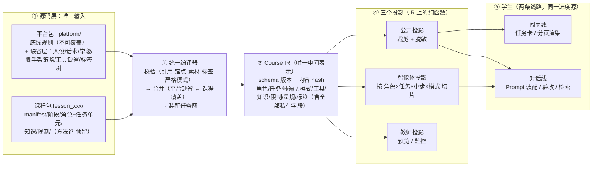

# 目标架构：两包 md 与课程渲染管线（已定稿）

> 文档性质：**已评审定稿 v1**（2026-08-06 评审：六项决策定案见 §7；运行层采用"语义理解优先"乙案，见 §8 与《图-回合语义理解-甲乙对比.png》）
> **落地进度（2026-08-07 晚）**：D1／D3／D4／D5／**D6** 已实现——任务单元就地格式定稿、5 门存量课迁移完成、`guidance/`＋`scaffolds/` 目录取消、语义理解优先已接入 `runTurn`、**平台缺省层六份 md 全部接入且 `mergeDefaults` 已实现（偏差① 关闭）**。
> **偏差③（IR 缺位）已部分关闭（M1 主体，2026-08-07 晚）**：编译产物收敛为唯一全量结构 `course.lesson`（带 `schemaVersion`／`courseVersion`／`contentVersion`），公开视图改为该结构上的**纯函数投影** `toPublic()`——构建期与运行期共用同一份裁剪清单，"双链路各自维护清单"结束。`前置` 已由 `通过后` 编译期转换而来（D2 落地），任务图装配完成。
> **智能体投影也已落地**：`toAgentContext`（`server/course/agent-context.js`）按 角色×任务×小步 切片，`buildAgentPrompt` 改为消费切片——§8 说的"Prompt 装配器从'到处凑材料'变成'消费一个切片'"成立了。等价性由 612 个场景的 Prompt 黄金档逐字节锁定。
> **仍未动**：`toTeacherView` 教师投影不存在，教师端仍是静态托管。任务图**有图无执行器**，推进仍是 `currentTaskIndex += 1`（那是 R3）。§8 图二第三段的 `composeReply` **仍不存在**——A4 只补了它的输入。
> 逐项状态见 [实施计划 §0.5](./问题清单-优先级与解决思路.md)。
> 回答的问题：图一（两类 md 如何变成学生看到的东西）的合理目标态是什么；对应的课程包 + 平台包 md 结构应该长什么样
> 评估立场：以"把底层架构修到合理水平"为基准评估现状，而非以现有代码为约束
> 实施计划：[问题清单-优先级与解决思路.md](./问题清单-优先级与解决思路.md)（v2，依据本稿重排）；主图：[图一目标态-两包md渲染管线.md](./图一目标态-两包md渲染管线.md)
> 日期：2026-08-06

---

## 1. 目标重述：四条架构承诺

你的意图翻译成可验收的架构承诺，后文一切设计都为兑现它们：

| # | 承诺 | 含义 |
|---|---|---|
| 承诺1 | **换课自由** | 新增/更换一门课 = 只交付一个课程包（md + assets 引用），零代码改动、零平台发版 |
| 承诺2 | **管线通用** | 图一的渲染管线对任何课程完全一致、逻辑清晰、可独立迭代 |
| 承诺3 | **智能体底层独立进化** | 图二（对话回合）、图三（进度推进）在编译产物之上迭代，不反向强迫 md 改结构 |
| 承诺4 | **双线路同源** | 对话模式与闯关模式消费同一份编译产物、同一份进度状态，只是遍历策略与呈现方式不同 |

**图一与图二/图三的关系**（呼应你的判断）：图一的产物定义了两个接口——①"智能体上下文切片"（图二的全部输入）与②"任务图 + 遍历模式"（图三的全部执行语义）。所以图一先定，图二、图三各自在接口内迭代。

---

## 2. 现状评估：骨架是对的，有三个结构性偏差

### 2.1 值得保留的骨架（不要动）

1. **内容即代码 + 两包分离**的思想本身；
2. **公开/私有双视图 + 多道防剧透**（构建裁剪、运行裁剪、流式拦截）；
3. **角色 → 任务 → 小步**三层 + 工具注册表（A01–A07 → 10 种稳定工具，课程只注入参数）；
4. **知识卡权限模型**（`roles` / `revealWhen` 门控）；
5. **服务端唯一权威**（进度只由 `state.updated` 推进）。

### 2.2 偏差①：平台包残缺——"系统 md"基本不存在　✅ 已关闭（M2，2026-08-07）

> 下表是 2026-08-06 评审时的现状。**六项已全部 md 化**，落点见右列；机制与验收见 [实施计划 §M2](./问题清单-优先级与解决思路.md)。

| 应属平台包的内容 | 评审时在哪 | 现在在哪 |
|---|---|---|
| 絮絮人设/性格/语气 | `platform-config.js` 常量 | `companion.md`（素材路径仍在 `platform-config.js`，浏览器构建期要用） |
| 学段表达规范（字数/句式） | `prompt.js` 的 `gradeDialoguePolicy()` | `language-levels.md`（顺带消掉了与 `gradeLimit()` 的两处重复） |
| 流程话术（入场/导航/求助/完成确认…） | `service.js` 的 `workflowResult()` 硬编码中文 | `voice.md`，61 个 key 与 `decision.intent` 一一对齐 |
| 脚手架 L0–L4 语义与升降策略 | `service.js` 散落（L0/L4 取不到） | `scaffolding.md`（L0–L4 取档已修；仍只升不降，见该文件说明） |
| 十种工具缺省参数/提示文案 | `tool-registry.js` | `tool-defaults.md`（中文正则匹配器留代码——它决定分支逻辑，不是文案） |
| 时长/提醒/推进方式等缺省值 | `lesson-parser.js` 硬编码 | `defaults.md`（当可选入参传进 `parseLesson`，服务端与浏览器包同源） |

**当时的后果**：课程作者改不动语气与话术；教研调整平台缺省要改代码发版；"换课程只需 md"在系统侧不成立。这是对承诺1 最大的违背。**现已解除。**

**目标**：平台包升级为一个完整的**缺省层（default layer）**——可以理解为"一门缺省课程"：课程包不写的一切都有平台缺省，课程包写了的按白名单覆盖。每份平台文件显式声明 `immutable`（三底线 + IP 锁定核）或 `overridable`。

### 2.3 偏差②：课程内容按"类型"分文件，消费却按"任务"切片——方向垂直

一个任务的完整定义目前散在 **5 个文件**：Step 在 `roles/`，引导在 `guidance/`，提示在 `scaffolds/`，量规在 `evaluation.md`，限制在 `restrictions.md`——靠任务序号和标签弱链接。这是"列式存储"，而运行时、作者和评审全都按"行"（任务）消费。

**后果**（之前 B3/A2/B4 都是它的症状）：序号错位静默装错；引用字段全是死标签；阅卷器只能整份灌；作者写一个任务要开 5 个文件、改一个任务要对 5 处。

**目标：聚合原则**——

> **任务独有的内容与任务定义同居；跨任务共享的内容集中存放，用稳定锚点引用。**

- 就地（写进任务单元）：Step 的引导话术、脚手架分级提示、验收标准/量规；
- 集中（保持现状）：知识卡（跨任务共享 ✓）、防剧透策略（全课策略 ✓）、课程级总量规、时间银行。

这不是"把引用修好"，而是**让大多数引用不需要存在**。引用机制只保留给真正共享的内容（知识、限制），且必须锚点化 + 编译期校验。

### 2.4 偏差③：编译无单一产物——IR 缺位　🟡 已部分关闭（M1 主体，2026-08-07）

目前"编译产物"是一堆相近而不相同的东西：构建期公开包、运行期私有对象、`tool.validation`、`pendingTools.payload.config`，两条链路各自解析、各自维护裁剪清单，且无版本概念。

**目标**：唯一编译器产出唯一 **Course IR**（中间表示）——一份结构化对象，带 schema 版本 + 内容 hash。所有消费者都是 IR 上的**纯函数投影**：公开投影（裁剪+脱敏）、智能体投影（按角色×任务×小步×模式切片）、教师投影（预览/监控）。

> md 是源码，IR 是目标码，投影是视图。三个概念三种职责，图一因此变成一条不分叉的主干。

**落地情况（2026-08-07）**：唯一产物与内容 hash 版本化已成立（`course.lesson` ＋ `schemaVersion`／`courseVersion`／`contentVersion`），公开投影 `toPublic()` 与智能体投影 `toAgentContext()` 都是 IR 上的纯函数，前者构建期与运行期共用。三投影已建成两个，`toTeacherView` 待建。

> **实施时发现的一个反直觉事实**：改造前服务端的 `course.publicLesson` 名叫"公开"却是**全量**结构（含 `keyData`／就地验收标准／能力标签／时间银行答案 `1142`），而这个误名是**载荷性的**——`answerTimeBank` 恰好依赖那些私有字段判分。所以正确做法是"改名 ＋ 补投影"，而不是"把它裁干净"；后者会静默弄坏时间银行。现有测试同时从两侧锁住：公开投影不得含这些字段，服务端全量结构**必须**仍含它们。

### 2.5 冗余与边界澄清清单

| 项 | 判定 | 处理 |
|---|---|---|
| `objectives.md` | 死文件 | 重定义为学科知识 DK-\* / 学科能力 DS-\* 两棵树的载体（标签体系课程侧） |
| `guidance/*.md`、`scaffolds/*.md` | 内容有价值、结构错位 | 取消独立文件，内容并入任务单元（偏差②） |
| `prompts/phaseN-*.md` vs guidance | 职责重叠模糊 | 澄清分工：**阶段提示词 = 阶段氛围/纪律/全班节奏**（课程级）；**教学策略 = 任务级就地内容**。两者不再互相兜底 |
| `evaluation.md` | 粒度错位 | 瘦身为课程级/跨任务量规；Step 级验收标准就地 |
| `course.md` 人设侧重字段 | ~~写了不生效~~ **原本从未存在**（SPEC 没有、5 门课没写、JS 零读者），本稿早先的判断有误 | ✅ 已建成通路（M2-3）：`companion.md` 定义锁定核＋可调侧面，SPEC 加字段、`compiler.js` 解析、`prompt.js` 注入。刻意绕开 `parseLesson`，不进浏览器公开包 |
| `restrictions.md`、`knowledge/`、`time-bank.md` | 结构合理 | 保持集中 |
| `README.md`、`assets-checklist.md` | 人读文件 | 保留，spec 显式标注"不参与编译" |

---

## 3. 图一的目标态



**四个形容词如何被结构保证：**

| 要求 | 保证机制 |
|---|---|
| 通用 | 管线零课程特判；换课 = 换课程包（承诺1）；平台缺省吃掉所有"课程没写"的情况 |
| 易操作 | 作者写一个任务只开一个文件；一条 `lint:lesson` 命令输出 file:line 级错误；素材/引用/标签编译期全校验 |
| 逻辑清晰 | 源码 → 编译 → IR → 投影 → 视图，五段单向流；任何数据只有一个权威来源 |
| 易于迭代 | 图二/图三只依赖 IR 接口，md 结构演进被编译器吸收；IR schema 版本化，新旧课程可共存过渡 |

**与现状的对照**：现状的"双链路编译"其实已经是两个投影的雏形，只是它们各自从 md 独立解析、独立维护清单；现状的 `_platform` 接入（platform-rules.js）已经是平台包编译的第一块，方向正确，只是平台包内容残缺。**目标态不是推倒重来，是把已有的骨架补完并收敛**。

---

## 4. 目标态的两包 md 结构

### 4.1 平台包（系统 md）：一门"缺省课程"

```text
_platform/
├── rules/                       [immutable] 三底线，现有内容平移
│   ├── safety-rules.md
│   ├── pedagogy-rules.md
│   └── privacy-rules.md
├── companion.md                 [核心锁定+侧面可覆盖] 絮絮人设：名字/底色锁定；
│                                语气侧重、口头禅等留课程覆盖位   ← 现 platform-config.js
├── voice.md                     [overridable] 流程话术模板：入场/导航/到达确认/
│                                验收反馈/求助/任务完成…，带 {占位符}  ← 现 workflowResult 硬编码
├── language-levels.md           [overridable] 学段表达规范（字数/句式/提问方式）
│                                                              ← 现 gradeDialoguePolicy 硬编码
├── scaffolding.md               [overridable] L0–L4 语义定义 + 升降策略
│                                                              ← 现 service.js 散落逻辑
├── tool-defaults.md             [overridable] 十种活动工具的缺省参数与提示文案
│                                                              ← 现 tool-registry.js 部分
├── defaults.md                  [overridable] 时长/无操作提醒/提醒冷却/推进方式等缺省值
│                                                              ← 现 lesson-parser.js 硬编码
├── competency-framework.md      [平台标签树] 核心能力 CC-* / 综合素质 CQ-*（draft 可迭代）
└── README.md                    平台包说明 + 覆盖规则声明
```

**判断标准**：教研/内容团队可能想调的 → 进 md；纯工程参数（超时、重试、池大小）→ 留代码。
**编译行为**：平台包先编译为 Platform IR（带版本，现有 SHA-256 机制推广），课程 IR 记录其引用的平台版本——课程行为可完整回放。

### 4.2 课程包：作者视角"一个任务一个地方"

```text
lesson_xxx/
├── course.md            manifest：基本信息/核心问题/角色体系/学习视图/
│                        推进模式(新,缺省sequential)/人设侧重(真正生效)/视觉素材
├── phases.md            全班时间轴：阶段时长/地点/触发/结束（保留现状）
├── objectives.md        [重定义] 学科知识 DK-* / 学科能力 DS-* 两棵树
├── roles/<role>.md      角色元数据 + 任务单元（见下）
├── knowledge/*.md       共享知识卡（保持集中，权限模型不变）
├── restrictions.md      课程级防剧透策略（保持集中）
├── evaluation.md        [瘦身] 仅课程级/跨任务量规
├── methodology.md       [模式3预留，可选] 方法论/探究地图：问题域、思路框架、资源索引
├── time-bank.md         保持
├── assets/              保持
├── README.md            人读（标注不参与编译）
└── assets-checklist.md  人读（标注不参与编译）
```

**任务单元**（聚合后的核心形态，取代 guidance/ + scaffolds/ + evaluation 的 Step 部分）：

```md
### 任务1：观其形
- id：observe-shape
- 前置：            ← 新字段：空=承接上一任务；可写多个任务 id（支持模式2）
- 能力标签：CC-1.2, DK-03        ← A1 预留，四棵树前缀
- …（现有任务字段不变）

#### Step 1：拍摄螭首正面全景
- id：photo-front
- 完成方式：ai_evaluation
- 功能模块：A01(拍照)
- 工具参数：{"photo":{"minCount":1}}
- 能力标签：DS-02
- …（现有 Step 字段不变）

##### 引导                       ← 原 guidance/<role>.md 对应段，就地
学生不知道往哪看时，先指向屋檐排水兽的方向…

##### 脚手架                     ← 原 scaffolds/<role>.md 对应行，就地
| L1 | "你注意到台基边缘有什么突出来的东西吗？" |
| L2 | … |

##### 验收标准                   ← 原 evaluation.md#S-x 对应量规，就地
照片包含完整螭首正面；能看清吻部开孔…
```

**收益**：作者写/改一个任务只碰一个文件；序号配对问题（B3）从结构上消失；阅卷器按 Step 拿到自己的量规（B4）零引用解析；引用机制只剩 `知识引用`/`限制引用` 两种，全部锚点化+编译校验。

**代价与对策**：`roles/<role>.md` 会变长（约 500–700 行/角色）。若嫌长可选目录制 `roles/<role>/task-N.md`（开放决策 D1）。5 门存量课程可**脚本机械迁移**（现有 `taskSection` 已能按任务切段，自动把三类内容并入对应位置，人工抽查）。

---

## 5. 三种任务模式的容纳设计（专项延后，数据模型现在定）

你的三种模式，架构上的表达是**把"数据"与"策略"分开**：

| 概念 | 是什么 | 在哪声明 |
|---|---|---|
| **任务图**（数据） | 任务节点 + `前置` 依赖关系 | 课程包任务单元的 `前置` 字段；缺省空 = 链式（承接上一任务） |
| **遍历模式**（策略） | `sequential / open / inquiry` | `course.md` 的 `推进模式`（可按 Phase 覆盖）；缺省 sequential |

- **模式1（良好定义、按顺序）**= 链式依赖 + sequential 遍历 → 即现状，5 门课零迁移；
- **模式2（良好定义、自由探索）**= 弱依赖/无依赖 + open 遍历：学生可在多个"可进入"任务间自选，完成态由依赖解锁；
- **模式3（无任务定义、方法论引导）**= 无任务图（或仅里程碑）+ inquiry 遍历：智能体由 `methodology.md` 驱动（问题域/思路框架/资源索引），这是 Tutor Policy 的专属输入，闯关渲染器不消费它。

**两条重要的复杂度控制决策**：

1. **无序只发生在任务层，小步层保持线性**——Step 是微流程（观察→记录→检查），线性是合理约束，也让验收器保持简单；
2. **闯关线声明只支持 sequential（或带锁的 open）；对话线支持全部三种**——这正是"模式 2/3 是智能对话精髓"的架构表达：两条线消费同一任务图，闯关是它的线性投影，对话是它的自由遍历。

**本期只做三件预留（改动极小）**：spec 写入 `前置` 与 `推进模式` 可选字段；IR 中任务集合按图存储（链式即特例）；执行器本期只实现 sequential。专项启动时数据模型已就位。

---

## 6. 迁移路径（双轨道，可并行）

原问题清单 A1–A6 不作废，**重新挂到目标态的实施阶段里**。两条轨道并行推进，交叉依赖只有两处（R3←M1、R4←M2）：

```text
轨道一 · 内容与编译（决定 md 怎么写，规范先行——课程团队每天在产内容）
  M0  SPEC v2 定稿：两包目标结构 / 聚合原则 / 锚点规范 / 标签字段(A1)
      / 前置＋推进模式字段 / 覆盖白名单 / 字段↔消费点对照表(B6)
  M1  编译器改造：统一编译器 → Course IR → 三投影
      吸收：A5 投影单一化、A6 内容版本、B3 序号校验、B8 严格模式
      兼容：双格式期——旧布局照常编译并告警
  M2  平台缺省层落地：companion/voice/language-levels/scaffolding/
      tool-defaults/defaults 逐个 md 化 ＋ mergeDefaults
      吸收：B1 set_scaffold 修链、B2 L0–L4 映射（随 scaffolding.md 一起定）
  M3  存量内容迁移：脚本机械迁移 5 门课 → 严格模式验收 → 关闭双格式期

轨道二 · 运行时智能体（与轨道一并行启动）
  R1  语义理解优先（乙案）落地——最先做，解决"你好/不知道从哪开始→循环"类线上硬伤
      routeInput 分流 / understandTurn 必经 / tutorPolicy 防复读 / 闲聊自然回应 / 降级链
  R2  五层拆分（机械重构，行为不变）：回合理解/教学决策/回应生成/状态执行/事件持久化
  R3  图执行器 advanceProgress（依赖 M1 的任务图 IR），失败处理/教师介入字段接活
  R4  流程话术接 voice.md 模板（依赖 M2），写死中文清零

收尾
  X1  模式2/3 专项（依赖 M1＋R3）：open/inquiry 遍历 ＋ methodology 驱动的教学策略
  X2  卫生清理（随时）：死代码/残留产物/文档同步/门禁测试
```

与原"三批"的关系：原第一批的 A1/A5/A6 并入 M0–M1；原第二批 A2/B3/B4/B6 大部分被聚合原则**结构性消灭**（不再是"修引用"而是"不需要引用"）；原第三批拆进轨道二，且**语义理解（原 A3-2）从末位提到 R1 首位**——它治的是当前线上体验硬伤，且不依赖内容重构。各阶段的验收标准（DoD）见实施计划。

---

## 7. 决策记录（2026-08-06 定案）

| # | 决策 | 定案 | 落地 |
|---|---|---|---|
| D1 | 任务单元文件粒度 | **内联在 `roles/<role>.md`**（角色是作者的自然工作单位，单文件约 500–700 行；特大课程再议目录制） | ✅ 5 门课已迁移 |
| D2 | 进度语义的权威字段 | **`前置`（入边）为权威**——同时表达顺序与解锁，天然支持模式2；`通过后` 保留为线性课程的语法糖，编译期转换为前置关系 | 🟡 **编译期转换已实现**（M1-A2，`server/course/task-graph.js`）：87 个任务节点、29 个终止节点、零告警；显式 `前置` 优先于语法糖推导。**仍无运行时读者**——推进仍是 `currentTaskIndex += 1`，换成读图是 R3 |
| D3 | 就地/集中的边界 | **就地**：引导、脚手架、Step 验收标准；**集中**：知识、限制、课程级量规、时间银行 | ✅ 含 B4 根治 |
| D4 | 平台覆盖白名单 | **不可覆盖**：三底线、絮絮名字/底色；**可覆盖**：语气侧面、话术模板、学段规范、工具缺省、时长缺省 | ✅ 已实现（M2，2026-08-07）：六份缺省层 md ＋ `mergeDefaults` ＋ 声明块（`overridable`/`merge`/`course-field`/`locked`）；被拦下的覆盖产出 warning 不静默丢弃 |
| D5 | 迁移节奏 | **脚本一次迁完 5 门课＋人工抽查**，短双格式兼容期，验收后关闭 | ✅ 已迁完；兼容期开启中（回退分支有测试锁定） |
| D6 | 运行层语义判断（新增） | **"语义理解优先"（乙案）**：一切语言输入必经轻量 LLM 语义理解，规则只处理非语言输入与状态机；进度判定保持确定性。分界线是"语言/非语言"，不是"高置信/低置信"。对比图：《图-回合语义理解-甲乙对比.png》 | ✅ 已接入 `runTurn`（R1，2026-08-07）：`deterministicLanguageDecision` → `understandTurn` → `decideTutorAction` 三段；`classifyTurn` 自由文字分支已删；情绪枚举已统一；`anti-loop.test.js` 6 例锁定（其中 4 例在接线前会失败） |

如需推翻任何一条，在 M0（SPEC v2 定稿）结束前提出，之后变更按新一轮评审走。

---

## 8. 附：目标态下图二/图三的接口（含 D6 乙案）

**图二（对话回合）拆成"理解 → 决策 → 生成"三段，只有首尾两段碰模型：**

1. **理解**（轻量 LLM，语言输入必经）：`understandTurn(text, contextSlice)` → 结构化 JSON `{ 意图, 情绪, 是否在答待答问题, 想要什么, 置信度 }`。由现有"回合理解器"（待答问题时的 jsonMode 调用）升级而来；zod 校验＋重试一次＋保守缺省（先接住这句话＋温和追问）的降级链，**绝不回落会循环的正则分支**。非语言输入（工具结果、位置、心跳、带问题ID按钮）不经过此步。
2. **决策**（确定性代码）：`tutorPolicy(理解结果, 任务状态, 待答问题, 脚手架等级, 提醒历史)` → 教学动作。能看到历史，同样的求助第二次来会换策略而不是复读。
3. **生成**：`composeReply(教学动作, getAgentContext(roleId, taskId, stepId, mode))`——闲聊寒暄由轻量模型直接自然生成（可与理解合并为一跳）；课程相关走 检索＋主模型；流程性事实取 voice.md 模板。全部输出过 findSpoiler。

`getAgentContext` 切片内容：人设（平台＋课程侧面）、话术模板、当前任务单元（含就地引导/脚手架/验收标准）、知识检索范围、限制片段、学段规范。Prompt 装配器从"到处凑材料"变成"消费一个切片"。

**图三（进度推进）的执行语义** = IR 任务图 ＋ 遍历模式 ＋ Step 内线性推进 ＋ 完成方式验收。执行器是图上的游标，`sequential` 只是最简单的遍历策略。**进度判定不经过任何 LLM。**

这两个接口一旦立住，图二图三的迭代（教学决策深化、模式2/3、学生模型）都不再触碰 md 与编译层。
