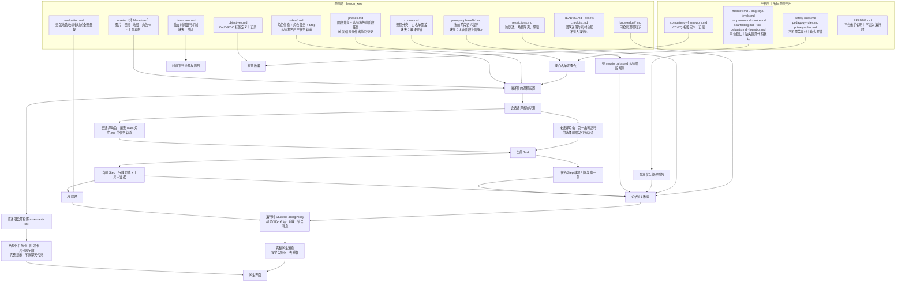
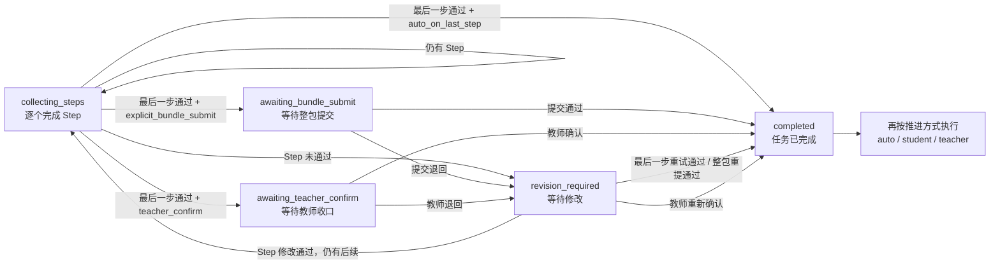

# 课程提交规范（学生端与智能体运行字段）

> 版本：**v2.1**（2026-08-11 系统说明更新）｜依据：2026-08-06 目标架构评审的 D1–D5 决策，以及 2026-08-11 对运行时权威顺序、任务三轴和支持边界的复核
> 系统侧总纲：[技术逻辑总纲](../TECHNICAL-LOGIC.md)
> 关联规范：[`../4-stu-learning/docs/dialogue-runtime-protocol.md`](../4-stu-learning/docs/dialogue-runtime-protocol.md) 定义角色阶段、小步、位置、完成方式、证据、工具与对话状态的正式运行契约。

## v2 相对 v1 的五项变化

| # | 变化 | 影响 |
|---|---|---|
| 1 | **任务单元聚合**（D1/D3）：引导、脚手架、验收标准写进 `roles/<role>.md` 的任务与 Step 内部，`guidance/`、`scaffolds/` 两个目录取消 | 作者写一个任务只开一个文件；`引导引用`、`脚手架引用`、`评估引用` 三类跨文件引用不再需要 |
| 2 | **能力标签**：任务与 Step 可写 `能力标签`，四棵树前缀 CC/CQ/DK/DS | 当前为**记录**：不进浏览器、不进 Prompt、无 UI、无计算（见 §8） |
| 3 | **任务图**：任务可写 `前置`；`course.md` 可写 `遍历模式` | 角色任务的 `前置`已进入运行时门禁；运行时当前固定按任务图顺序推进，`遍历模式` 字段仅记录，`open`/`inquiry`还会收到 lint warning（见 §9） |
| 4 | **双格式兼容期**：旧布局（独立 guidance/scaffolds 目录）继续编译 | 迁移完成后关闭；同一课程不要混用两种布局 |
| 5 | **非角色任务**：不属于任何角色的集体／小组／个人任务写成 `phases.md` 的 `### 阶段任务N` | 选择角色前的阶段任务**生效**；选择角色后的全班／小组共享轨道当前**不支持**（见 §0.3、§4.1） |

每门课程使用独立目录 `lesson_xxx/`。课程团队提交 Markdown 与 `assets/`，平台负责解析、编译、对话调度、工具渲染、结果校验和学习状态推进。

课程团队负责课程名称、阶段、角色、任务、小步、知识、引导、限制、评估、工具参数和素材。平台代码提供统一 IP、对话引擎、位置、时间、师生通信、活动工具组件和安全规则。课程文件不得依赖角色名称触发前端逻辑。

## 阅读入口：课程元素、权威顺序、文件位置与缺失行为

这一节回答四个问题：**学生做什么写在哪里、絮絮怎样说由谁规定、任务怎样完成和推进、某份配置缺失时系统会怎样。** 后续章节再给字段语法。

### 状态图例

本文只使用下面五种运行状态，避免把“已解析”误写成“已实现”：

| 状态 | 精确定义 |
|---|---|
| **生效** | 字段已被运行时代码消费，会改变学生界面、对话、验收或进度。 |
| **记录** | 字段会被解析、保存，或仅用于 lint、离线分析与人工维护；当前不改变课堂行为。 |
| **兼容** | 旧格式仍可运行，但只用于迁移过渡；新课程不要继续采用。 |
| **不支持** | 当前没有对应运行路径，写入后不能依赖它产生预期行为。 |
| **报错** | 缺失或非法会导致编译失败，或被发布 lint 以 error 拦截。 |

“warning”是迁移或质量提醒，可与“生效、记录、兼容”同时出现；它不等于运行语义。

### 权威顺序：谁能覆盖谁

从上到下读取，越靠上的边界优先级越高；下层只能在上层允许的范围内补充或逐键覆盖：

1. `_platform/safety-rules.md`、`pedagogy-rules.md`、`privacy-rules.md`：不可覆盖的安全、教学与隐私底线。
2. `_platform/` 其他默认文件：全平台人设、话术、学段、脚手架、工具、数值和组织信息默认。
3. `course.md`：仅通过白名单章节覆盖整门课的默认值；没写对应章节就完整继承平台值。
4. `prompts/phaseN-*.md`：当前 Phase 的阶段目标、工作方式、禁止行为和转场条件。
5. 当前任务与 Step：`roles/*.md` 或 `phases.md` 中就地写的行动、工具、引导、脚手架和验收。
6. 当前会话状态：`phaseId → roleId → currentTaskIndex → guidanceStepIndex → (taskId, stepId, helpType) 脚手架档位`只选择本轮该取哪一片内容，不改写课程规则。
7. 学生可见边界分两条：动态对话、固定对话、AI 验收反馈和可见错误消息在运行时经过`StudentFacingPolicy`；结构化任务卡、阶段卡和工具可见字段在编译期经过公开投影与 semantic lint。前者执行防剧透、安全、按学段完整分泡和去重复；后者执行私有字段裁剪、防剧透和危险内容检查，按卡片结构完整显示，不拆成聊天气泡，也不用运行时硬截断代替作者修订。

因此，任务里的 `##### 脚手架`可以提供某一步的具体提示，不能把 L4 改成直接公布答案；Phase 提示也不能关闭平台安全规则。

### 所有 Markdown 影响关系总图



### 每份 Markdown 的职责与缺失行为

| 文件 | 权威内容／真实消费点 | 没有或没写时怎样 | 状态 |
|---|---|---|---|
| `_platform/safety-rules.md` | 全程安全边界，进入主对话与 AI 验收规则包 | 缺失或为空时课程编译失败 | **生效／报错** |
| `_platform/pedagogy-rules.md` | 教学底线、引导边界与来源要求 | 缺失或为空时课程编译失败 | **生效／报错** |
| `_platform/privacy-rules.md` | 未成年人隐私与数据边界 | 缺失或为空时课程编译失败 | **生效／报错** |
| `_platform/defaults.md` | 时长、提醒、最大尝试、任务推进方式等默认 | 缺文件或缺键时回落代码默认 | **生效** |
| `_platform/language-levels.md` | 四学段的目标字数、单气泡硬上限、句式 | 缺文件或缺键时回落代码默认 | **生效** |
| `_platform/companion.md` | 絮絮基础人设；名字与素材锁定 | 缺文件时回落代码默认；课程只可调白名单侧面 | **生效** |
| `_platform/voice.md` | 入场、导航、求助、完成、错误修复等固定流程话术 | 缺文件或缺键时回落代码默认 | **生效** |
| `_platform/scaffolding.md` | 最高档、是否重复求助升档、兜底提示与 L0–L4 帮助深度语义 | 缺文件或缺键时回落代码默认 | 参数与 L0–L4 语义均**生效**；语义只控制模型帮助深度，不会逐字念给学生 |
| `_platform/tool-defaults.md` | 活动工具显示名与默认字段标签 | 缺文件或缺键时回落代码默认 | **生效** |
| `_platform/logistics.md` | 时长、场地、厕所等组织信息问题的回答边界和默认话术 | 缺文件时回落代码内组织信息规则 | **生效** |
| `_platform/competency-framework.md` | CC/CQ 平台标签树 | 不改变本轮对话、界面或评价 | **记录** |
| `_platform/README.md` | 平台包维护说明 | 不影响课堂 | **记录** |
| `course.md` | 课程基本信息、角色选择体系、学习视图、视觉素材、平台默认的白名单覆盖，以及已登记的教研说明 | 整份缺失则编译失败；某个可选覆盖章节缺失则继承平台默认；教研说明缺失不影响运行 | 运行配置**生效／报错**；教研说明**记录** |
| `phases.md` | Phase 名称、时长、模式、地点；`### 阶段任务N` | 没写阶段任务就没有正式非角色任务；`### 流程`不会自动变任务 | 展示与选择角色前任务**生效**；触发／结束为**记录**；角色后共享轨道**不支持** |
| `roles/*.md` | 角色基本信息、角色任务、Step、就地引导／脚手架／验收 | 某角色没写某任务就没有该任务；角色必填信息缺失时报错 | **生效／报错** |
| `prompts/phaseN-*.md` | 当前阶段的语义规则 | 缺失时保留平台与任务规则，但没有该阶段专属规则 | **生效**；旧全文格式为**兼容** |
| `knowledge/*.md` | 可检索课程知识；`知识引用`提供定向权重 | 缺失时不提供本课知识条目，不能靠模型常识补成课程事实 | **生效** |
| `restrictions.md` | 防剧透、角色隔离、保护词与解锁条件 | 缺失时仍有平台底线，但没有本课保护清单 | **生效** |
| `evaluation.md` | Step 和任务都没写就地验收标准时的全课通用量规 | 缺失时 AI 只能依据证据要求、工具结果和平台规则判断 | **生效** |
| `time-bank.md` | 时间银行开关、题目、答案、奖励与赠时规则 | 缺失时机制关闭；不影响角色任务推进 | **生效** |
| `objectives.md` | DK/DS/DC 课程标签定义与教研说明 | 不进入浏览器、Prompt 或实时评价 | **记录** |
| `README.md`、`assets-checklist.md` | 课程团队维护手册、素材来源与授权台账 | 不影响课堂；不能代替文件存在性 lint | **记录** |
| `guidance/*.md`、`scaffolds/*.md` | v1 独立引导和脚手架 | 仅在任务没有 v2 就地内容时回落读取 | **兼容** |
| `assets/`（非 Markdown） | 课程视觉、音视频、地图、角色与工具素材 | 路径写错或文件缺失时 lint 报错，界面也无法加载资源 | **生效／报错** |

编译器会把课程目录内的全部 Markdown 纳入`courseVersion`内容指纹。因此，`README.md`、`assets-checklist.md`或`objectives.md`虽不改变本轮课堂行为，修改它们仍会更新课程版本并使缓存失效；留痕可以据此辨认当时使用的完整课程包。

### 学生任务写在哪里、谁完成

| 活动 | 写在哪里 | 当前实际完成范围 | 缺失时怎样 | 状态 |
|---|---|---|---|---|
| 某角色专属任务 | `roles/<role>.md / ### 任务N` | 每个选择该角色的学生会话各自完成 | 不会从其他角色或 Phase 自动补 | **生效** |
| 角色任务的小步 | 任务下的 `#### Step N` | 当前会话按数组顺序逐步完成 | 无显式 Step 时会从`引导步骤`或任务要求合成 `user_confirm` 小步 | **生效**；合成小步为**兼容** |
| 同角色多人的短协作 | 仍写 `roles/<role>.md`，用 A05 等工具表达协作 | A05 工具操作**生效**；当前进度仍按学生会话保存，同角色多人结果自动聚合**不支持** | 没配协作工具就不会自动产生协作 | **生效／不支持** |
| 选择角色前的阶段任务 | `phases.md / ### 阶段任务N` | 系统从开场到角色任务阶段（含该 Phase）寻找第一条含任务的 Phase，给每个学生会话各自执行 | 没写就直接进入角色选择流程；`### 流程`只作说明 | **生效** |
| `执行单位：全班` | 阶段任务字段 | 当前只是意图标签；每个会话仍各做一份 | 省略时解析默认值为`全班` | **记录**（多人聚合**不支持**） |
| `执行单位：小组` | 阶段任务字段 | 当前只是意图标签；没有“每组共一份”的共享状态 | 不会自动建小组提交 | **记录**（小组聚合**不支持**） |
| `执行单位：个人` | 阶段任务字段 | 在当前生效的选择角色前轨道中按每个学生会话完成，与现有状态模型一致 | 没写时不会自动推断为个人 | **生效**（限选择角色前轨道） |
| 选择角色后的全班／小组阶段任务 | 理论上仍写 `phases.md / ### 阶段任务N` | 当前学生端不会切入这条共享任务轨道 | 即使写了，也不能依赖它在角色任务之后出现 | **不支持** |
| 教师授课流程 | `phases.md / ### 流程` | 只保存为教师组织说明 | 不产生任务卡、验收或进度 | **记录** |

`执行单位`写成`全组`等未知值时，解析层会回落为`全班`并给`bad_phase_task_executor` warning；发布 lint 同时直接检查课程原文并报 error，避免归一化后丢失原非法值。回落只保证解析过程能给出完整诊断，错误配置不能上线。

### 絮絮提示词与脚手架写在哪里

| 要控制的内容 | 写在哪里 | 优先级／缺失行为 | 状态 |
|---|---|---|---|
| 安全、教学、隐私底线 | 三份 `_platform/*-rules.md` | 最高优先级，课程与学生都不能覆盖 | **生效／报错** |
| 基础人设与流程固定话术 | `_platform/companion.md`、`voice.md` | `course.md / ## 人设侧重`、`## 话术覆盖`可逐键覆盖白名单；没写就继承 | **生效** |
| 学段表达 | `_platform/language-levels.md` → `course.md / ## 学段规范` | 当前学生学段选择对应一档；长回复按句拆成多条，不截断内容 | **生效** |
| 当前 Phase 怎么工作 | `prompts/phaseN-*.md` | 按`session.phaseId`选择；推荐结构见 §4；没文件则无阶段专属提示 | **生效／兼容** |
| 当前任务或 Step 的引导策略 | Step `##### 引导` → 任务 `##### 引导` → 任务`AI引导方向` | 只取最具体的一层，不叠加；都缺失时只剩任务行动和通用规则 | **生效** |
| 脚手架最高档、重复求助升档、兜底提示 | `_platform/scaffolding.md` → `course.md / ## 脚手架` | `course.md`整节可选；`lesson_gewu_001`未写即完整继承平台参数 | **生效** |
| L0–L4 平台语义说明文本 | 同上 | 当前档位语义进入 Prompt，控制“给多少帮助”；它不替代任务／Step 的具体提示，也不会作为固定话术直接展示 | **生效** |
| 当前任务／小步的具体分档话术 | Step `##### 脚手架` → 任务 `##### 脚手架` | 缺当前档时向下找最近档；整表缺失再找引导示例、学生行动、课程／平台兜底 | **生效** |
| 组织信息问题 | `_platform/logistics.md` → `course.md / ## 组织信息` | 课程只补有依据的信息；没写的设施位置不得猜 | **生效** |
| 可说的课程知识 | `knowledge/*.md` + `知识引用` | 先按问题检索；任务引用用于定向，不能越过揭示时机 | **生效** |
| 不能说的课程内容 | `restrictions.md` + `限制引用` | 当前 Step 只注入精确命中的最小限制片段；lint、运行时和评测共用同一 canonical matcher，把阿拉伯／中文数字、万／亿量级、百分比、`m³`／立方米等写法归一，并拦截高置信等价结论；不对开放语义做模糊猜测 | **生效** |

脚手架升档按`(taskId, stepId, helpType)`分别保存。学生在某一步重复问“怎么开始”，只提升该小步的任务求助档位；进入新 Step、切换任务或改问另一类问题时不会沿用旧档。教师可覆盖当前小步档位，旧会话里只有全局`scaffoldLevel`的数据会在第一次进入上下文时兼容迁移一次。

上述文件都只提供“候选内容”。动态对话（主模型回复）、固定对话（平台／课程话术）、AI 验收反馈和可见错误消息，必须在完整生成后经过运行时`StudentFacingPolicy`，再写入会话和下发界面。策略统一执行防剧透、拦截不安全行动、按当前学段生成一条或多条完整消息和去重复；以对话呈现时按完整句子分泡，不能在句中硬截断后展示残句。

结构化任务卡、阶段卡和工具可见字段走另一条边界：编译器先生成公开投影，裁掉答案、评分和内部引导等私有字段，再由 semantic lint 检查保护答案、危险行动以及嵌套可见字段。结构化内容按原卡片字段完整显示，不拆成聊天气泡，运行时也不硬截断。当前只有 Phase Prompt 配置了 2000 字的作者审阅 warning；任务卡和工具字段尚无通用字数门禁，需由作者保持简洁，并在真实浏览器旅程中验收可读性。

成功、被拒绝和异常失败的回合都会记录同一结构的最小 trace：课程内容版本、平台规则版本、Prompt 版本、决策来源、输出路径、策略动作、错误码和前后状态摘要。留痕只存长度、哈希、枚举和最小状态，不保存学生原话、完整 Prompt、模型原文或现场坐标。

每个回合在下发前生成一个`TurnPlan`，并将同一份摘要放入末尾`state.updated`与最小 trace。摘要固定记录`primaryAction`、`nextAction`、`tool`、`quickReplies`、`safetyAction`、`stateChanges`、`source`、`rhythm`、`visibleCount`和`issues`；`stateChanges`只列服务端已实际提交的权威状态变化，`source`记录服务端核准的内容来源模式、标签与引用数量，前端不得自行猜测或改写这两项，也不得再推断另一套主操作或事件顺序。一个回合最多保留一个主要操作：安全求助优先于导航，导航优先于任务工具；有工具时快捷回复让位，避免同时要求学生点两个入口。可见事件保留“阶段卡 → 絮絮提示”的语义顺序，工具卡统一放在提示之后；后续普通消息间隔约 900ms，工具卡在前一条提示后等待 2000ms，再逐条展示。最后一条阶段完成提示保留约 2400ms 的阅读时间后才切换页面。

SSE 幂等重放使用带版本的 replay envelope，绑定请求摘要、课程内容版本、策略／trace／`TurnPlan`版本、已核准事件序列、末尾`state.updated`和权威会话状态。envelope 缺失、旧版、结构非法、摘要或版本不匹配、终态与当前权威状态不一致时一律 fail closed：不得重播其中缓存的学生可见文本，只能下发当前权威恢复状态以及仍待处理且重新净化过的工具；不能用残缺事件拼出回复或再次执行同一状态变更。

主动提醒还会读取客户端 busy 状态。媒体播放、相机或文件选择、录音、上传／处理、AI 验收和导航期间不发送 nudge；这些状态解除后重新按任务自己的`无操作提醒／提醒冷却／最大主动提醒`判断。

L4 仍属于“帮助学生自己验证”的提示档。可以把关键线索说得很具体、给验证动作、缩小选择范围；不得直接宣布正确答案、保护词、隐藏数值或完整推理结论。

### 完成、收口、推进是三条轴

```text
Step 完成方式：这一小步凭什么通过
  → 任务收口方式：最后一步通过后，任务何时算正式完成
  → 任务推进方式：任务完成后，由谁进入下一任务
```

- `完成方式`写在 Step，决定走学生确认、工具、AI、教师、位置或组合验收。
- `收口方式`写在任务，正式枚举为`auto_on_last_step`、`explicit_bundle_submit`、`teacher_confirm`；详见 §3.7。三种模式均已接通运行时，未写时默认`auto_on_last_step`。
- `推进方式`写在任务，决定已经完成的任务是自动推进、学生点“继续”还是等待教师推进。

AI 验收只取当前小步最相关的一份标准：

```text
Step 的 ##### 验收标准
  → 没写：任务的 ##### 验收标准
  → 没写：evaluation.md 的全课通用量规
  → 也没写：证据要求 + 工具结果 + 平台规则
```

任务推进方式的缺省链：

```text
任务字段「推进方式」
  → 没写：course.md / ## 数值默认
  → 没写：_platform/defaults.md
  → 仍没有：代码默认 auto_after_validation
```

### `lesson_gewu_001` 对照实例

1. `phases.md` 的 Phase 1 有两项正式阶段任务：“查看暴雨将至情境图”标`全班`，“写下最初猜想”标`个人`。当前两项都由每个学生会话各自完成；“全班”还没有整班共享完成记录。
2. `roles/*.md` 有六个角色，每个角色三个正式角色任务，共十八个；选择角色后，每个学生进入自己角色的任务轨道。
3. Phase 3 的“六角色发现拼合”和 Phase 4 的“沙盘推演”若只写在`### 流程`，它们只是教师组织说明。即使改写为阶段任务，角色选择后的共享阶段轨道目前也**不支持**。
4. `course.md` 没有`## 脚手架`是正确配置：整课沿用`_platform/scaffolding.md`的 L0–L4 语义、最高档、升档和兜底提示；六个角色文件里的`##### 脚手架`负责各任务的具体话术。两者分层明确，不存在不匹配。

放置原则：**只服务当前任务的内容就地写进任务或 Step；跨任务共享的知识、限制和量规放独立 Markdown；整门课确实需要偏离平台默认时才在 `course.md` 写白名单覆盖。课程叙事、选题池、成果设计和史料边界可以作为已登记的“教研说明”保留在 `course.md` 总览，但不会因此自动进入运行时。**

## 0. 课程元素层级

先看清四层的关系，再看后面的字段表。**这一节只描述当前平台的实际行为**；尚未实现的设计在 §0.3 明确列出。

### 0.1 四层与它们的归属文件

```
课程 lesson_xxx/
│
├─ Phase 阶段         phases.md ＋ prompts/phaseN-*.md
│    时间轴上的一段。管倒计时、顶栏显示、絮絮这一段的说话方式。
│    可持有不属于任何角色的「阶段任务」。
│
├─ 角色 Role          roles/<role>.md（一个文件 = 一个角色）
│    一个学生在这门课里的身份。学生一次只领一个。
│    选择角色后，角色任务仍挂在这里。
│
├─ 任务 Task          roles/<role>.md 里的 ### 任务N
│    该角色的一件大事。也叫"角色阶段"——见下面的同义词说明。
│
└─ Step 小步          ### 任务N 下面的 #### Step N
     学生此刻只做的一件事。验收、工具、位置、证据都落在这一层。
```

**`### 任务N` 与 `### 角色阶段N` 是同一个东西**，两个标题写法平台都接受，解析结果完全一致（内部 `roleStageId === task.id`，五门课 87/87 全等）。不要理解成两层。新课程统一写 `### 任务N`。

### 0.2 Phase 与任务是什么关系

这是最容易误解的一处，说清楚：

| | Phase | 任务 |
|---|---|---|
| 是什么 | 时间轴上的一段 | 一件要做完的事 |
| 谁推进 | **教师或明确的客户端阶段指令**；倒计时只显示，不自动转场 | **学生完成与收口后**，再按任务的`推进方式`决定自动／学生／教师推进 |
| 写在哪 | `phases.md` | `roles/<role>.md` |
| 平台读它做什么 | 顶栏名称、倒计时、`prompts/phaseN-*.md` 那份阶段提示词进 System Prompt | 任务卡、小步、工具、验收、进度 |

两者是**并行的两条线**。学生会话里各存一个游标：`phaseId`（在哪个阶段）和 `currentTaskIndex`（当前任务轨道做到第几个任务），互不干涉。学生做完全部任务时，阶段不会自动往前走；教师推进阶段时，任务进度也不会被重置。

Phase 有两条运行作用：`session.phaseId`选择`prompts/phase<N>-*.md`编译后的阶段规则；从开场到角色任务阶段（**包含角色任务 Phase 本身**）第一条含正式任务的 Phase，可成为选择角色前的学生任务轨道。教师端推进阶段通过学生端指令桥回写会话的`phaseId`，最长延迟为一次轮询周期。

`phases.md`里的`触发条件`和`结束条件`当前会被解析并下发公开课程对象，但没有自动执行器消费；倒计时归零也不会根据它们自动切换`phaseId`。它们目前属于**记录**字段，教师仍需明确推进。

任务里那个 `- 阶段：Phase 2 现场采证` 字段**当前没有任何运行行为**。它会被解析保存，但没有任何代码读它——不做任务过滤，也不做阶段绑定。它今天的价值只是给人看的注释。想让任务和阶段真正联动，得等 §9 的图执行器。

### 0.3 非角色任务：写在 phases.md 的「阶段任务」

角色任务必须属于某个角色（写在 `roles/<role>.md`，节点键是 `roleId/taskId`）。但有几类内容天生不属于任何角色：

1. 选择角色之前的集体任务（看导入视频、收集初始猜想；完成后进入角色选择页）
2. 全员完成后的小组协作任务（多角色发现拼合、沙盘推演、共同展示）
3. 全员完成后的个人任务（个人反思、成果提交）

这三类在内容模型里都写成**阶段任务**，挂在`phases.md`的对应 Phase 下，写法见 §4.1。当前运行时只接入了第一类：选择角色前的阶段任务。后两类可以先作为课程设计记录，不能依赖学生端在角色任务结束后自动进入。

第四类「同角色多人的短协作」**不在这里**——它需要 roleId 才能知道是哪个角色的几个人，仍然属于角色内任务，照旧写在 `roles/<role>.md`。

**当前状态：选择角色前的阶段任务已可运行。** 平台建立`roleId`为空的正式会话，从开场到角色任务阶段（含）选择第一条含任务的 Phase 作为`currentTaskIndex`上下文；全部完成后，在教师开放的领取窗口中原子占用本组角色，并在同一`sessionId`上切入角色任务，对话和证据上下文不丢。若这个搜索范围内有多个 Phase 都写了阶段任务，目前只会进入第一条。每个学生会话各自保存完成记录，`执行单位：全班／小组`尚不会合并成整班或整组进度。

不要为了绕过后续共享语义的限制就把阶段任务塞进某个角色的 Step——那样不同角色会得到不同入口。`roles/*.md` 里写 `### 阶段任务N` 会被 lint 报 `phase_task_in_role_file` error（那里谁都不解析它，整块内容会静默消失）。

## 1. course.md

### 教研说明章节（authoring-only）

课程总览允许使用以下已登记二级标题保存教研设计：`叙事框架`、`密符机制`、`默认物种池`、`信息边界`、`调查边界`、`默认议题与成果`、`研究与效力边界`、`五层战图机制`、`史料边界`。

- 这些正文参与课程内容指纹，方便课程负责人审阅和追溯。
- 它们不被 parser/compiler 解释成自动转场、自动聚合、自动解锁、自动发布或 Prompt 规则。
- 需要真实约束学生或 AI 的边界，仍须写入 `restrictions.md`、Phase Prompt 或 Step 的 `限制引用`。
- 标题需在 lint 的 `AUTHORING_ONLY_COURSE_SECTIONS` 中登记；其他未知二级标题继续报错，防止作者误以为内容已经生效。

### 基本信息

- `系列`：学生端显示名称，例如“铸魂”。
- `系列代码`：稳定代码，例如 `zhuhun`。
- `主题模板`：四套平台主题之一；当前可用值为 `gewu`、`zhizhi`、`youyi`、`zhuhun`。
- `场地`、`时长`、`适用年级`、`分组`：课程入口与会话信息。
- `课程层级`、`层级代码`：课程的学习深度。稳定代码为 `experience`（大众体验版）、`inquiry`（深度探究版）、`research`（研究性学习版）。旧课程可暂时省略；新增分层课程应同时提交中文名称和稳定代码。
- `遍历模式`：可写`sequential`（默认）、`open`或`inquiry`。当前该字段会被解析保存，运行时没有读取它；引擎固定按任务图拓扑序推进并执行同角色`前置`门禁。`open`和`inquiry`另给 lint warning，不能依赖其目标语义。可省略，见 §9。

### 学生端角色体系

- `collectionName`：本课程角色集合名称，例如“治水官”。
- `itemName`：单个角色的产品称谓，例如“身份”。
- `选择眉题`、`选择标题`、`选择说明`：角色选择页文案。
- `collectionItemName`：角色完成后获得的收集物名称，例如“密符”。
- `collectionPanelName`：小组页的收集面板名称。
- `unlockTarget`：集齐后解锁的课程阶段名称。
- `任务阶段`：角色进入学习主界面时对应的阶段 ID。

角色文案支持 `{roleCount}`、`{collectionName}`、`{itemName}`、`{collectionItemName}`、`{unlockTarget}` 占位符。

正式教师场次采用**学生领取、组内唯一**的角色语义：专属入课链接只绑定学生与小组，不预先绑定角色；学生完成选择前阶段任务、且教师开放领取后，才能选择本组尚未被占用的角色。同组不能重复领取同一角色，不同组可以使用相同角色。教师锁定后不能调换；重新开放后才可换领。本地 `standalone` 预览不建立共享占位，仍可自由切换角色。

首次领取会复用已经完成选择前任务的同一 `sessionId`，保留阶段对话与证据。课程不得用“直接新建带 `roleId` 的会话”绕过入口任务；角色冲突时原角色、原会话和草稿都保持不变。

### 核心问题

`## 核心问题`下第一行非空正文作为学生端显示的全课核心问题。省略时课程仍可编译，但学生端核心问题区域没有本课文案；平台不会从标题、角色或知识文件自动生成。

### 学习视图（可选）

`## 学习视图`可写：

- `enabled`：是否启用对话／闯关双视图机制；
- `default`：`dialogue`或`challenge`，写其他值会编译报错；
- `allowStudentSwitch`：学生是否可主动切换。

整节省略时使用平台代码默认。它只决定同一任务状态的呈现方式，不创建第二套任务进度，也不改变验收结果。

### 数值默认（可选）

整门课统一调整时长与提醒节奏时写 `## 数值默认`，可用键与 `_platform/defaults.md` 相同：`建议时长`、`无操作提醒`、`提醒冷却`、`最大主动提醒`、`最大尝试`、`推进方式`。

优先级从高到低：角色阶段/Step 里的同名字段 → 本节 → `_platform/defaults.md` → 代码内默认。整节省略时行为与平台默认一致。

> **旧名仍然可用**：2026-08 之前这些地方写的是「缺省」。四个字面标记的旧名继续被读取——`## 数值缺省`、`## 工具缺省`、脚手架的 `缺省提示`、话术键 `task_step_completed.补充缺省语`。新课程请写「默认」；存量课程不必赶着改，两个名字并存时以「默认」那一份为准。

### 学段规范（可选）

需要偏离平台学段规范时写 `## 学段规范`，键是「学段 + 字段」拼起来的：`初中字数`、`初中硬上限`、`初中句式`，四档名称为 `小学低年级`、`小学高年级`、`初中`、`高中`。

`字数` 写进 System Prompt 管一轮回复优先说多长，`硬上限` 管单个气泡的分段长度。超出后按句拆成多条对话逐条显示，不截断原文。没写的键回落到 `_platform/language-levels.md`。

学段取自当前学生，不能用`course.md`里的课程适用学段列表代替。正式教师场次在创建或恢复会话时必须提供学生学段；旧会话只有`platform_default`时会要求学生补选，不会将整门课程的“小学高年级／初中／高中”当成某一个学生的学段。

```md
## 学段规范
- 初中字数：50–80
- 初中硬上限：100
- 初中句式：先回应学生当前表达，再给一个行动或一个问题
```

这里的“拼起来”表示键名中间没有点号或空格：`初中`是学段，`字数／硬上限／句式`是三个字段。只需写确实要偏离平台值的键，其余键继续继承。

### 脚手架（可选）

需要调整脚手架层级说明或升档参数时写`## 脚手架`，可用键与`_platform/scaffolding.md`相同：`L0`…`L4`、`最高等级`、`升档触发`、`默认提示`。这些键都会被运行时消费：参数控制升档与兜底，当前 L 档的语义进入 Prompt 以限制帮助深度。任务／Step 里的脚手架仍是学生具体话术的权威来源；平台语义不会被逐字念出。本阶段只支持升档，不支持降档。

### 工具默认（可选）

整门课统一改工具显示名或默认字段文案时写 `## 工具默认`，键为工具 id（如 `photo`）或 `text.observation`。决定程序分支的中文匹配（如扫码器何时切物体识别）不在此覆盖。

### 话术覆盖（可选）

想换掉某句流程话术时写 `## 话术覆盖`，键与 `_platform/voice.md` 里的完全一致（`intent.分支`，例如 `navigation.已打开`）。写了未知键会被忽略并产出一条 warning。

只能改**说什么**，不能改**什么时候说**：流程、工具调用和推进节奏由引擎决定。占位符照抄平台模板里的写法，漏写会在学生面前显示成 `{location}` 这样的字面量。模板里出现 `restrictions.md` 的保护词会导致课程编译失败。

### 组织信息（可选）

需要补充本课确实掌握的现场组织信息话术时写`## 组织信息`，键与`_platform/logistics.md`一致。它服务“几点结束、老师在哪里、设施怎么找、能否换组”等活动安排问题，不作为课程知识检索。

没写时使用平台组织信息规则。课程包没有提供的设施方位、绝对结束时刻或教师安排，絮絮必须承认没有信息并建议询问带队老师，不能用常识猜测。

### 学生端视觉素材

所有路径相对于课程目录的 `assets/`：

- 课程封面、对话背景、阶段转场、完课证书；
- 导航地图、导入占位图、推演占位图。

### 平台统一 IP 与人设侧重（可选）

- 所有课程中的 AI 学习同伴统一为“絮絮”。名称与基础形象锁定：`name`、`posterAsset`、`idleAsset`、`talkAsset` 课程写了不生效，编译时会得到一条 warning。
- 可调侧面写在 `## 人设侧重`：`character`（性格底色整句替换）、`tone`（语气）、`口头禅`、`侧重`（一句话说明本课偏向什么语气）。默认值见 `_platform/companion.md`。
- `侧重` 也可以简写成 `## 基本信息` 里的一行 `人设侧重：更冷静克制，少用语气词`。
- 这一节只影响服务端 System Prompt，不下发浏览器；公开课程对象仍不包含 `persona`，其 `assets` 也不包含 `companionIdle` 或 `companionTalk`。
- 课程仍然不提交 `## 智能体人设`：整套人设由平台定义，课程只调侧面。

## 2. roles/*.md 与角色阶段

每个角色文件在“基本信息”中提交：

- `排序`、`地点`、`地理围栏`、`类型`；
- `选择说明`；
- `角色卡图`、`角色徽章图`；
- `收集物`、`收集物图`。

以上角色选择说明、角色卡图、徽章、收集物和收集物图均为必填项。解析器不会根据角色名称猜测素材路径；缺失字段会在课程加载时给出错误。角色数量由 `roles/*.md` 文件数量决定，平台不限定为六个。

每个 `### 角色阶段N` 或兼容标题 `### 任务N` 表示该角色的一项大任务。角色阶段字段包括：

- `id`：课程内稳定且唯一的英文 ID。
- `阶段`：所属课程 Phase 的设计标签，用于作者阅读和任务卡语境。当前不是运行时门禁：不会按它过滤角色任务，也不会自动推进 Phase。Phase 仍由教师或明确的客户端阶段指令组织，详见 §0.2。
- `配置`：阶段主要任务，用于阶段播报和任务卡。
- `通过条件`：全部必做小步完成后的任务级验收说明，进入任务卡和 AI 验收上下文。平台没有通用的中文条件表达式执行器；需要硬判定的要求必须同时落在工具私有参数、Step`完成方式`或`##### 验收标准`中。
- `收口方式`：最后一个 Step 通过后，任务怎样被正式标记完成；三个稳定值见 §3.7。未写时默认`auto_on_last_step`；只有明确需要跨 Step 整包复核或任务级教师终审时才显式填写另外两种模式。
- `推进方式`：三个值都已接通运行时。
  - `auto_after_validation`（默认）：验收通过就进下一个任务。
  - `ai_suggest`：任务卡上出现「继续下一个任务」，**学生自己点了才推进**。适合需要学生自主停顿整理的任务。
  - `teacher`：停住等老师在教师端按「进入下一任务」。适合小组发布、集体讲评这类必须现场对齐节奏的任务。⚠️ 写了它就意味着**这门课必须有老师在教师端**，否则学生走不过去。
- `任务图`：相对于 `assets/` 的素材路径；未提交时使用角色卡图。
- `位置模式`、`地点`、`坐标`、`围栏半径`、`最短停留`、`到达验证`：角色阶段的位置属性。没有位置要求时显式提交 `位置模式：none`。
- `建议时长`：阶段卡展示的预计时长；默认为 `15min`。
- `无操作提醒`、`提醒冷却`、`最大主动提醒`：平台判断是否主动关心或提醒学生的角色阶段阈值；默认分别为 `3min`、`2min`、`2` 次。
- `功能模块`、`工具参数`：可作为该角色阶段所有小步的默认工具配置。正式课程优先在具体 Step 中配置，避免工具过早出现。

旧字段 `引导步骤` 继续兼容 2–5 个分号或换行分隔的小步。正式课程应提交下一节所述的结构化 Step；平台不会长期依靠 `配置` 文案猜测小步、地点和完成条件。

## 3. 结构化 Step

每个角色阶段由若干可执行、可验证的小步组成。每个 Step 至少提交：

- `id`：角色内稳定唯一 ID。
- `小步目标`：希望学生在本步形成的认识或产出。
- `学生行动`：学生此刻只需执行的一件事。
- `位置`：`inherit`、`none` 或具体位置模式；每个 Step 必须显式存在。
- `完成方式`：平台支持的稳定枚举，见 §3.6。
- `证据要求`：学生可理解的验收说明。
- `通过后`：任务图引用。`step:<id>`、`role-stage:<taskId>`、`role:complete`等格式会被解析和 lint；当前 Step 游标仍按文档数组顺序`+1`，`step:<id>`**不会跳转或改变小步顺序**。跨任务引用可参与任务图装配，详见 §9。

按需增加：`地点`、`坐标`、`围栏半径`、`最短停留`、`到达验证`、`功能模块`、`工具参数`、`知识引用`、`限制引用`、`能力标签`、`常见误区`、`最大尝试`、`失败处理` 和 `教师介入`。

> v2 起 `引导引用`、`脚手架引用`、`评估引用` 三个字段**不再需要**——对应内容改为就地书写（见 §3.1）。旧课程里的这三个字段仍可解析，但不产生行为，迁移时应删除。

### 3.1 任务单元：就地书写引导、脚手架与验收标准（v2 核心）

一个任务的完整定义写在一个地方。任务或 Step 的字段列表之后，用 `##### ` 五级标题写入三类教学内容：

| 标题 | 内容 | 运行时用途 |
|---|---|---|
| `##### 引导` | 学生卡住时往哪个方向点拨、绝对不能说什么 | 进对话 Prompt 的引导方向 |
| `##### 脚手架` | L0–L4 分级提示，每行一档 | 按当前脚手架等级取对应档 |
| `##### 验收标准` | 本步（或本任务）的通过标准 | 进 AI 阅卷 Prompt；只注入本步这一段 |

三段都是可选的。写在 `#### Step N` 内部即属于该 Step；写在 `### 任务N` 的字段区之后、第一个 `#### Step` 之前即属于该任务，作为其所有 Step 的默认。**Step 级优先于任务级**，两者不叠加。

脚手架可以使用 Markdown 表格`| L1 | 话术 |`，也可以使用列表`- L1：话术`。运行时按当前档取值；当前档为空时向下寻找最近有内容的一档，整段缺失再回落到引导示例、学生行动或默认提示：

```md
##### 脚手架
| L0 | 学生已能自己推进，不给提示，只回应他说的话 |
| L1 | "你注意到台基边缘有什么突出来的东西吗？" |
| L2 | "螭首的嘴部有个开孔，想想雨天它会发生什么" |
| L3 | "屋顶的雨水汇到台基，需要一个出口——找找那个出口在哪" |
| L4 | "把镜头同时对准开孔、台基边缘和下方地面；比较三处关系，再用照片说明你判断它承担什么作用" |
```

L0–L4 的语义由平台 `_platform/scaffolding.md` 定义，课程只填本步的具体话术；缺档时运行时向下取最近的一档。L4 可以接近答案边界并给出验证方法，仍不得直接公布答案、保护词、隐藏数值或完整推理结论。

完整任务单元示例：

```md
### 任务1：观其形
- id：observe-shape
- 前置：
- 阶段：课程任务
- 能力标签：CC-1.2, DK-03
- 位置模式：inherit
- 通过条件：完成全部小步并提交现场照片
- 推进方式：auto_after_validation
- AI引导方向：先让学生描述看到的形状，不要先给名称

##### 引导
学生说不出形状时，让他先比大小、再比方向，最后才谈用途。不要替他说出"排水"这个词。

#### Step 1：拍摄螭首正面全景
- id：photo-front
- 小步目标：确认自己找到的是螭首本体
- 学生行动：站在台基正前方，拍一张能看清整个兽头的照片
- 位置：inherit
- 完成方式：ai_evaluation
- 证据要求：照片包含完整兽头，能看清吻部
- 功能模块：A01(拍照)
- 工具参数：{"photo":{"minCount":1}}
- 能力标签：DS-02

##### 脚手架
| L1 | "先找台基边缘那一排突出来的石雕" |
| L2 | "它长得像动物的头，嘴朝外" |

##### 验收标准
照片包含完整螭首正面；能看清吻部开孔；不接受只拍到局部纹样的照片。
```

### 3.2 P 类固定能力、A 类活动工具与 CM01 的边界

| 层级 | 由谁提供 | 课程怎样使用 |
|---|---|---|
| P01 AI 对话引擎 | 平台固定 | 每轮自动理解意图、读取历史和运行上下文、检索课程知识、执行引导与限制、流式回复；课程提交 B1–B6 内容。 |
| P02 语音通道 | 平台固定 | 对话输入的 STT、回复朗读 TTS、唤醒和静音属于通道能力；A01 `audio` 用于留下可评估的课程录音证据。 |
| P03 位置感知 | 平台固定 | GPS、围栏、轨迹和高德导航由平台提供；课程在角色阶段和 Step 中配置地点、坐标、半径、停留与验证方式。无需把导航写入 `功能模块`。 |
| P04 时间管理 | 平台固定 | 阶段倒计时、暂停、教师加减时读取 `phases.md`；它与时间银行余额分别管理。 |
| P05 师生通信 | 平台固定 | 呼叫老师、教师消息、暂停、集合和证据审核始终可达；课程只配置介入条件和提示。 |
| A01–A07 课程活动工具 | 平台组件、课程选配 | 在 Step 的 `功能模块` 与 `工具参数` 中选择和配置，由絮絮在当前流程调用。 |
| CM01 时间银行 | 平台独立 widget、课程级可选 | 只在 `time-bank.md` 中开启并配置任务池、奖励与赠时规则，不写入角色 Step 的 `功能模块`。 |

### 3.3 A01–A07：10 种课程活动工具

平台中央工具注册表使用以下稳定工具 ID。`功能模块` 决定启用哪些工具，`工具参数` 只提供课程内容和参数。

| 模块 | 工具 ID | 用途 | 常用公开参数 | 常用判定参数 |
|---|---|---|---|---|
| A01 多模态采集 | `photo` | 拍照、连拍、参考图对照 | `prompt`、`minCount`、`maxCount`、`accept`、`recognition`、`referenceImage` | 最少张数、识别规则引用 |
| A01 多模态采集 | `audio` | 留存学生口述和转写 | `prompt`、`minSeconds`、`maxSeconds`、`language`、`transcribe` | 最短时长、就地验收标准 |
| A01 多模态采集 | `text` | 短文本、长文本、数值、下拉字段 | `fields[]`；字段含 `id`、`label`、`type`、`placeholder`、`required`、`minLength`、`maxLength`、`options` | 必填与字数上下限 |
| A01 多模态采集 | `sketch` | 自由绘图、底图圈画和连线 | `prompt`、`width`、`height`、`brushColors`、`backgroundImage` | 是否形成画板结果、就地验收标准 |
| A02 答题评测 | `quiz` | 单选、多选、判断、排序、填空、开放回答 | `type`、`question`、`options`、`placeholder`、`unit` | `answer`、`tolerance`、`minLength`、`explanation`、`retryMessage`、`evaluationPrompt` |
| A03 拼合搭建 | `builder` | 证据墙、分类、排序、流程搭建 | `mode`、`prompt`、`items[]`、`zones[]`、`bindings`、`zoneMinimums`、`connections[]` | `correctMapping`、`validConnections`、`retryMessage` |
| A04 沙盘推演 | `simulation` | 多轮决策、资源变化和因果推演 | `prompt`、`roundPrompts[]`、`rounds`、`allowRepeat`、`resources`、`choices[]`、`metrics[]` | 选项评分、阈值、`evaluationPrompt` |
| A05 团队协作 | `team` | 讨论记录、投票、分工和证据汇总 | `mode`、`prompt`、`minimumEntries`、`roles[]`、`recordTypes[]`、`requiredRecordTypes[]` | 最少记录数、必需记录类型、团队提交条件 |
| A06 沉浸媒体 | `media` | 图片、音频、视频与阶段材料 | `type`、`url`、`poster`、`posterOnly`、`title`、`requireCompletion` | 是否要求观看或查看完成 |
| A07 扫码识别 | `scanner` | 二维码、条码、身份卡和实物识别 | `mode`、`prompt`、`allowManualEntry` | `expectedResults`、识别规则引用 |

推荐显式写出子工具，例如：

```md
- 功能模块：A01(拍照), A01(文字), A05(讨论)
```

只写 `A01(多模态)` 会同时启用 `photo`、`audio`、`text` 和 `sketch`，通常会给学生增加无关操作。A02–A07 可在括号内声明模式，例如 `A02(排序)`、`A03(证据墙)`、`A05(投票)`、`A07(实物识别)`。

### 3.4 `工具参数` 单行 JSON

正式课程使用单行合法 JSON：双引号、无尾随逗号、布尔值使用 `true`/`false`。一个 Step 组合多个工具时，以工具 ID 为一级键。素材字段 `url`、`poster`、`backgroundImage`、`referenceImage` 均填写相对于本课 `assets/` 的路径。

视频只用静态情境图时，明确配置 `"posterOnly":true` 并提供非空 `poster`，无需填写 `url`。学生端会显示“情境图”及查看确认按钮，不会生成播放器或声称视频已经播放。未声明 `posterOnly` 的空 `url` 仍属于发布错误。

组合拍照和文字的完整 Step 示例：

```md
#### Step 2：记录水流方向
- id：dragon-stage-1-step-2
- 小步目标：用现场证据说明螭首与台基水流方向的关系
- 学生行动：拍摄两张能同时看到螭首和台基边缘的照片，再写下水流方向与判断依据
- 位置：inherit
- 完成方式：tool_result
- 证据要求：至少2张现场照片；方向已选择；判断依据不少于20字
- 功能模块：A01(拍照), A01(文字)
- 工具参数：{"photo":{"prompt":"照片需同时拍到螭首和台基边缘","minCount":2,"maxCount":4,"referenceImage":"references/chishou-context.jpg"},"text":{"fields":[{"id":"direction","label":"水流方向","type":"select","options":["向东","向西","向南","向北"],"required":true},{"id":"reason","label":"判断依据","type":"long_text","placeholder":"结合坡面和出水口说明","minLength":20,"required":true}]}}
- 通过后：dragon-stage-1-step-3
```

单选题示例：

```md
- 功能模块：A02(单选)
- 工具参数：{"quiz":{"type":"single_choice","question":"哪项证据最能说明水从高处流向低处？","options":["坡面高差","瓦片颜色","游客数量"],"answer":"坡面高差","explanation":"坡面高差直接决定重力作用下的水流方向","retryMessage":"回到现场，比较三项内容与水流方向的直接关系。"}}
```

### 3.5 学生公开字段与服务端私有字段

课程源文件可以同时记录展示配置和判定配置。课程编译器必须生成两份视图：学生端 `publicConfig` 与服务端 `validation`。

学生端可接收：

- 工具 ID、模块名、标题、操作说明和图标；
- 题干、可选项、字段标签、输入类型、placeholder、单位和必填提示；
- 学生操作所需的素材 URL、参考图、画布尺寸、可拖拽卡片、区域、公开资源和公开反馈；
- 当前 Step 的学生行动、证据要求、位置与完成方式。

semantic lint 必须覆盖工具配置中的嵌套学生可见字段，包括`roundPrompts[]`、`options[].label`、`fields[].label／placeholder／options[]`、`items[].label`、`zones[].label`、`bindings.*.prefix`、`metrics[].label／initialLabel`和`choices[].label／feedback`等；新增嵌套可见字段时需同步加入公开投影、lint 和测试，不能只检查工具标题或最外层`prompt`。

服务端私有字段包括：

- `answer`、`answers`、`expectedResults`；
- `correctMapping`、`validConnections`；
- 正确值允许误差、隐藏评分、选项的 `score`/`correct`；
- `explanation`、`retryMessage` 的受控揭示内容、`evaluationPrompt`；
- B1 隐藏真值、B3 未解锁内容、B5 评分细则和教师审核规则。

上述私有字段不得出现在生成的学生公开课程对象、DOM 属性、浏览器日志或静态 JSON 中。新增工具判定字段时，需同步加入服务端私有字段过滤和测试。课程 Markdown 中的“真值、参考值、正确答案、答案、允许误差、关键数据”也属于服务端判断内容。公开字段应在卡片中完整显示；作者简洁预算用于提交前审阅和 lint，不得被实现成浏览器端省略号、切字或聊天气泡拆分。

客户端预校验只用于即时提示缺少照片、必填项或未完成操作。服务端根据会话 ID、当前角色阶段、Step、工具实例、私有参数和 `toolCallId` 再次校验；只有服务端结果可以推进学习状态。

### 3.6 Step 完成方式

| `完成方式` | 通过条件 | 课程配置要求 |
|---|---|---|
| `user_confirm` | 学生明确确认已完成 | 用于观看、阅读、低风险观察；不要承载答案正确性。 |
| `tool_result` | 当前 Step 的工具结果通过结构和私有参数校验 | 配置 `功能模块`、`工具参数` 和清晰证据要求。 |
| `ai_evaluation` | 工具证据通过本步／任务就地验收标准，缺失时回落 B5 | 配置开放产出、`##### 验收标准`、最大尝试和失败处理。 |
| `teacher_confirm` | 教师端审核通过 | 配置教师介入说明；学生端停留在当前 Step。 |
| `location_event` | 位置、精度和停留时间满足配置 | 配置地点、坐标、围栏、停留和到达验证。 |
| `compound` | 多个条件按课程定义共同满足 | 明确位置、工具、AI 或教师条件的 AND/OR 关系。 |

角色阶段必须先完成全部必做 Step，再按`收口方式`完成任务级验收。`通过条件`提供验收语义，但不会把任意中文自动变成确定性规则。学生自由文本中说“做完了”不会替代工具、位置、AI 或教师验收。

**5 门存量课实测分布**（2026-08-07，`compileCourse` 统计 Step 级 `completionMode`）：

| 完成方式 | 使用数 | 运行时 |
|---|---:|---|
| `ai_evaluation` | 138 | **生效**（AI 结构化验收 + 最大尝试） |
| `tool_result` | 59 | **生效** |
| `teacher_confirm` | 11 | **生效**（与`教师介入：必须`配对，教师端`approve_evidence`可推进） |
| `location_event` | 0 | **生效**（`service.js` 到达门禁）；尚无课程使用，可先试点 1 个低风险观察 Step |
| `compound` | 0 | **生效**（到达 + 工具双条件）；尚无课程使用，可先试点验证 |

`location_event`／`compound`已经**生效**，当前属于“零课程使用、待内容试点验证”。

### 3.7 Step 完成、任务收口、任务推进三轴

三类字段分别回答不同问题，任何一类通过都不能替代另外两类：

| 轴 | 字段位置 | 回答的问题 | 稳定值 |
|---|---|---|---|
| Step 完成 | 每个`#### Step N / 完成方式` | 当前小步凭什么通过 | `user_confirm`、`tool_result`、`ai_evaluation`、`teacher_confirm`、`location_event`、`compound` |
| 任务收口 | `### 任务N / 收口方式` | 最后一个必做 Step 通过后，任务何时正式完成 | `auto_on_last_step`、`explicit_bundle_submit`、`teacher_confirm` |
| 任务推进 | `### 任务N / 推进方式` | 任务完成后，谁进入下一任务 | `auto_after_validation`、`ai_suggest`、`teacher` |

`收口方式`是已经生效的正式运行契约，运行时按下表执行：

| `收口方式` | 正式语义 | 适用任务 | 状态 |
|---|---|---|---|
| `auto_on_last_step` | 最后一个必做 Step 的合法结果通过后，服务端原子地标记任务完成；不再要求学生重复提交整包 | 单一视频观看、单一文本判断、每步已经提交完整证据的任务 | **生效** |
| `explicit_bundle_submit` | 全部 Step 通过后进入“待整包提交”；学生可检查、增删或修改证据，再提交任务工具卡完成最终验收 | 最后一步之后仍明确需要跨 Step 检查、删改并统一提交的证据包 | **生效／显式配置** |
| `teacher_confirm` | 全部 Step 通过后进入“待教师收口”；教师确认后才标记任务完成；退回后重开最后一步 | 小组发布、现场讲评、必须对齐全班节奏的任务 | **生效** |

P1 的持久化收口状态统一为`collecting_steps`、`awaiting_bundle_submit`、`awaiting_teacher_confirm`、`revision_required`、`completed`：



约束：

- 未写`收口方式`时默认`auto_on_last_step`。课程只有在文字明确要求跨 Step 整包复核时写`explicit_bundle_submit`，明确要求任务级教师终审时写`teacher_confirm`。
- Step 的`teacher_confirm`只确认一个小步；任务的`收口方式：teacher_confirm`确认整个任务，两者可以独立存在。
- 任务只能成功收口一次。重复的工具结果、重复教师指令或页面重试必须幂等，不能重复写完成记录或推进两次。
- `收口方式`决定“何时算完成”；`推进方式`只在完成之后执行。`teacher_confirm + auto_after_validation`表示教师一确认就自动进下一任务；`auto_on_last_step + teacher`表示任务已经完成，但停在当前页等老师推进。
- `通过条件`提供任务最终验收内容，不产生流程动作。它与就地验收标准共同用于判断，不能代替`收口方式`。
- 若最后一个 Step 失败，任务保持未完成并停留在该 Step；不得先触发收口或推进。

## 4. phases.md

阶段名称、时长、模式、地点、触发条件和结束条件均从本文件读取。学生端顶栏和倒计时读取当前阶段配置。P04 阶段剩余时间与 CM01 时间银行余额使用不同状态字段。

其中`名称／时长／模式／地点`已进入学生端展示；`触发条件／结束条件`当前只解析保存，**不会自动执行阶段切换**。倒计时归零也不会按结束条件自动修改`session.phaseId`，必须由教师或明确阶段指令推进。

`### 流程` 是给**教师**看的叙述，平台只读成一个字符串数组，不产生任何运行行为。要让某一步真的变成可执行单元，写成下面的阶段任务。两者并存：迁移一个 Phase 时不必同时删掉流程说明。

每个 Phase 的絮絮规则写在`prompts/phaseN-*.md`。新课程使用以下结构化二级标题：

| 二级标题 | 普通回合是否注入 | 用途 |
|---|---|---|
| `## 阶段目标` | 是 | 当前阶段要形成的认识或产出 |
| `## 絮絮行为`、`## 絮絮在本阶段的工作方式`、`## 对话结构`、`## 每轮固定流程`、`## 讨论顺序`、`## 核心问题顺序`、`## 产出格式`、`## 评价方式` | 是 | 本阶段怎样主持、提问、等待、回应和组织产出；同组标题会合并 |
| `## 角色行为差异`或`## 角色关注点` | 是 | 不同角色在本阶段的关注差异 |
| `## 禁止行为`、`## 知识与来源规则`、`## 强制展示标签` | 是 | 阶段专属禁区、来源边界和必须保留的展示标记 |
| `## 转场条件`或`## 完成条件` | 是 | 模型何时可以说转场话术；不自动改变`phaseId` |
| `## 开场白模板`、`## 开场模板`、`## 主持话术`、`## 结束语模板`、`## 汇报模板` | 否 | 单独保存，普通回合不反复注入；当前没有阶段事件消费点，属于**记录** |
| `## 关键提示词` | 否 | 单独保存，不作为普通回合口头禅反复注入；当前属于**记录** |

结构化文件至少应有`阶段目标`、`禁止行为`和`转场条件`；缺项产生`phase_prompt_missing_core_section` warning。未知二级标题会产生`phase_prompt_unknown_section` warning并忽略。没有二级标题的旧文件会以全文完整装配，不做字符截断，同时产生`phase_prompt_unstructured` warning；这条路径属于**兼容**。

### 4.1 阶段任务（非角色任务）

标题用 `### 阶段任务N：<名字>`，降一级挂在 `## Phase N` 下面：

```markdown
## Phase 1：沉浸叙事
- 时长：20min
- 模式：集体（全班）

### 流程
1. 查看"暴雨将至"情境预览图

### 阶段任务1：查看"暴雨将至"情境图
- id：phase-1-task-1
- 执行单位：全班
- 建议时长：3min
- 收口方式：auto_on_last_step
- 推进方式：auto_after_validation
- 通过条件：学生确认已查看情境预览图
- 证据要求：无需提交，确认查看即通过
- AI引导方向：学生确认看过情境图后再开口；这一步不要给任何排水知识

#### Step 1：查看情境预览图
- id：phase-1-task-1-step-1
- 小步目标：查看情境图，形成最初的情境感受
- 学生行动：观察情境图并确认已查看
- 位置：inherit
- 完成方式：tool_result
- 证据要求：媒体工具返回情境图查看确认
- 功能模块：A06(沉浸媒体)
- 工具参数：{"media":{"type":"video","poster":"videos/video-storm-coming.png","posterOnly":true,"requireCompletion":true}}
- 通过后：role-stage:complete

##### 验收标准
媒体工具返回情境图查看确认；无需学生再次提交说明。

### 阶段任务2：写下你最初的猜想
- id：phase-1-task-2
- 执行单位：个人
- 收口方式：auto_on_last_step
- 推进方式：auto_after_validation
- 通过条件：写出是否会积水的判断，并给出至少一条理由
- 能力标签：DS-01, DC-01

#### Step 1：提交初始猜想
- id：phase-1-task-2-step-1
- 小步目标：留下探究开始前的判断和理由
- 学生行动：写下你认为暴雨时故宫会不会积水，并说明至少一条理由
- 位置：inherit
- 完成方式：ai_evaluation
- 证据要求：包含明确判断与至少一条理由；理由是否正确不影响通过
- 功能模块：A01(文字)
- 工具参数：{"text":{"fields":[{"id":"initial-hypothesis","label":"你的初始猜想和理由","type":"long_text","required":true,"minLength":15}]}}
- 通过后：role-stage:complete

##### 引导
**引导策略**
- "先不管对不对——你觉得下暴雨的时候，故宫会积水吗？"

##### 验收标准
有明确判断（会/不会/看情况都算），且至少给出一条支撑理由。理由是否正确不影响通过。
```

`lesson_gewu_001` 的 Phase 1 是可直接对照的真样本。

**字段表与角色任务完全一致**——`功能模块`／`工具参数`／Step `完成方式`／任务`收口方式`／`推进方式`／`通过条件`／`证据要求`／`能力标签`／`建议时长`／`前置`／`AI引导方向`／`##### 引导`·`##### 脚手架`·`##### 验收标准` 全部照 §3 的规则写，不另立一套。只多一个字段：

| 字段 | 必填 | 取值 | 含义 |
|---|---|---|---|
| `执行单位` | 否，解析默认 `全班` | `全班` / `小组` / `个人` | 课程设计期记录预期完成范围；当前只有`个人`与会话状态一致 |

三个值表达课程设计意图；当前运行边界必须同时写清：

- **全班**：意图是整班共一份，例如导入短片或教师演示；当前仍由每个学生会话各自完成，没有班级共享完成记录，属于**记录**。
- **小组**：意图是每组一份，例如发现拼合、沙盘推演或小组展示；当前没有小组共享提交与聚合进度，属于**记录**。
- **个人**：每人各做一遍；在当前生效的选择前阶段任务轨道中与每会话进度模型一致，属于**生效**。角色选择后的阶段任务轨道仍**不支持**。

写了三值之外的词（比如`全组`）时，解析器产生`bad_phase_task_executor` warning并回落为`全班`，实际完成范围已经偏离作者意图。发布 lint 已直接读取`phases.md`原始字段并报`bad_phase_task_executor` error，不能依赖解析器回落上线。

其余约定：

- **不写`id`也可以**，默认按顺序生成`phase-<N>-task-<i>`。当前解析器只保留以`phase-`开头的自定义阶段任务 id；其他自定义值会被改写为默认 id。新课程统一使用`phase-<N>-task-<i>`格式，避免课程源与运行 id 不一致。
- **Phase 自己的字段不受影响**。Phase 的 `- 时长：20min` 在阶段任务块之前，不会被任务里的 `- 建议时长：3min` 抢走。
- **`工具参数` 里的素材路径相对课程 assets 目录**，与角色任务同规则；写错文件名会被 lint 报 `missing_asset`。
- **就地引导与验收标准不下发浏览器**，与角色任务同一把裁剪清单（§3.5）。能力标签同样只是记录字段（§8）。
- **跨作用域的 `前置` 本轮不支持**：阶段任务的 `前置` 只能指向**同一个 Phase 内**的阶段任务。指向角色任务（或别的 Phase）会被丢掉并告警 `unknown_prerequisite`，等 §9 的执行器定清语义再开。

## 5. B 类课程知识与教学规则

**就地内容**（写在任务单元里，见 §3.1）：引导策略、分级提示、Step 验收标准。

**集中内容**（跨任务共享，独立文件）：

- `knowledge/*.md`：B1 领域知识、来源、适用角色和揭示时机。
- `restrictions.md`：B3 防剧透、跨角色隔离和解锁条件。
- `prompts/*.md`：B4 课程阶段提示词——**阶段氛围、纪律与全班节奏**，不写任务级教学策略。
- `evaluation.md`：B5 **课程级/跨任务**量规（例如全课通用的证据质量标准）。Step 级验收标准就地写。
- `objectives.md`：学科知识 DK-\* 与学科能力 DS-\* 两棵标签树（见 §8）。

划分标准一句话：**任务独有的内容与任务定义同居；跨任务共享的内容集中存放，用锚点引用。**

### 5.1 两类引用的运行方式

v2 只保留两种跨文件引用，都指向真正共享的内容：

| Step 字段 | 推荐格式 | 作用 | 课程团队注意事项 |
|---|---|---|---|
| `知识引用` | `K-10, K-11` | 定向检索 B1 条目，并继续检查适用角色和 `revealTiming` | ID 必须与 `knowledge/*.md` 标题中的 ID 一致 |
| `限制引用` | `restrictions.md#核心路线限制` | 精确解析同名表格行或二、三级标题；最小匹配片段进入当前小步对话和 AI 验收 | 标题必须逐字一致；优先引用最小限制单元，避免把无关规则送入模型 |

`限制引用` 找不到精确标题时不会自动扩大到整份 `restrictions.md`，编译器返回空匹配。发布 lint 已报`dead_restriction_ref` error并定位到 file:line；提交时仍应人工确认引用选中的限制片段是否足够小且语义正确。

**已废止的三类引用**：`引导引用`、`脚手架引用`、`评估引用`。v1 中它们按任务序号整段装配，序号错位会静默装错内容，且 `评估引用` 实际把整份 `evaluation.md` 灌进阅卷 Prompt。v2 改为就地书写后这三个字段没有存在必要，解析器保留读取但不产生行为。

## 6. time-bank.md（CM01）

时间银行是独立的课程级可选机制：

- 基本设置：`enabled`、`initial_balance`、`currency_unit`；
- 赚取规则：总上限、单题上限、同时显示题目数量；
- 分配规则：是否可赠送自己、单次上下限、赠送范围；
- 任务池：题型、题目、选项、答案、奖励、解锁阶段、验证方式和位置。

题目及答案属于课程内容，平台代码中不得增加课程题目。时间银行任务独立于角色 Step，完成后只更新 CM01 余额和流转记录，不直接推进角色阶段。

## 7. 课程导入与本地验证

学生端先运行课程配置的选择前阶段任务；没有这类任务时才直接进入等待领取。阶段任务完成后，教师端执行 `release_roles` 开放角色领取，学生端进入选择页；`lock_roles` 会在所有已导入名单学生完成领取后停止调换。

正式场次必须使用老师发放的学生专属链接进入，角色不写在链接里。本地演示可使用显式 `mode=standalone` 运行课程包；指定课程使用 `?lesson=lesson_xxx`，未指定时加载已同步课程列表中的第一门课程。

提交前至少检查：

1. 每个角色的选择说明、角色图、徽章、收集物和收集物图齐全；
2. 每个角色阶段和 Step 都有稳定 ID 与显式位置属性；
3. 每个非 `user_confirm` Step 具备对应工具、位置、AI 或教师验收配置；
4. `工具参数` 是单行合法 JSON，组合工具使用工具 ID 分组；
5. 学生公开文案和素材不含答案、隐藏真值、映射关系或未解锁内容；
6. 所有素材路径存在，工具素材相对于 `assets/`；
7. 任务单元的就地引导/脚手架/验收标准写在正确层级（Step 内属该 Step，任务字段区后属该任务）；
8. `能力标签` 前缀合法（CC/CQ/DK/DS），DK/DS 编号在本课 `objectives.md` 中有定义；
9. 执行课程同步、课程解析测试、服务端测试和前端构建。

## 8. 能力标签（记录，不产生实时行为）

任务与 Step 可提交 `能力标签`，逗号分隔：

```md
- 能力标签：CC-1.2, DK-03, DS-02, CQ-4
```

四棵树与各自的载体：

| 前缀 | 含义 | 定义在哪 | 谁维护 |
|---|---|---|---|
| `CC-*` | 核心能力 | `_platform/competency-framework.md` | 平台（跨课程可比） |
| `CQ-*` | 综合素质 | `_platform/competency-framework.md` | 平台（跨课程可比） |
| `DK-*` | 学科知识 | 本课 `objectives.md` | 课程 |
| `DS-*` | 学科能力 | 本课 `objectives.md` | 课程 |
| `DC-*` | 课程级核心能力 | 本课 `objectives.md` | 课程（过渡用，见下） |

**关于 `DC-*`**：存量 5 门课的 `目标关联` 里有一套课程自定的核心能力编号（C1–C6），各课语义不同，且与平台 CC/CQ 不能机械对齐——例如某课 C1 是"证据意识"，而平台 CQ-1 是"自主学习"。迁移时这些编号原样落到 `DC-*` 留在课程侧，等平台树定稿后人工对照升级为 `CC-*`。**新写的课程直接用 `CC-*`，不要新增 `DC-*`。**

**本阶段的明确边界**：标签属于**记录**字段。编译器透传并保存标签，但

- 不下发到浏览器公开课程包；
- 不进入任何 Prompt（不影响絮絮的话）；
- 没有 UI、没有统计、没有学生画像、没有评价计算。

标签写得不确定没有关系，先占位即可，后续可整体调整。未来评价的最小数据闭环 = 任务标签 × 完成记录 × 课程版本，三者离线 join，届时无需改运行时。

## 9. 任务图与遍历模式（任务图顺序生效，策略字段当前仅记录）

数据与策略分开声明：

| 概念 | 字段 | 位置 | 默认 |
|---|---|---|---|
| 任务图（数据） | `前置` | 任务字段 | 空 = 没有显式声明入边；`sequential`按可用节点的书写顺序推进 |
| 遍历模式（策略） | `遍历模式` | `course.md` 基本信息 | `sequential` |

`前置`写法：写一个或多个任务 id（逗号分隔）表示这些任务全部完成后才解锁本任务。留空表示没有显式声明；编译器可以从前一任务 Step 的跨任务`通过后`反向推导入边。显式`前置`优先于这条推导。

**`前置` 的作用域规则**（lint 强校验，跨作用域报 `cross_scope_prerequisite` **error**）：

| 任务类型 | `前置` 允许指向 | 不允许 |
|---|---|---|
| 角色任务（`roles/*.md`） | **同一角色内**的其他任务 id | 别的角色的任务、阶段任务、别的 Phase 的任务 |
| 阶段任务（`phases.md`） | **同一 Phase 内**的其他阶段任务 id | 任意角色任务、其他 Phase 的任务 |

跨作用域的 `前置` 在任务图装配时会被丢弃（`unknown_prerequisite` 告警），课程作者会以为设了门禁实际没有——所以 lint 在编译前就报错。**不要写跨作用域前置**。

`遍历模式` 保留三个稳定值，当前都只用于记录目标策略；运行时固定执行任务图拓扑顺序：

| 值 | 语义 | 本期状态 |
|---|---|---|
| `sequential` | 目标语义：按任务图拓扑序推进，并校验同角色 `前置` | **记录**；当前固定运行行为恰好与该目标一致，但代码不读取该字段 |
| `open` | 目标语义：学生在所有已解锁任务间自选 | **不支持**；字段会记录，lint 报`unsupported_traversal_mode` warning，运行时按`sequential` |
| `inquiry` | 目标语义：无固定任务顺序的方法论探究 | **不支持**；字段会记录，lint 同上，运行时按`sequential`；当前没有`methodology.md`运行消费点 |

两个不支持值的当前行为相同：**字段被记录，运行时按`sequential`处理，lint 给一条 warning 作为回执**（不挡编译）。课程不能依据目标语义设计必经流程。

`open`／`inquiry` 当前不会改变实际策略；要控制角色任务顺序请用 `前置`。运行时由 `server/agent/task-advance.js` 的 `advanceToNextTask()`（推进下一任务）调用 `traversalOrder()`（拓扑遍历）并执行门禁。图有环时会记录警告并回退数组线性推进，避免学生死锁。

**两条复杂度约束**（未来实现约定）：无序只发生在任务层，Step 内保持线性；闯关线只渲染`sequential`，对话线才可能扩展其他策略。

未来空间继续落在**图**上：`前置` 已装配并由运行时读取（见 `server/course/task-graph.js`）。后续实现 `open`／`inquiry` 时只需增加走图策略，无需再改课程包字段。

**阶段任务也会被装配进图**：节点键是`phaseId/taskId`（角色任务是`roleId/taskId`）。选择角色前的阶段任务当前仍按 Phase 内数组顺序执行，运行时不会读取阶段任务图的`前置`门禁；选择角色后的共享阶段任务当前**不支持**。因此阶段任务的图边目前属于**记录**。

### Step 的`通过后`当前到底影响什么

| 写法 | 编译／lint | 当前运行行为 | 状态 |
|---|---|---|---|
| `step:<stepId>` | 解析为同任务小步引用 | `guidanceStepIndex`仍按数组顺序`+1`，不会跳到该 id | **记录** |
| `role-stage:<taskId>`或`role:<taskId>` | 装配为同角色任务图出边；目标没有显式`前置`时可反推入边 | 角色任务的固定拓扑顺序与门禁会读取该图 | **生效（任务层）** |
| `role:complete` | 将当前任务节点标成终止节点 | 不改变 Phase，也不替代任务收口；完成仍由收口方式和任务进度处理 | **记录** |
| 无前缀或非法值 | lint 报`bad_next_ref` error | 不允许发布 | **报错** |

因此，当前 Step 状态机的跳转权威是文档数组顺序，`通过后`不负责改变小步游标。课程作者应让 Step 的书写顺序就是执行顺序；跨任务顺序优先用任务字段`前置`表达。

## 附录 A：字段 → 消费点对照表

每个字段都要有明确去处。状态含义只按本文开头的“生效／记录／兼容／不支持／报错”图例理解。

| 字段 | 层级 | 消费点 | 状态 |
|---|---|---|---|
| `id` | 任务／Step | 进度状态、工具实例、事件记录 | **生效**；阶段任务自定义 id 必须以`phase-`开头 |
| `阶段` | 任务 | 编译期保存 | **记录**：不做任务过滤或 Phase 绑定（§0.2） |
| Phase `名称／时长／模式／地点` | `phases.md` | 学生端顶栏、倒计时和组织信息上下文 | **生效** |
| Phase `触发条件／结束条件` | `phases.md` | 编译与公开课程对象 | **记录**：不自动切换`phaseId` |
| `### 流程` | `phases.md` | 教师说明数组 | **记录**：不产生学生任务 |
| `prompts/phaseN-*.md`结构化规则 | Phase | `session.phaseId`选择后进入 System Prompt | **生效** |
| 无二级标题的 Phase Prompt | Phase | 全文兼容装配并给 warning | **兼容** |
| `配置／通过条件` | 任务 | 任务卡说明与 AI 验收上下文 | **生效**；不具备通用中文表达式执行能力，硬门禁需另配 validator |
| `收口方式` | 任务 | 最后一个 Step 后的任务完成状态机 | **生效**；缺失时默认`auto_on_last_step` |
| `推进方式` | 任务 | 任务完成后自动／学生／教师推进 | **生效** |
| `任务图` | 任务 | 任务卡配图 | **生效** |
| `位置模式／位置／地点／坐标／围栏半径／最短停留／到达验证` | 任务／Step | 位置门禁与到达判定 | **生效** |
| `建议时长／无操作提醒／提醒冷却／最大主动提醒` | 任务 | 展示与主动提醒节奏 | **生效** |
| `功能模块／工具参数` | 任务／Step | 工具实例化、公开配置与服务端校验 | **生效** |
| `小步目标／学生行动／证据要求` | Step | 任务卡文案、对话上下文与验收 | **生效** |
| `完成方式` | Step | Step 验收路径选择 | **生效**；`location_event／compound`代码路径存在但尚无课程使用 |
| `最大尝试` | Step | AI 验收尝试计数与转教师建议 | **生效** |
| `失败处理` | Step | lint 检查 | **记录**：当前不进入 Prompt，也不决定失败后的运行分支 |
| `教师介入` | Step | 与`完成方式：teacher_confirm`的 lint 配对 | **记录／报错**：教师确认路径由`完成方式`触发 |
| `知识引用` | Step | 定向知识检索，并继续检查角色和揭示时机 | **生效** |
| `限制引用` | Step | 精确解析并注入最小防剧透片段 | **生效** |
| `AI引导方向` | 任务 | 没有就地引导时的对话回退 | **生效** |
| `##### 引导` | 任务／Step | Step 优先的本轮引导方向 | **生效** |
| `##### 脚手架` | 任务／Step | Step 优先、按当前 L 档取具体提示 | **生效**；L4 仍不可直接给答案 |
| `##### 验收标准` | 任务／Step | Step 优先的 AI 阅卷标准 | **生效** |
| `常见误区` | Step | 当前小步对话上下文 | **生效** |
| `能力标签` | 任务／Step | 编译透传与 lint | **记录**（§8） |
| `前置`（角色任务） | 任务 | 任务图装配和`advanceToNextTask()`门禁 | **生效** |
| `前置`（阶段任务） | 任务 | 阶段任务图装配 | **记录**：角色选择前仍线性执行，运行时不读图门禁 |
| `### 阶段任务N` | `phases.md` | `entryPhaseForLesson()`选择入口 Phase，再由无角色会话与学生端任务卡消费 | **生效**：只接入从开场到角色任务阶段（含该 Phase）的第一条含任务 Phase；角色后共享轨道**不支持** |
| `执行单位` | 阶段任务 | 全班／小组／个人意图标签与 lint | `个人`与当前会话模型一致；全班／小组聚合为**不支持** |
| `遍历模式：sequential` | `course.md` | 解析保存；运行时固定按任务图拓扑推进，不读取该字段 | **记录** |
| `遍历模式：open／inquiry` | `course.md` | 保存字段并给 warning | **记录／不支持**：运行时按`sequential` |
| `通过后：step:<id>` | Step | 解析、公开字段与 lint | **记录**：不驱动`guidanceStepIndex` |
| `通过后：role-stage:<id>` | Step | 角色任务图出边与入边推导 | **生效（任务层）** |
| `通过后：role:complete` | Step | 任务图终止标记 | **记录**：不替代收口和推进 |
| `引导引用／脚手架引用／评估引用` | Step | 解析器保留字段，无运行消费点 | **不支持**：v2 迁移时删除 |
| `guidance/*.md／scaffolds/*.md` | 旧布局 | 任务没有 v2 就地内容时的编译回退 | **兼容** |
| 非法`通过后`、跨作用域`前置` | 对应字段 | 发布 lint | **报错** |
| 未知`执行单位` | 阶段任务 | 解析 warning 并回落`全班`；发布 lint 直接检查原文 | **报错** |
