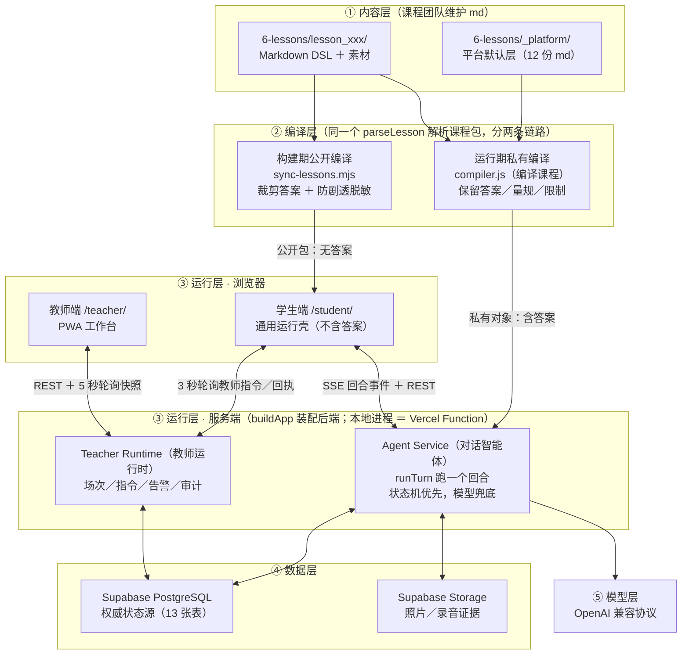
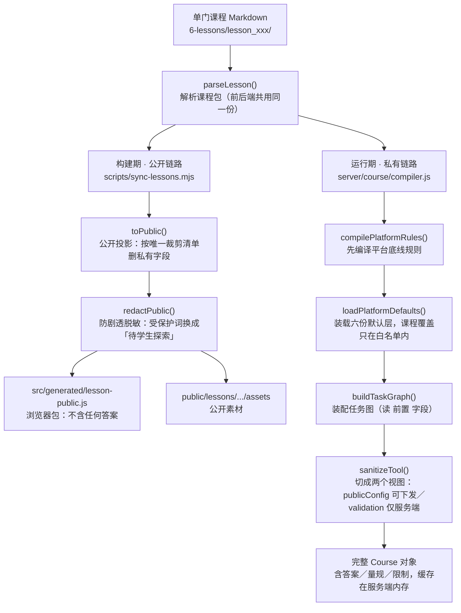
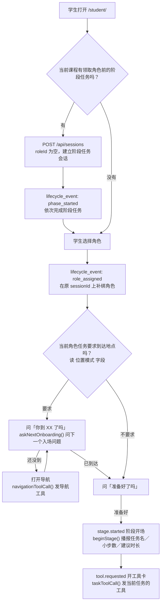
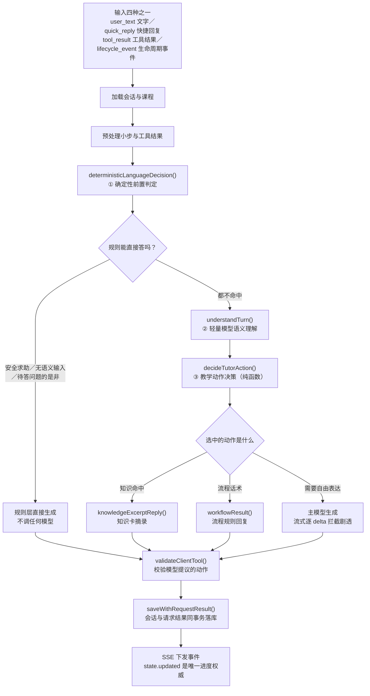
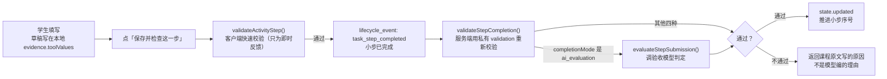
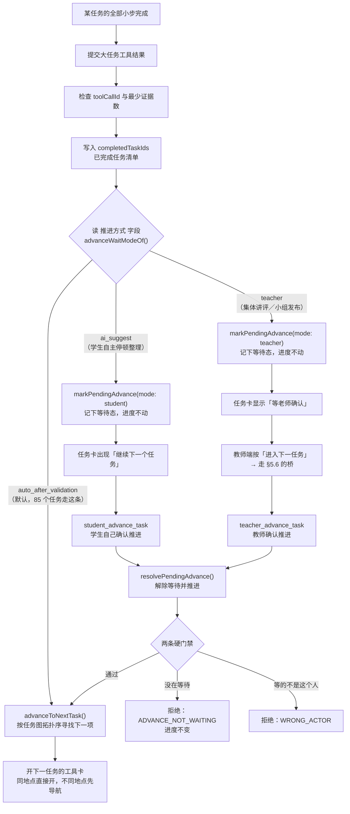
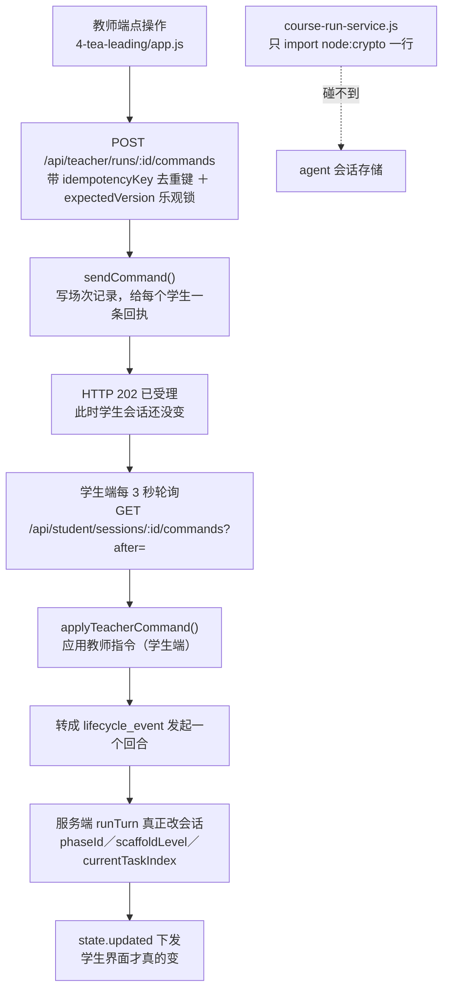

# 技术逻辑总纲

> 本文档与代码同步维护，地位等同 README。**后续技术路径迭代以本文档为准。**
> 更新时间：2026-08-08 ｜ 基线：307 项测试全绿 ／ lint 0 error 57 warning
> 阅读约定：出现函数名与字段名时一律带中文名，例如 `advanceToNextTask()`（往前推一格）。
>
> 相关规范（各有权威范围，本文档只指向、不复制）：
> - [课程包提交规范](6-lessons/COURSE-SUBMISSION-SPEC.md) — 课程作者写课的字段权威
> - [对话运行时协议](4-stu-learning/docs/dialogue-runtime-protocol.md) — 对话状态与回合契约
> - [前端架构规范](4-stu-learning/docs/frontend-architecture.md) — 前端分层职责
> - [教师端安全待办](1-docs/教师端安全待办.md) — 上线阻塞项
> - [部署架构决策](1-docs/vercel-supabase-ai-fullstack-implementation-plan.md) — 7 条 ADR

---

## 1. 这是什么，以及三条不能破的原则

**一个 AI 研学课程智能体平台**：课程团队用 Markdown 写课，平台把它编译成可运行的课程；学生在实地（故宫、博物馆等）用手机以角色身份完成任务，由 AI 学习同伴「絮絮」引导；教师用另一个 Web 端实时掌控课堂。现有 5 门课程（故宫治水、动物博物馆三层级、四渡赤水）。

三条原则贯穿全系统，改任何一处前先确认没有破坏它们：

**① 内容即代码。** 课程是 Markdown DSL，经"编译"变成运行时数据。学生端是**与具体课程无关的通用运行壳**——换课不改代码，只换 `6-lessons/` 里的 md。

**② 确定性优先。** 课程推进由状态机主导，规则能处理的回合不调大模型。模型只能"提议"动作，平台校验、服务端判定。**进度判定永不经过大模型。**

**③ 服务端是唯一权威。** 答案与判定逻辑永不进浏览器；只有服务端下发的 `state.updated`（状态已更新）事件能推进学习进度。客户端的一切校验都只是"快速反馈"。

---

## 2. 仓库地图：每个目录放什么、谁维护、为什么单独存在

monorepo（npm workspaces），根目录本身也是一个 package（放 Vercel 适配层与构建脚本）。

| 路径 | 放什么 | 谁维护 | 为什么单独存在 |
|---|---|---|---|
| `1-docs/` | 本文档之外的长期文档：安全待办、部署 ADR | 平台研发 | 与代码无关的决策依据，不适合塞进代码注释 |
| `3-pr/` | 产品方案展示页（两个单文件 HTML） | 产品 | 对外讲解用，**不参与构建**，改它不影响系统 |
| `4-stu-learning/` | ★ 学生端前端 + **唯一真实后端** | 平台研发 | 前后端同一个 package：后端要 import 前端的 `src/engine/` 解析器（同一份解析逻辑两处用，见 §5.1） |
| `4-stu-learning/src/` | 前端：Vite 无框架 SPA，手写 DOM | 平台研发 | 学生端只有一个大控制器 `app-controller.js`（2635 行），无框架是刻意的——运行壳逻辑简单，框架带来的构建复杂度不值得 |
| `4-stu-learning/server/` | 后端：Fastify 单体（约 7700 行） | 平台研发 | **不是 mock**。本地进程与 Vercel Function 跑同一个 `buildApp()`（装配后端），见 §6.4 |
| `4-stu-learning/scripts/` | `sync-lessons.mjs`（构建期公开编译）、`lint-lesson.mjs`（课程包体检） | 平台研发 | 构建期工具，不进运行时 |
| `4-stu-learning/tests/` | 44 个测试文件，`node --test` | 平台研发 | 无 Jest/Vitest；全是服务端与纯函数测试，无 DOM 测试 |
| `4-tea-leading/` | ★ 教师端：零构建原生 ESM + Service Worker（PWA） | 平台研发 | 没有 `package.json`，构建时**原样拷贝**。教师端功能收敛（四个视图 + 一个 `app.js`），上构建工具是负担 |
| `5-evaluation/` | 学生报告视觉产物（独立静态站） | 设计 | 与主系统**零代码耦合**，只是视觉稿 |
| `6-lessons/` | ★ 课程内容库：Markdown DSL + 素材 | **课程团队**（不写代码） | 内容与代码分离的落点。课程作者只碰这里 |
| `6-lessons/_platform/` | 平台包：教学/安全/隐私底线 + 六份默认层（12 份 md） | 平台教研 | 服务端**最高优先级**规则包。课程只能在白名单内覆盖，见 §6.7 |
| `6-lessons/lesson_*/` | 5 门课程各自一个目录 | 课程团队 | 一门课一个目录，互不影响 |
| `api/serverless.mjs` | ★ Vercel 唯一 Function 入口（14 行薄壳） | 平台研发 | Vercel 要求 Function 在 `api/`；这里只注入 `lessonsRoot`（课程包路径）后转交 |
| `server/vercel/` | Serverless 适配器：路径还原 + 单例懒加载 | 平台研发 | Vercel 的 rewrite 会改写请求路径，需要在 Function 内还原 |
| `scripts/` | 构建拼装 + 产物门禁 | 平台研发 | 把两个前端拼成一个 `dist/`，并做 8 项发布前检查，见 §6.5 |
| `supabase/migrations/` | 数据库迁移（13 张表） | 平台研发 | 只当 Postgres 用：`pg` 直连，**无 supabase-js SDK**，Auth/Realtime 未启用 |
| `tests/` | 根级适配器测试（3 项） | 平台研发 | 测 Vercel 适配层，不属于 workspace |
| `dist/` | 构建产物（`student/` + `teacher/`） | 自动生成 | CDN 直出目标，**不要手改** |

**不参与构建、被 gitignore 的**：`0-temp-asset/`（原始素材）、`6-lessons/_backups/`、`4-stu-learning/.env.local`（真实密钥）、`.runtime/`（本地会话文件）、`uploads/`（本地证据文件）。

> ⚠️ 仓库位于 iCloud Drive，会产生 `dist/student 2`、`.vercel/output/functions 2` 之类冲突副本目录。产物门禁的「恰好 1 个 Function」断言会因此误报，发现后手动清理即可。

---

## 3. 架构总图



五层记忆法：**内容层 → 编译层 → 运行层（学生端／教师端／服务端三个运行体）→ 数据层 → 模型层**。

**注意教师运行时与 Agent 之间没有直连箭头**——这是刻意的架构墙，见 §5.6。

---

## 4. 课程包数据模型

### 4.1 四层术语（对接时必须统一口径）

| 层 | 中文 | 写在哪 | 一门课的量级 |
|---|---|---|---|
| Phase | 课程阶段 | `phases.md` | 6 个 |
| Role Stage / Task | 角色大任务 | `roles/<角色>.md` | 每角色 3 个 |
| Step | 任务小步 | 任务内部 | 每任务 3–5 个 |
| Activity Tool | 活动工具 | 任务的 `功能模块` 字段 | A01–A07 十种 |

术语混用是最常见的沟通事故来源：**「任务」永远指角色大任务，「小步」永远指 Step**。

### 4.2 单课目录结构

```text
lesson_gewu_001/
├── course.md          manifest：基本信息／角色体系／视觉素材（缺失直接编译报错）
│                      可写 遍历模式（仅 sequential 生效，见 §8）
├── phases.md          6 个课程 Phase：时长／模式／地点／触发与结束条件
│                      可写 ### 阶段任务N（不属于任何角色的集体任务）
├── roles/*.md         ★ 数据模型核心：角色 → 角色大任务 → 小步 三层
│                      引导／脚手架／验收标准就地写在任务与小步内部
├── objectives.md      学科知识 DK-* ／学科能力 DS-* ／课程核心能力 DC-* 三棵标签树
├── knowledge/*.md     知识卡（## K-01 标题 ＋ 字段列表）
├── restrictions.md    防剧透：四列表格（限制项／内容／原因／解除条件）
├── prompts/phaseN-*.md 阶段提示词（阶段氛围与全班节奏，不写任务级策略）
├── evaluation.md      课程级／跨任务量规（小步级已就地）
├── time-bank.md       时间银行任务池
└── assets/            封面／地图／角色卡／视频等素材
```

### 4.3 为什么是这个结构：聚合原则

**任务独有的内容与任务定义同居，跨任务共享的内容才集中存放。**

改造前一个任务的定义散在 5 个文件（`roles/` + `guidance/` + `scaffolds/` + `evaluation.md` + `restrictions.md`），靠**序号**弱链接。序号错位不会报错，只会静默装错——第 2 个任务配上第 3 个任务的脚手架，课程作者看不出来，学生拿到错的提示。

现在引导、脚手架、小步验收标准都写在任务单元内部，`guidance/`／`scaffolds/` 两个目录已删除。作者写一个任务只开一个文件，**序号错位静默装错的问题从结构上消失了**。

字段级写法与全部字段表在 [课程包提交规范](6-lessons/COURSE-SUBMISSION-SPEC.md)。本文档不复制字段表——两处维护必然漂移。

---

## 5. 六条 Workflow

### 5.1 课程编译：一份 md 变成两个产物



**为什么是两条链路而不是一条。** 学生浏览器里的东西是可以被查看的——F12 打开就能读。所以答案、判定阈值、量规**必须从物理上不存在于浏览器包里**，而不是"存在但藏起来"。两条链路共用同一个 `parseLesson()`（解析课程包），差别只在裁剪：公开链路删，私有链路留。

**唯一裁剪清单。** 裁剪逻辑集中在 `toPublic()`（公开投影，`server/course/projections.js`），构建期与运行期**共用同一份**。历史上曾经两处各维护一份清单，结果加了新私有字段只改一处，另一处漏裁——现在从结构上不可能。

**内容指纹与缓存。** `courseVersionFor()`（算课程内容指纹）把所有 md 按文件名排序后逐个喂 sha256。课程 md 一改，指纹变，服务端缓存自动失效并重编译。这解决了"改了课程但服务端还在跑旧版"的问题。

| 函数 | 中文名 | 位置 |
|---|---|---|
| `parseLesson()` | 解析课程包 | `src/engine/lesson-parser.js` |
| `compileCourse()` | 编译课程（运行期私有） | `server/course/compiler.js` |
| `toPublic()` | 公开投影（唯一裁剪清单） | `server/course/projections.js` |
| `redactPublic()` | 防剧透脱敏 | `server/course/projections.js` |
| `sanitizeTool()` | 切工具双视图 | `server/course/projections.js` |
| `buildTaskGraph()` | 装配任务图 | `server/course/task-graph.js` |
| `courseVersionFor()` | 算课程内容指纹 | `server/course/compiler.js` |

### 5.2 学生入场：先跑阶段任务，再在同一会话领取角色



无角色会话仍是正式 Agent 会话：基础人设取平台统一的「絮絮」，任务、Step、工具和验收上下文取当前 Phase 的阶段任务。补绑角色时只切换任务轨道；对话消息、证据引用和学习记忆保留，阶段完成快照归档到 `phaseTaskState`（阶段任务快照）。没有阶段任务的课程继续直接进入角色选择。

**为什么入场要问两次。** 到达确认与就绪确认是两件事：学生可能到了地方但还在喘气，也可能没到就想先看任务。两个门禁分开，学生端才能在"还没到"时给导航而不是硬推任务。

**位置判定是双层的。** 客户端算 Haversine 距离只做提示，**服务端重算才置 `arrived`（已到达）**。原因同 §5.4：客户端可改。

### 5.3 一次对话回合（最核心的一条）



**三段式的意义：把"听懂"和"怎么教"分开。** 改造前是一条长正则级联，"我到位置了"会先被导航正则截走——而这句话其实是在回答"到了吗"。学生答了却被当成问路，于是又问一遍，形成死循环。

现在分三段：① 只处理**状态机输入与时效动作**（安全求助、无语义输入、抱怨对话本身、待答问题的是非、入场信号）；② 轻量模型给出结构化理解；③ 纯函数选教学动作，含两条防复读规则。

**进度判定永不经过模型。** 到达/就绪的取值优先用确定性解析，读不出才采纳②给的 `pendingAnswer`（待答问题的答案），两者都读不出就降级为自然回应——**绝不猜一个值去改状态机**。所以轻量模型整体挂掉时入场流程仍走得通（有测试锁定）。

**两个刻意的例外**，改这块前必须知道：
- `guide_location`（给导航）／`advance_pending_question`（推进待答问题）**不参与防复读**：它们带确定性副作用，学生问两次路就该得到两次导航。防复读只治"话术复读"。
- 三个模型角色分工：主模型（自由表达）、轻量理解模型（语义理解，可独立配置）、验收模型（小步 `ai_evaluation` 判定）。验收模型由 `OPENAI_EVALUATION_*` 独立配置，缺省沿用主模型身份，但使用专用的 28 秒超时与一次传输层重试；三者可以指向不同模型服务。

| 函数 | 中文名 | 位置 |
|---|---|---|
| `runTurn()` | 跑一个回合（约 330 行主流程） | `server/agent/service.js` |
| `deterministicLanguageDecision()` | 确定性前置判定 | `server/agent/turn-router.js` |
| `understandTurn()` | 轻量模型语义理解 | `server/agent/understanding.js` |
| `decideTutorAction()` | 教学动作决策 | `server/agent/tutor-policy.js` |
| `workflowResult()` | 流程话术生成 | `server/agent/service.js` |
| `buildAgentPrompt()` | 拼装 Prompt | `server/agent/prompt.js` |
| `toAgentContext()` | 智能体上下文切片 | `server/course/agent-context.js` |

### 5.4 小步验收：双层校验



**为什么要校验两遍。** 客户端校验是为了让学生**立刻**知道"照片还差两张",不用等一次网络往返。但客户端代码在学生手机里，改得动。所以服务端拿**私有** `validation`（验收配置，浏览器里没有）重新算一遍，**只有服务端下发的 `state.updated` 才推进进度**。

六种小步验收方式：`user_confirm`（学生自认）／`tool_result`（工具结果达标）／`ai_evaluation`（模型判定）／`teacher_confirm`（教师确认）／`location_event`（到达触发）／`compound`（组合）。

### 5.5 任务推进：三种推进方式



**等待态必须落在会话上，不能落在回合载荷上。** 这是曾经的一个真实死锁：`ai_suggest`／`teacher` 两个分支原本只往 `input.data`（单次回合载荷）写一个标记，而**回合结束这个对象就没了**，教师指令要等下一次轮询才到。结果学生做完任务后进度永久停住，且界面上看不出为什么。现在等待态写在 `session.pendingAdvance`（待推进状态），跨回合存活。

**两条硬门禁的意义。** 教师是现场权威，可以推进；但**不能推过还没做的任务**——那不是"干预"，是丢进度。所以必须①真的处于等待态，②等的必须是这个 actor。教师按不动学生自己的 `ai_suggest` 等待（认人不认权限）。

**`advanceToNextTask()`（往前推一格）是唯一写入点。** 全仓只有这一个地方改 `currentTaskIndex`（当前任务下标）。要改推进规则只动这一个文件。

角色任务的 `sequential`（线性遍历）已接通任务图：先按 `traversalOrder()`（拓扑遍历）找下一项，再检查该节点同角色的 `前置` 是否都在 `completedTaskIds`（已完成任务清单）中；缺前置时不改下标并返回 `blockedBy`（未满足前置）。图有环时记录警告并回退原来的数组线性推进，避免学生死锁。`open`（开放自选）与 `inquiry`（探究遍历）仍为预留值，按 2026-08-10 产品决策暂不实现。

| 函数／字段 | 中文名 | 位置 |
|---|---|---|
| `currentTaskOf()` | 取当前任务（越界收敛到末尾） | `server/agent/task-advance.js` |
| `advanceToNextTask()` | 往前推一格（唯一写入点） | 同上 |
| `markPendingAdvance()` | 记下等待推进 | 同上 |
| `resolvePendingAdvance()` | 解除等待并推进 | 同上 |
| `advanceWaitModeOf()` | 读该任务由谁推进 | 同上 |
| `session.pendingAdvance` | 待推进状态（跨回合存活） | 会话字段 |
| `taskAtIndex()` | 按下标取任务（**注意不是** `currentTaskOf`） | `server/course/agent-context.js` |

> ⚠️ `currentTaskOf(role, session)`（收会话）与 `taskAtIndex(role, taskIndex)`（收下标）**签名不兼容**。混用不报错，会静默返回第一个任务——等于把学生悄悄退回任务 1。所以名字刻意不同，且有测试钉住不许重名。

### 5.6 教师控制：学生端作为桥



**为什么要绕这么一圈。** 教师运行时（`server/runtime/course-run-service.js`）**只有一行 import**（`node:crypto`），它物理上碰不到 agent 会话存储。这是刻意的架构墙：教师运行时管的是"场次层"（谁在哪个组、告警、审计），学生会话管的是"学习层"（进度、对话状态）。两层耦合会让任何一边的改动都要考虑另一边。

代价是教师操作有**最长 3 秒延迟**（一次轮询周期），且必须经过学生端。收益是两层可以各自演进。

**这条墙有测试钉住**：`course-run-service.js` 的 import 行数被断言。加第二个 import 会红。

**教师指令的幂等**：`(场次 ID, idempotencyKey)` 唯一索引 + `expectedVersion` 乐观锁。教师网络差重复点两次，只生效一次。

---

## 6. Workflow 之外的重要机制

上面六条讲的是"一次交互怎么走完"。这一节讲的是**横切所有交互的机制**——它们不属于任何单条 workflow，但每条都经过。

### 6.1 防剧透四道防线

课程里有答案（"这道水槽是排水的"）、有阈值（"误差 ±5cm 算对"）、有量规。这些不能让学生提前看到，否则研学变成抄答案。四道防线层层收口：

| 防线 | 在哪 | 做什么 |
|---|---|---|
| ① 解析器内建 | `src/engine/lesson-parser.js` | 小步字段续行里的 `答案`／`真值`／`允许误差` 等行被**静默剥离** |
| ② 构建期裁剪 | `toPublic()`（公开投影） | 删私有字段 + 受保护词替换成 `[待学生探索]` |
| ③ 运行期双视图 | `sanitizeTool()`（切工具双视图） | `publicConfig`（可下发）／`validation`（仅服务端）分离 |
| ④ 运行时输出 | `guardedDeltaEmitter()`（流式拦截器） | 模型流式输出**逐 delta** 查剧透；AI 验收的反馈文本也要洗一遍 |

第④道最容易被忽略：模型可能自己"推理"出答案说给学生。所以不是只查课程数据，**连模型生成的每一小段都要过一遍**。

**验证方式**：`tests/course.test.js` 有一张禁词表，对公开包递归扫描；`tests/agent.test.js` 有一例专门测"流式拦截剧透且整轮只调一次模型"。

### 6.2 幂等与并发三层链

学生手机在故宫，信号时好时坏。一次 AI 回合可能被重发三次。三层防重，改任何一层前先看全链：

```text
① 前端 src/services/ai-service.js
   requestId 必传（重试复用同一个）＋ 100 秒总预算（重试不重新计时）
   ＋ 409 时读 leaseExpiresAt 轮询 ＋ 事件指纹去重（回放时抑制重复终态事件）
        ↓
② HTTP 层 server/app.js 的 /api/agent/turn
   AbortController 绑 3 个断连事件 ＋ AI_TURN_TIMEOUT_MS 截止线
   ＋ learnerRequestStore.claim()（抢请求租约）：
       pending   → 409（已在处理，让前端轮询等）
       completed → 回放缓存的事件流（不重跑模型）
       acquired  → 真正执行
   ＋ 数据库部分唯一索引：一个会话同时只能有一个 processing 请求
        ↓
③ 会话层 server/agent/service.js ＋ postgres-store.js
   session.handledRequestIds（已处理请求 ID）兜底去重
   ＋ saveWithRequestResult()（会话与请求结果同事务提交）
```

**超时不变式**（启动即校验，违反直接拒绝启动）：普通模型 `AI_TIMEOUT_MS`(18s) < 整轮 `AI_TURN_TIMEOUT_MS`(70s)；验收模型最多尝试两次，所以 `2 × AI_EVALUATION_TIMEOUT_MS + 1s` 也必须小于整轮预算；`AI_REQUEST_LEASE_MS`(80s) ≥ 回合超时 +5s，客户端预算 100s。外层预算必须比内层宽，否则外层先超时、内层仍在运行，租约无法及时释放。

角色补绑同样走这条回合链：`role_assigned`（角色已领取）带自己的 `requestId`（请求去重键），在一次原子会话写入里归档阶段任务、写入 `roleId`、重置角色任务游标。网络重试复用同一请求 ID，不会把同一个角色重复领取两次。

### 6.3 存储双轨：本地文件 vs 生产 Postgres

`buildApp()`（装配后端）按环境二选一装存储层。**这是本地与生产行为差异的唯一根源**，新人必须先知道：

| 依赖 | 有 `DATABASE_URL`（生产／预览） | 无（本地开发） |
|---|---|---|
| 学生会话 | Postgres，CAS 乐观锁（`state_version`） | 写 `.runtime/ses_xxx.json` 文件 |
| 教师场次 | Postgres（`runtime_state` 单行 JSONB，行锁） | `.runtime/course-runs.json`（写队列串行） |
| AI 请求租约 | `learner_requests` 表（幂等 + 回放） | **无租约** |
| 证据文件 | S3（Supabase Storage） | 本地 `uploads/` |

**⚠️ 本地测不出的行为**（只能靠对应测试文件或连库验证）：
- 409 租约冲突与回放
- CAS 写冲突（两个请求同时改一个会话）
- 数据库唯一索引拦重复请求

`APP_ENV` 为 preview/production 且缺 `DATABASE_URL` 时**不会退回文件**，而是装一个直接拒绝写入的 store，并强制关闭演示模式——防止生产环境静默降级成单机文件存储。

### 6.4 同构后端：本地进程 ＝ Vercel Function

`4-stu-learning/server/` **不是 mock，是唯一的真实后端**。本地 `node server/index.js` 与 Vercel Function 跑同一个 `buildApp()`（装配后端），差异只在装配参数：

| 参数 | 本地 | Vercel |
|---|---|---|
| `serveStatic` | `true`（顺带托管 dist 与教师端） | `false`（静态走 CDN） |
| `realtimeMode` | 可用 WebSocket | `'polling'`（Function 实例间无共享内存，WebSocket 路由不注册） |

Vercel 入口链：`api/serverless.mjs`（14 行薄壳，注入课程包路径）→ `server/vercel/serverless-handler.mjs`（还原被 rewrite 改写的路径 + 模块级单例懒加载 + `app.server.emit('request')` 零代理分发）。

### 6.5 部署管线与 8 项产物门禁

```text
npm run build
 ├─ 学生端：VITE_API_BASE_URL=/api → 自动跑 sync:lessons（课程编译）→ vite build
 └─ scripts/build-vercel-site.mjs：
      4-stu-learning/dist → dist/student/
      4-tea-leading/（原样拷贝，无构建）→ dist/teacher/
      生成 dist/index.html（跳转到 /student/）
Vercel 平台
 ├─ dist/ 整体上 CDN
 ├─ api/serverless.mjs 打成唯一 Function（强制带上 6-lessons/**/*.md）
 ├─ rewrite：/api/:path* → /api/serverless?path=:path*（Function 内再还原）
 └─ redirect：/ → /student/
```

`scripts/verify-vercel-output.mjs` 做 8 项门禁：恰好 1 个 Function、真实 `import()` 入口、5 门课程 md 完整、禁入清单（dist／测试／素材／任何 `.env*`）、体积 ≤100MB、客户端启动代码不含 `[SENSITIVE]` 占位符等。

最后一项来自真实事故：Vercel CLI 会把环境变量值脱敏成 `[REDACTED]`，那个字符串被编译进前端当成 API 地址，线上全部 404。现在构建门禁 + 运行时兜底（API 地址为空或形如 `[REDACTED]` 时回退同源 `/api`）双重防护。

### 6.6 数据库：13 张表，三组分工

唯一迁移 `supabase/migrations/20260731120000_m2_expand_persistence.sql`（幂等可重跑）。

**学生会话组**：`learner_sessions`（Agent 完整状态，不透明 JSONB + `state_version` 乐观锁）、`learner_requests`（AI 回合幂等与租约，复合主键 + sha256 摘要防同 ID 不同内容，`result` 列缓存事件流供回放）。

**教学场次组**：`course_runs`（场次，入场码只存摘要）、`run_groups`、`participants`（座位，一组内角色唯一）、`participant_presence`（每人一行 upsert）、`run_events`（bigserial 全局游标，前端 `?after=` 增量依赖它）、`teacher_commands`（幂等去重）、`command_deliveries`（指令×学生扇出回执）、`alerts`（P0–P3 + 去重键）、`teacher_interventions`、`audit_events`（append-only，IP 只存哈希）。

**Legacy 兼容**：`runtime_state`（教师运行态整体 JSONB 单行，规范化前的兼容写入）。

**权限边界**：13 张表**全部启用 RLS 但零 policy（默认全拒）**，并显式 revoke 匿名与登录角色的全部权限。浏览器角色对数据库零权限，所有流量走服务端 `pg` 直连（连接池 max 默认 2，为 serverless 收敛）。

### 6.7 平台默认层的覆盖优先级

`6-lessons/_platform/` 的 12 份 md 分两类：

**底线规则（不可覆盖）**：`safety-rules.md`／`privacy-rules.md`／`pedagogy-rules.md`。课程写什么都盖不住它们，服务端 Prompt 里优先级最高。

**默认层（白名单内可覆盖）**：`companion.md`（絮絮人设）、`voice.md`（流程话术）、`language-levels.md`（学段语言）、`scaffolding.md`（脚手架 L0–L4）、`tool-defaults.md`（工具数值默认）、`defaults.md`、`logistics.md`（组织信息话术）。

覆盖顺序：**平台默认 → 课程覆盖**。每份 md 声明自己 `overridable`（可否覆盖）与 `courseField`（课程用哪个字段覆盖），例如 `voice.md` 对应课程的 `话术覆盖`。写了不认识的键会收到 lint 警告并被忽略，不会静默生效。

---

## 7. 我想改 X，该动哪里

| 想改什么 | 改哪里 | 注意 | 哪个测试会抓住改错 |
|---|---|---|---|
| **絮絮的话术** | `6-lessons/_platform/voice.md`，或课程里写 `话术覆盖` | 键名必须对齐 `decision.intent`（回合意图），写错键会被忽略并告警 | `tests/voice.test.js` |
| **絮絮的人设** | `_platform/companion.md` | — | `tests/companion.test.js` |
| **脚手架 L0–L4 提示策略** | `_platform/scaffolding.md` | `server/course/platform-defaults.js` 有回落值，md 缺档位时不会崩 | `tests/scaffolding.test.js` |
| **学段语言风格** | `_platform/language-levels.md` | — | `tests/language-levels.test.js` |
| **加一个活动工具** | `src/engine/tool-registry.js`（A01–A07 注册表）＋ `src/components/activity-tools.js`（渲染器） | 两处都要改：注册表定义能力，渲染器画界面 | `tests/tool-registry.test.js` |
| **工具的数值默认**（最少几张照片等） | `_platform/tool-defaults.md` | — | `tests/tool-defaults.test.js` |
| **课程可写的字段／写法** | 三处必须同步：`src/engine/lesson-parser.js`（解析）＋ `6-lessons/COURSE-SUBMISSION-SPEC.md`（规范）＋ `scripts/lint-lesson.mjs`（校验） | 只改解析器 = 课程作者不知道能写；只改规范 = 写了不生效 | `tests/lint-lesson.test.js`、`tests/spec-appendix-status.test.js` |
| **任务推进规则** | `server/agent/task-advance.js` | **唯一写入点**，不要在别处改 `currentTaskIndex` | `tests/advance-task.test.js`、`tests/task-accessor-names.test.js` |
| **对话决策／教学动作** | `server/agent/tutor-policy.js`（选动作）＋ `turn-router.js`（映射为 decision） | 防复读有豁免清单，带副作用的动作不能被防复读拦掉 | `tests/tutor-policy.test.js`、`tests/anti-loop.test.js` |
| **语义理解的输出结构** | `server/agent/understanding.js` | 必须保持"任何输入不抛异常"，失败要有保守默认 | `tests/understanding.test.js` |
| **教师指令**（加一种） | 四处：`server/runtime/routes.js`（收）＋ `course-run-service.js`（记场次）＋ `src/app-controller.js` 的 `applyTeacherCommand()`（学生端应用）＋ `4-tea-leading/app.js`（教师端按钮） | 漏掉第三处 = 教师看到"已下发"但学生端静默丢弃 | `tests/teacher-directive.test.js`、`tests/teacher-runtime.test.js` |
| **公开包裁剪清单** | `server/course/projections.js` 的 `toPublic()` | **唯一清单**，构建期与运行期共用 | `tests/course.test.js`、`tests/projections.test.js` |
| **环境变量** | `server/config/env.js`（zod，启动即校验）＋ `.env.example` | 超时类变量要满足 §6.2 的不变式 | `tests/env.test.js` |
| **数据库结构** | `supabase/migrations/` 新增迁移文件 | 迁移必须幂等可重跑；不要改已发布的迁移 | `tests/migration-contract.test.js` |
| **课程内容**（改课不改代码） | 只碰 `6-lessons/lesson_xxx/` | 改完跑 `npm run lint:lesson`；见 §9 的"改课程包后要重跑什么" | `tests/animal-level-lessons.test.js`、`tests/course-format-v2.test.js` |

---

## 8. 现状边界与技术债（诚实清单）

这一节是**给自己看的**，不是对外话术。每条都实测过。

### 8.1 上线阻塞项：鉴权

- **学生端全部 API 无鉴权，`sessionId` 即权限**——泄露即可代学生发言、上传、读教师指令；
- **教师端身份来自可任意伪造的 `x-teacher-id` 请求头**（默认 `teacher-demo`）。任何人带这个头就能读写全班数据；
- CORS 反射任意来源；
- 唯一有真实鉴权的是 `/api/readiness`（就绪探针）。

**生产公网发布被明确门禁在这一项完成之后。** 详见 [教师端安全待办](1-docs/教师端安全待办.md)。

### 8.2 字段接入状态

| 字段 | 状态 |
|---|---|
| `前置` | **角色任务已生效**：装配为任务图，`advanceToNextTask()` 按拓扑序推进并校验同角色前置；阶段任务当前仍按阶段内数组顺序执行 |
| `遍历模式` | `sequential` 已按任务图拓扑序执行；`open`／`inquiry` 维持预留，写了会收到 lint 警告并按 `sequential` 处理（Sonya 决策 2026-08-10） |
| `能力标签` | 零运行行为（不进浏览器包、不进 Prompt、无 UI、无计算）。**这是刻意的边界**，评价体系只预留挂点 |
| `失败处理`／`教师介入` | 有 lint 配对校验，但无运行时挂点 |
| `阶段任务` | **领取角色前的个人阶段任务已接通**：无 `roleId` 会话、学生端任务卡、工具验收与原会话补绑角色均生效；领角色后的全班／小组共享执行语义仍待后续实现 |

### 8.3 演示数据与真实数据的区别（容易误判）

教师端场次的 `averageProgress`（班级平均进度）与各学生的 `progress`（个人进度）在演示场次里是**造出来的种子数据**——创建场次时按序号生成 30 个学生（5 组 × 6 角色）连进度一起造好。

只有学生真的绑定会话、真的上报进度之后，数字才是真的。**对外演示时看到的百分比不代表真实学情。**

### 8.4 设计意图与实现的偏差

- `runTurn()`（跑一个回合）仍是单个约 330 行的大函数，"生成"段尚未拆出（原计划的 `composeReply` 不存在）；
- 服务端验收数据有三份相近来源（`role.tasks[].steps[]`／`tool.validation`／工具公开配置），应收敛为单一验收计划；
- 解析器仍允许旧格式课程静默降级为 `user_confirm`（学生自认）小步；正式发布应加"缺少结构化小步即失败"的门禁；
- 死代码：`src/services/map-service.js`（孤儿模块，实际在用的是 `amap-service.js`）；
- `AI_WEB_SEARCH_MODE` 环境变量存在但联网检索**未实现**（适配器报告 `webSearch: false`）；
- 已知脆测试：`tests/serverless-api.test.js` 的 deadline 一例设 `AI_TURN_TIMEOUT_MS: 15`，15 毫秒预算在跑全量时会被别的测试挤掉，约半数全量跑会红；单跑该文件稳定全绿。

---

## 9. 本地开发与验证速查

```bash
cd 4-stu-learning && npm run dev
```

`dev:api`（Fastify :3000，监听 `server/` 变更）与 `dev:web`（Vite，`/api` 代理到 3000）并行，`predev` 自动跑课程编译。

### 改了东西之后要跑什么

| 改了什么 | 要做什么 |
|---|---|
| `6-lessons/*.md` | 浏览器公开包要重跑 `npm run sync:lessons`（或重启 dev）；服务端私有编译有进程内缓存，**通常要重启 API 进程** |
| 课程包字段 | `npm run lint:lesson`（报到 file:line） |
| `server/` 代码 | 自动重载 |
| 任何代码 | 提交前 `npm run verify`（= test + build） |

### 当前基线（改动后应仍成立）

```bash
npm test                                        # 307 项全绿（workspace 304 + 根 3）
npm run lint:lesson                             # 0 error，57 warning
shasum -a 256 4-stu-learning/src/generated/lesson-public.js
# a96c9009d4399f4fbdeda6cc212deaadcaf50a4182edf2b2f4b5583e2d4348d3
```

公开包指纹用途：**不碰课程内容的改动，这个 sha256 必须一位不变**。变了说明意外改到了课程数据或裁剪逻辑。

### 单独调工具

打开 `4-stu-learning/tools.html`（隔离工具沙盒），可加载真实课程小步、查看本地证据 JSON、跑完成条件校验并随时重置。改活动工具渲染器时用它比在完整流程里点快得多。
